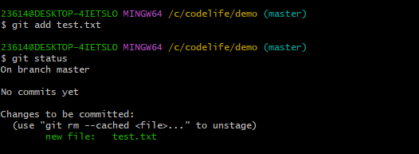
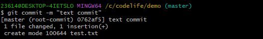

#  git简述

[Git](https://git-scm.com/)是当前最流行的一个开源的分布式版本控制系统,用于敏捷高效地处理任何或小或大的项目.

它是[Linus Torvalds](https://baike.baidu.com/item/林纳斯·本纳第克特·托瓦兹/1034429?fromtitle=Linus Torvalds&fromid=9336769&fr=aladdin)为了帮助管理[Linux](https://baike.baidu.com/item/Linux)内核开发而开发的一个开放源码的版本控制软件.

Git最大的特点是分布式.它与以往集中式的版本控制工具最大的不同就是Git的仓库是相互独立的,每个人电脑中都有完整的版本库,所以某人的机器挂了并不影响其它人.这一特性天生对开源软件亲和.


# 工作流程


git版本控制系统由工作区,缓存区,版本库组成.它跟踪的是文件的修改而不是全部文件.

也就是说它的版本控制靠的是记录变化.因此相比较起管理二进制文件,git更擅长管理代码等文本文件.


# 小抄


# 基本版本控制

Git是分布式代码仓库,但如果只是本地使用也完全可以用于项目的版本控制.

但无论怎样你都需要先在本地创建一个代码仓库.


### git status

使用

```git
git status
```

来查看仓库状态：not a git repository


### git init

```
git init
```

创建本地仓库后项目根目录下会生成一个`.git`的文件夹,其中`config`文件会记录仓库的一些基本信息.项目会有一个`HEAD`文件用于记录当前的状态.

这个`HEAD`会指向一个分支,一般是`master`分支,分支这个概念我们会在下一单元介绍.

此时demo文件夹已经被当成了一个代码仓库


此时再查看git status

No commits yet【还没有提交】

因为我们只建立了仓库，并没有将该文件夹下的某些文件列为仓库追踪项目，仓库就当作不认识他们。。


### git add

```git
git add test.txt
```




已经没有Untracked files提示了，这说明文件hit.txt已经被添加到 Git 仓库了，

而在我们没有进行git add操作之前，文件hit.txt并不被 Git 仓库认可，因此才会出现提示初始化仓库为空的现象。

在这里，需要声明一点，那就是：git add命令并没有把文件提交到 Git 仓库，而是把文件添加到了「临时缓冲区」，这个命令有效防止了我们错误提交的可能性。


### git commit

```git
git commit -m "提交信息"
```



如上图所示，我们成功将文件hit.txt提交到了 Git 仓库，

其中commit表示提交，-m表示提交信息，提交信息写在双引号""内。甚至可以是中文。

接下来，再输入git status命令查看仓库状态：


nothing to commit, working tree clean

没什么可以被提交的，工作树干净。


### git remote 

```git
git remote add origin git@github.com:Souseohyun/chat_room.git
```

建立远程连线，然后要换仓库，可以重新set-url

```git
 git remote set-url origin git@github.com:Souseohyun/new_room.git
```


### git push

第一次要加-u，后续仓库里有东西了就不用-u了

```git
git push -u origin master
```


### git clone

```git
git clone 链接
```

用于从仓库拉取代码到本地。


### git log

```git
git log
```

查看提交记录

提交记录的内容包括Author提交作者、Date提交日期和提交信息。

通过以上的操作，我们会发现一个现象，那就是：在每个git操作之后，我们基本都会输入git status命令，查看仓库状态。

这也从侧面说明了git status命令使用的频率之高，也建议大家在操作 Git 仓库的时候多使用git status命令，这能帮助我们实时了解仓库的状态，显然非常有用。


### git branch

```git
git branch
```

查看仓库的分支情况，其中前面带*号的，就是当前所处位置。


同时可以在后面加分支名用来创建分支，例如

```GIT
git branch pathA
```


可以加上参数-d or -D来删除分支

-D强制删除

```git
git branch -d pathA
```


### git checkout

```git
git checkout ...
```

用于切换分支，同时我们也可以通过命令行后面蓝色后缀括号里的信息来判断当前分支。


### git tag

```git
git tag v1.0
```

如上，我可以通过tag 版本号来为当前分支添加一个v1.0的标签。

可以通过checkout tag号来切换到该标签下的代码状态。


# 使用ssh完成git与GitHub绑定


现在，我们已经对 GitHub 有了一定的了解，包括创建仓库、拉分支，或者通过Clone or download克隆或者下载代码；我们也下载并安装了 Git，也了解了其常用的命令。

But，无论是 GitHub，还是 Git，我们都是单独或者说是独立操作的，并没有将两者绑定啊！也就是说，我们现在只能通过 GitHub 下载代码，并不能通过 Git 向 GitHub 提交代码。

如今我们将使用ssh将俩者结合起来。


## 生成ssh key

我们要想生成SSH key，首先就得先安装 SSH，对于 Linux 和 Mac 系统，其默认是安装 SSH 的，而对于 Windows 系统，其默认是不安装 SSH 的，不过由于我们安装了 Git Bash，其也应该自带了 SSH. 可以通过在 Git Bash 中输入ssh命令，查看本机是否安装 SSH：


如上图表示我们已经安装了ssh，可以使用ssh命令

```ssh
ssh-keygen -t rsa
```

输入ssh-keygen -t rsa命令，表示我们指定 RSA 算法生成密钥，

然后敲三次回车键，期间不需要输入密码，之后就就会生成两个文件，


生成的俩个文件分别为id_rsa和id_rsa.pub，即密钥id_rsa和公钥id_rsa.pub. 

对于这两个文件，其都为隐藏文件，默认生成在以下目录：

Linux 系统：~/.ssh

Mac 系统：~/.ssh

Windows 系统：C:\Documents and Settings\username\\.ssh

我的路径：C:\Users\23614\\.ssh


密钥和公钥生成之后，我们要做的事情就是把公钥id_rsa.pub的内容添加到 GitHub，

这样我们本地的密钥id_rsa和 GitHub 上的公钥id_rsa.pub才可以进行匹配，

授权成功后，就可以向 GitHub 提交代码啦！


## 添加ssh key

首先进入个人主页，右上角，点开settings


左侧下方，ssh和gpg密钥


new一个新的，然后就只需要把公钥复制一份放到key里就ok了，titile可以不填


结果界面：


## 验证绑定是否成功

在我们添加完SSH key之后，也没有明确的通知告诉我们绑定成功啊！不过我们可以通过在 Git Bash 中输入ssh -T git@github.com进行测试：

```git
ssh -T git@github.com
```


