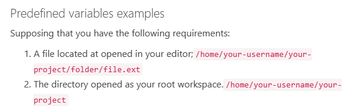
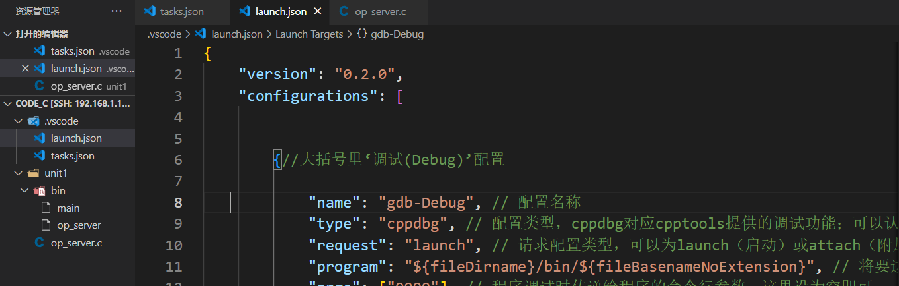
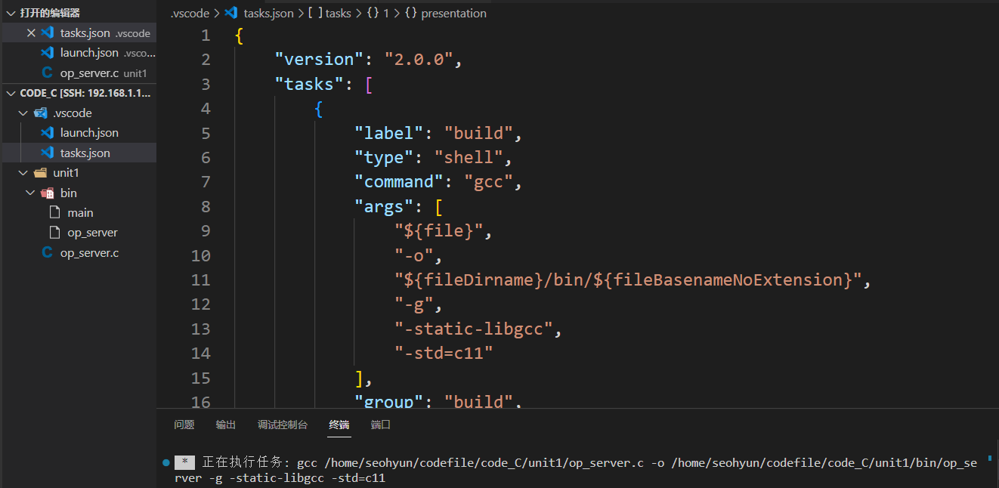
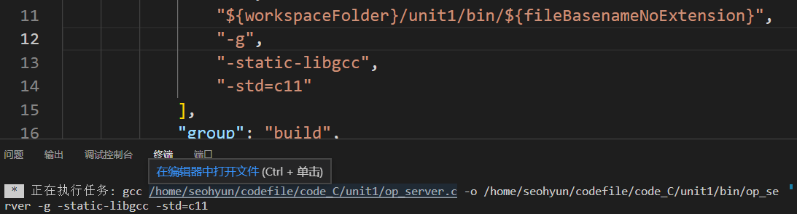

## 预定义变量列表

${workspaceFolder} -在 VS Code 中打开的文件夹的路径
${workspaceFolderBasename} -在 VS Code 中打开的文件夹名称，不带任何斜杠（/）
${file} -当前打开的文件
${relativeFile} -当前相对于打开的文件 workspaceFolder
${relativeFileDirname} -当前打开文件的目录名，相对于 workspaceFolder
${fileBasename} -当前打开的文件的基本名称
${fileBasenameNoExtension} -当前打开的文件的基本名称，没有文件扩展名
${fileDirname} -当前打开的文件的目录名
${fileExtname} -当前打开的文件的扩展名
${cwd} -启动时任务运行器的当前工作目录
${lineNumber} -活动文件中当前选择的行号
${selectedText} -活动文件中的当前选定文本
${execPath} -正在运行的 VS Code 可执行文件的路径
${defaultBuildTask} -默认构建任务的名称
预定义变量的例子
vscode 的当前状态

## 预定义变量值列表



变量	值
${workspaceFolder}						/home/your-username/your-project
${workspaceFolderBasename}	your-project
${file}												/home/your-username/your-project/folder/file.ext
${relativeFile}								  folder/file.ext
${relativeFileDirname}				  folder
${fileBasename}							 file.ext
${fileBasenameNoExtension}		file
${fileDirname}								/home/your-username/your-project/folder
${fileExtname}								.ext
${lineNumber}							   光标的行号
${selectedText}							  在代码编辑器中选择的文本
${execPath}									Code.exe 的位置


## 举例

以此为例：







以上图为例：

运行结果

```shell
 gcc /home/seohyun/codefile/code_C/unit1/op_server.c -o /home/seohyun/codefile/code_C/unit1/bin/op_server -g -static-libgcc -std=c11 
```

故此可知

常用的预处理变量见析：

```shell
${file}		-->		/home/seohyun/codefile/code_C/unit1/op_server.c		//故此预处理file指的当前处理文件指op_server.c源文件
${fileDirname}		-->		/home/seohyun/codefile/code_C/unit1			//由上面file指.c文件可知，filedirname则是file所在的目录
${fileBasenameNoExtension}		-->		op_server						//这个就是.c源文件去掉后缀
${workspaceFolder}		-->		/home/seohyun/codefile/code_C			//这个就是vscode打开的文件

```


