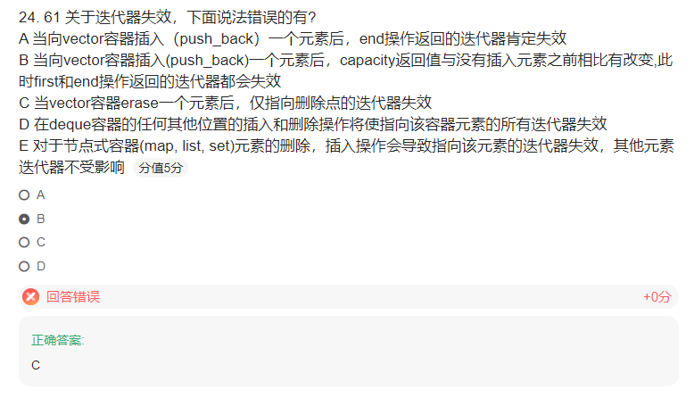

# 难题

## short溢出

```cpp
short i = 65537		//100...001	溢出一位，编译器最后i = 1一样
int j = i+1;		//2
printf("%d %d",i,j);
```

i = 1  j = 2


## 类指针指空

类指针指空的情况下还能调用一般成员函数（不含类成员变量）

```cpp
class A {
public:
    void tests() {
        printf("test A\n");
    }
};
int main() {
    A* pa = NULL;
    pa->tests();	//pa地址通过ecx传入，然后就call相应函数地址，只要不用到ecx的内容就不会露馅
    system("pause");
    return 0;
}

```


## 三维数组偏移

我们知道

```cpp
int* p = xxx;
p++;	//p+1相当于p偏移一个int类型的大小，而非地址+1
```

放至二维：

```cpp
int a[2][3] = { {1,2,3},{4,5,6} };
int* p = (int*)(a + 1);		//a+1相当于a偏移一个int[3]大小的距离，而非偏移int类型大小
std::cout << *p;	//4
```

放至三维：

```cpp
int a[2][3][4] = { {  {1,2,3,4},{5,6,7,8},{9,10,11,12}            },
                    {  {13,14,15,16},{17,18,19,20},{21,22,23,24}  }
                   };
int* p = (int*)(a+1);		//a+1相当于偏移一个int[3][4]大小的距离，直奔第二行。
std::cout<<*p;				//13

```

在多维数组里，a+1，就代表偏移一行，直接去下一行


题目：

```cpp
int main() {   
    int a[2][2][3] = { {{1,2,3},{4,5,6}}, {{7,8,9},{10,11,12}} };
    int* p = (int*)(&a + 1);

    printf("%d  %d\n", *(int*)(a + 1), *(p - 1));
    system("pause");
    return 0;
}
```

主要要解释这一句：

```cpp
int* p = (int*)(&a + 1);
```

它其实是指向数组 a 后面的位置，即 a 的地址加上 a 所占的内存大小，即 `&a + 1 = &a[2]`。因此 p 指向 a 的最后一个元素后面的位置，也就是 12 后面的位置。


# 错题

## 题干语义不清晰：


## 只能用new创建


当我们规定类只能在堆上分配内存时，就可以将析构函数声明为私有的。

原因呢，C++是一个静态绑定的语言。在编译过程中，所有的非虚函数调用都必须分析完成。即使是虚函数，也需检查可访问性。因些，当在栈上生成对象时，对象会自动析构，也就说析构函数必须可以访问。而堆上生成对象，由于析构时机由程序员控制，所以不一定需要析构函数。

保证了不能在栈上生成对象后，需要证明能在堆上生成它。这里OnlyCanNew与一般对象唯一的区别在于它的析构函数为私有。delete操作会调用析构函数。所以不能编译。那么如何释放它呢？

答案也很简单，提供一个成员函数，完成delete操作。在成员函数中，析构函数是可以访问的。当然detele操作也是可以编译通过。


## 对齐系数


在32位机器里，貌似默认对其系数是4


## 迭代器失效




## 题干描述不清


## 类 安全转换


## 传入参数


```cpp 
int func(int (*p)[4]) {}
int func(int *p[4]) {}
```

这俩东西是不一样的、

