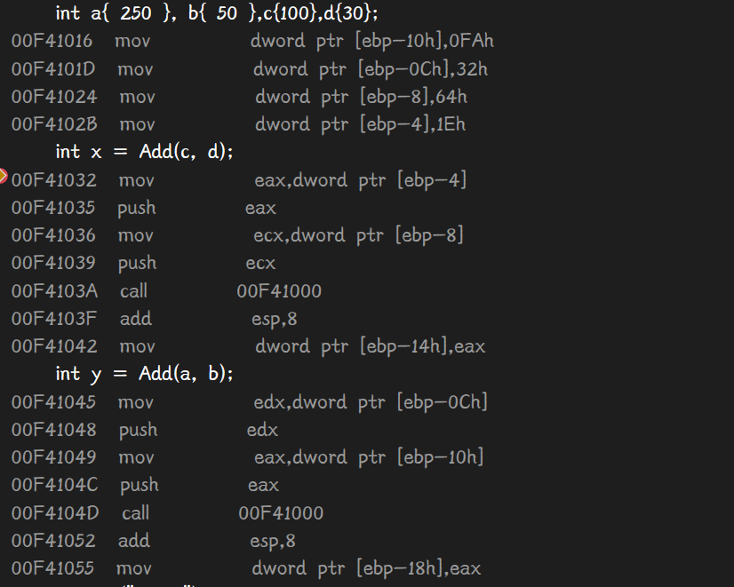

# 内存分区基本模型


7FFEFFFF-4GB的操作系统内核要用。


# 函数与栈

详细解析一下栈区

变量的本质是对应的内存空间，因此每个变量都需要独立的内存空间，

如果为每个这样的变量都分配固定的内存空间将十分浪费内存，

于是有了栈的概念，**栈的本质是一段提前分配好的内存空间，**

**主要用来存放临时变量，管理好栈，即将可以避免频繁的内存分配和不必要的内存开销。**


## 必要的汇编知识

## 寄存器

```cpp
eax,ecx,edx,ebp,esp,edi,eip
```

以上都是看反汇编常常会看见的寄存器名

其中eax比较特别，函数通常会有一个返回值，这个返回值通常用eax来传递

esp代表栈顶，栈顶往下的代表已经使用过的内存空间，以下代表未使用的

ebp代表取堆栈指针，

esp一直指向栈顶，而ebp知识存取某时刻的栈顶指针，以方便对栈的操作，例如取值，局部变量等


## 汇编指令

基本汇编指令有：

### call / ret

```cpp
call	Add (0741000h)	//相当于将程序执行光标移动到目的地址处
ret						//通常与call对应，返回call前地址

```

例如：

00C6107A		call	 CD1020

00C6107F		add 	esp，8

执行call指令、

首先还是会esp = esp - 4；然后再esp的内存地址里写入call语句的下一条顺序指令的地址（00C6107F）

然后CPU执行跳转call后地址（CD1020)

而：

ret指令，CPU将执行跳转到esp的内存地址的值，然后esp = esp +4；让之前esp内容视为未使用


### push / pop

(与栈强相关)

```cpp
push	32h
```

xx代表已用内存空间，假设esp（栈顶）刚开始再0x10050处

push首先会让栈顶往上走一个类型大小，达到0x1004c，然后将32h放进0x1004c里

即：esp = esp - 4（int型举例）；   esp的内存地址写入32h


pop与之相反

```
pop ebp
```

将栈顶元素弹出赋值给ebp，同时esp自增4，此句后经常时ret了，esp再增4、


### mov

```
mov	ebp,esp
```

相当于ebp = esp


常见

```
mov		dword ptr [ebp-4],0FAh
```

相当于ebp这个取堆栈指针-4，往上走一格的位置，往里面放入0x0FA


### jmp

```
jmp		 CD1020
```

jmp无条件跳转


### add / sub

```
sub	esp，8
```

esp栈顶的值减8，相当于栈顶往上移2个4，一般来说，栈只要往上一走，一减，就基本上必然要用它。

add与之相反，add，sub就是自增自减的


### ret

```
ret
```


ret是子程序的返回指令，

执行此指令时，esp自增4，栈顶数据出栈赋值给ip寄存器。


## 汇编代码分析

调用函数


首先声明语句int a{}，b{}即将ptr [a]，ptr[b]里放入相应的值。

然后第二句：int x = Add(a,b);调用函数了

首先将32h和0FAh（ptr a/b分别指向的值）赋值给eax，ecx这俩寄存器，同时，push eax，ecx，

当然这个push的过程也完成了esp自减4的俩次调用。

然后就call	0DD1000h这个地址，顺带esp自减4，再将00DD1031这个add指令的地址放入了esp栈顶。

函数执行完：

为什么是esp+8呢，因为Add()函数有俩个参数故2*4，如此一来栈又恢复到原来没调用函数的样子了

并将x地址中放入eax的值，eax值是什么，看下面Add()函数就知道了


eax存入ptr a的值，并add 上ptr b的值，此时eax里的值就是a+b。


倘若不开【显示符号名】这个选项将更直观的看出参数存放位置

一般调用函数的参数顺序从ebp-4开始往前移，-8，-0C，-10

call指令会将esp自减4并放入下一条指令的地址，

在调用函数前，ebp里的值一般是esp未push前的值，也就是堆栈原来的基址，用于保存之前的任务型信息，

调用函数后第一步往往是：

push ebp，mov ebp,esp

让ebp存的基值入栈新的栈顶。然后将新栈顶赋值给ebp（某种意义上的栈底）



我的理解：

调用一个函数时，先将堆栈原先的基址（EBP）入栈，以保存之前任务的信息。

然后将栈顶指针的值赋给EBP，将之前的栈顶作为新的基址（栈底），

然后再这个基址上开辟相应的空间用作被调用函数的堆栈。

函数返回后，从EBP中可取出之前的ESP值，使栈顶恢复函数调用前的位置；

再从恢复后的栈顶可弹出之前的EBP值，因为这个值在函数调用前一步被压入堆栈。

这样，EBP和ESP就都恢复了调用前的位置，堆栈恢复函数调用前的状态。


所以重点就在pop这个语句了。pop ebp究竟表达神马意思？

ebp的值起初存在了栈中，

pop ebp于push ebp相对

push ebp时esp自减4，再将ebp的值压入栈中

pop ebp时将从栈顶拿出一个元素，赋值给ebp，并且esp将+4；


ret是子程序的返回指令，

执行此指令时，esp自增4，栈顶数据出栈赋值给ip寄存器。


如此，通过捣鼓ebp，esp保证了栈区在调用函数前后会恢复到原来的样子。


## 例子：

独立思考一下这段代码


此图执行结束后，esp指向0x10034，ebp指向原来的0x10044

然后到了call后的add语言（地址：83C408），add esp 8，则0x10034和38的FA与32均没用了

esp指向了0x1003c，恢复了栈平衡

然后终于再ebp-8的位置（0x1003c）放了数，这个数就是上个函数的返回值eax里的数据


中间过程省略，最后pop，再ret后，0x1004c，0x10050里放到东西就被放弃了，又是一个函数结束了


## 结论

一般来说，

ebp：  **存放调用函数前ebp的值**

ebp+4：存放call指令调用函数时压入堆栈的**返回地址**

ebp+8：**存放函数传参的第一个参数地址**

ebp+C: 存放[函数传参](https://so.csdn.net/so/search?q=函数传参&spm=1001.2101.3001.7020)的第二个参数地址

...

ebp-4： 从ebp-4开始到函数提升堆栈后的栈顶之间被称为缓冲区(一般缓冲区栈顶是：函数调用时提升堆栈后[esp](https://so.csdn.net/so/search?q=esp&spm=1001.2101.3001.7020)的值)，我们常说的局部变量都是定义在这里，所以大致可以理解为函数中**ebp-4往上就是定义局部变量的位置**


所以堆栈溢出之所以挺恐怖是因为其很有可能改变call指令后存放着用来返回远处的下一句指令地址

执行了不该执行的代码


函数中声明的局部变量以及函数执行过程中需要用到的一些临时变量也都存在栈中。 

**小于等于 4 个字节的返回值会被保存到 EAX 中**，

如果大于 4 字节，小于 8 字节，那么 EDX 也会被用来保存返回值。

如果返回值占用的空间还要大，那么调用者会向被调用者传递一个额外的参数，这个额外的参数指向将要保存返回值的地址。


首先，函数必须建立它自己的栈帧。EBP 寄存器现在正指向 main 的栈帧中的某个位置，这个值必须被保留，因此，EBP 进栈保存当前值；

然后 ESP 的内容赋值给了 EBP，这使得函数的参数可以通过对 EBP 附加一个偏移量得到，而栈寄存器 ESP 便可以空出来做其他事情。如此一来，几乎所有的 C/C++ 函数调用都从如下两个指令开始：

```text
 push ebp
 mov ebp, esp
```


ret指令将专跳到EIP地址，esp自增4

自己总结半天，说实话不如别人写的：[C/C++ 函数调用是如何实现的？ - 知乎 (zhihu.com)](https://zhuanlan.zhihu.com/p/394009663)

