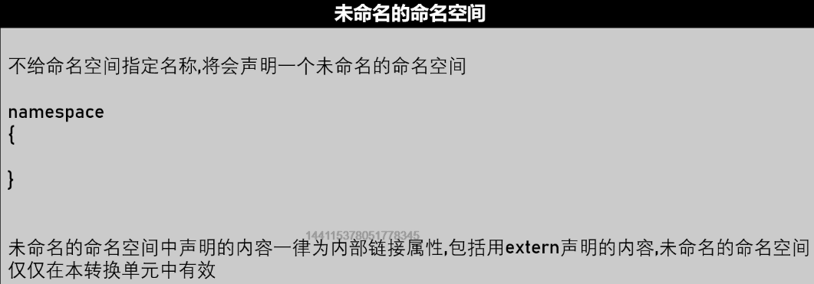
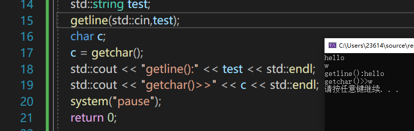

# system

执行系统指令，例如cls，pause，前者是清屏后者是暂停

```c++
system("color 12")		//修改cmd命令框背景颜色0x12
system("shutdown")		//关机
system("C:\\Users\\2361\\Desktop\\xxx.jpg");	//打开该路径文件
system("mode con cols=宽 lines=高");
```

可以system暂定再清屏再打印再暂停，完成界面的更新


# 基本数据类型

## 变量与常量


### 变量

#### 变量命名规范

```cpp
hong-9					//错误，-不行_行
9hong					//不能用数字开头
hong9					//能用，但不雅
hong 9					//不能，空格
Asdasdfqwfas123asd		//能用，但不雅
_hong9					//_可以开头，能用
_9hong					//可以
int						//不可以，关键字
int2					//可以
```


#### 变量定义方式

有俩种定义方式：

```cpp
类型 名字 {初始值}
or
类型 名字 = 初始值
```

前面是新标准，推荐用前一种，安全性更高

例如前一种int hp {99.5}会报错，而int hp = 99.5只会警告不会报错。

再用{}进行初始化时，可以空置例如，int age{};，Windows下此时age为0；

初始化是重要的，尽量要赋初值


### 常量


#### 常量定义方式

1-直接使用，就算没起名字，也是常量

2-const 类型 名字 {初始值} 或者倒过来写，类型 const 名字 {初始值}

3-#define 名字 值  这是预处理语句不属于代码段不需要加分号，而且是直接用值替换后续名字


## 整型

### sign

sign的意思：签字-符号


单独的signed也可以表示int

数字大了可以不用记得敏感

但占1B-8b：-128~127（共2^8=256）

占2B-16b：-32768~32767（共2^16=65535)

这俩个要熟记

以及

int型4B32b：-[2^31] ~ (2^31)-1

**long一般64操作系统是8B，win32是4B**，Linux下一般是4B


### unsigned


 unsigned 不能和 float double等一类浮点数搭配

单独拿出来讲要注意的是

wchar_t，宽字节

是用来表示字符的一个类型，直接cout输出是其十进制数字


## 浮点数

参考C语言md王道训练营文档阅读


首先并不是严格浮点数等于小数

小数一般用定点数或者浮点数表示，

前者已经基本淘汰，浮点数的命名是与之对立的，而不是就是小数。

浮点数因为占用字节足够多而也常被用于存储巨大的整数


浮点数的精度范围


浮点数在立即数阶段是默认把自己认为是8字节的，只有在立即数后加f或者F才会只有4字节。

浮点数作比较时一定要注意精度，注意特殊处理，一般不直接==


## 数字后缀

后缀可以跟在任何整形进制描述之后


u（unsigned）

l（long）

ll（long long）

ull（unsigned long long）

f（float）

使用后缀可以将常量数字赋予其您想赋予的类型


浮点数后缀规则：


例如：

200l		是long型数据

200.0l	是long double型数据


## 数字类型转换

### 隐式转换：

（编译器自动处理了）


short和char运算时一律转换成int型。

混合运算时，会自动转换类型再进行运算，详情课参阅C训练营混合运算md文档

举例：


a是int型，b是无符号int型，俩者进行运算时，会自动转换成最大的再运算。

可以修改为


### 显式转换

C语言版：

```cpp
<<（int)(a-b)<<std::endl;
```

Cpp版：（静态转换）相对比较安全

```cpp
int a = static_cast<int>(b);
```


注：我们可以使用const_cast<int&>之类的来解除const修饰，从而修改。

const_cast<> 中的类型必须是指针、引用或指向对象类型成员的指针

```cpp
	const int ca{ 10 };
	const_cast<int&>(ca) = 100;
```


## 布尔


这是Cpp创新C的，用来表示真假的，但其本质还是和C语言一样0和1

1为true，0为false；

倘若赋值成数字进行真假判断，则0为假，非0则真


## 字符

稍微熟记一下，

’A'的ASCII码65，

'a'ASCII码97，

'\n'换行键10，

空格键32，

双引号34，单引号39

字符0，对应48，余下逐个上升

反斜杠\，92


字符的初始化可以用字符也可以用数字

```cpp
char charA{'A'};
char charB{65};
```


### wchar_t

有关wchar_t宽字节字符的说明：

locale是本地，载入本地的编码规范setlocale。

宽字节不论是输出英文还是中文还是其他文字的字符，同一占俩字节。

初始化时要么用数字，要么要在字符前加大写L，表面其字符为宽字节字符。

输出时cout不支持wcahr_t，wcout才支持。


并且，他字符数组的下标还是一个一个加，不需要i +=2


### char16_t/char32_t

为了跨平台的统一规范，

规定死了char16_t,char32_t分别占2字节，4字节，分别用utf16、32标准来解读这些字符/数字

在char16_t初始化时同一在字符前加小u

在char32_t初始化要加前缀大U


但无论是wcout还是cout都没有支持char16_t/32_t的规范，所以如果输出只能是输出对应数字


### 字符前缀

就像是数字后缀一样，用来表明字符类型的东西

u	char16_t

U	char32_t

L	wchar_t


### 字符的故事

字符的处理非常容易出错。

中文的无论是gb2312还是gbk都是大于127的

包含中文在内的一昧用strlen()是得不到准确的字符数量的，需要自己处理

需要判断第一个字符1字节如果大过127，第二个字节就不用管，这俩个直接归到汉字，

再从第三个字节开始判断是多少，再判断是否大于127，如果小于，就这个字节是英文，


Unicode只提供了由字到数字的映射，没有形成真正的标准

于是就出现了 utf16，utf32这样的标准。

utf-16，不管怎么着，就用俩个字节表示一个字，可以解决大部分问题。

还有utf-8这样的变长规范，英文1字节，中文2，3，4字节都有，最长用4字节标识。


## auto

```cpp
auto 变量名{初始值};
```

可以由编译器来自动给你赋类型


### typeid(变量).name()

工具函数，可以通过这个来得到变量的类型

该函数的返回值是char*类型，相当于返回一个字符串

不能用其返回值来定义变量类型。


## 枚举


如无特别设置，

枚举量最开始从0开始网上递增，如上图，normal对应0，high对应1...

可以用等号设置，设置normal = 5，high就开始逐渐往上递增


可以同时俩套装备体系：


可以不写EquipLv：int，的这个int；会默认为int，当然你数范围很小也可以写short。

枚举需要注意的点：

**主要是枚举类型成员只能是整数类型，和其它类型比较/转换需要强转。**


# 自定义变量名

给已经有的变量起别名

C语言中可以用

```cpp
//#define就是无脑替换，纯粹字符上的替换，没有涉及任何逻辑
#define A typeName
//此时typeid(a).name()  结果还是typeName

//typedef比#define有脑子一点
typedef int eInt；
eInt name = 1；
//此时typeid().name()得到的是eInt

//cpp方法，跟typedef基本一样，cpp的新特性支持
using eInt32 = int；
using eInt32 {int};//非法

```

这个谁在前面谁在后面特别容易反

#define 别名 真值

typedef 真值 别名

using 别名 = 真值


# 变量的生命周期

变量的生命周期实际上就是分配给这个变量的那块内存的生命周期

用的时候分配的时候生命开始，回收的时候生命结束。

详情可见：Cpp存储持续性，作用域和链接性.md


就近原则：

变量，当使用它的时候，它是就近原则，会找离他最近的声明


生命周期：


全局变量程序开始就存在，main函数结束才会回收

要访问冲突的全局变量，可以用限定符::


# 结构体变量

cpp可以自定义数据类型，

就是C语言的内容

```cpp
struct Person{
}
```

但有一点细微区别，cpp不用typedef重命名，也可以直接用Person来当数据类型，而不用struct Person


注：如果要使用结构体指针基本名，还是得和C一样用到typedef

```cpp
typedef struct Role {
	char* name{};
	int hp{};
	int mp{};
}*PROLE,ROLE;
```


结构体是一段连续的内存，

该结构体所占内存涉及内存对齐的知识，

详情可见回顾C语言.md文档


注意了！struct结构体里面也可以定义函数，C语言某种程度上也可以实现您面向对象编程的思想。


# 宏定义

## #define X

预定义X，下面出现X会替换成啥也没有，可以提高代码可阅读性

例如：

```cpp
#define _TEST_
....
int _TEST_ a{10};
```


## #undef X

取消预定义X


## #ifdef	#ifndef	#endif

#开头的，是我们跟编译器沟通，是不会记入代码里的，

#if和if()是完全不同的概念

拥有一套完整的：

```cpp
#if	  #elif   #else
#ifdef		#ifndef
#endif
#undef
```


还有#else，相当于宏定义的if else 

有#ifdef，就一定有#endif


处理字符集本地化问题：

像UNICODE这样的宏都是被预先定义的

```cpp
#define SENDSMS 1
#ifdef UNICODE && SENDSMS
wchar_t a;
#else
char a;
#endif
```


## 复杂表达式宏

1：宏定义支持类似以下操作：

```cpp
#define SUM(X,Y) (X+Y)
#define BIGGER(X,Y)	(X>Y?X:Y)
#define RELEASE(x)	delete[] x;x=nullptr;

```

如果发现宏替换报错了，您可以尝试在函数内手动替换掉内容先试一试，然后根据需求加上各级括号


2：可以将一个标识符参数字符串化：

```cpp
原始写法：
#define SHOW(X)		std::cout<<X
   
加#号使参数字符串化
#define SHOW(X)		std::cout<<#X
```

此后，可以在函数中使用SHOW(你好233\n)这样的操作，能识别转义字符


## 预定义标准宏

编译器里会给你提前定义好一些宏，类似

```cpp
__cplusplus
UNICODE
```

这一些宏，被称为预定义宏


### _ _func _ _

您需要支持ISO C99标准或C++11标准

可以返回当前函数的名称

```cpp
void hello() {
	std::cout << __func__ << std::endl;
}
int main() {
	hello();
	system("pause");
}
--------------------------------------------
hello
```


以下预定义宏都需要支持ISO 99 或C++11

### _ __DATE_ _ _

源文件的编译日期，几年几月几日


### _ _ TIME_ _

当前转换单元的转换时间

可以理解为这个代码改没改，用这个控制版本行。。


### _ _ FILE _ _

当前源文件的名称


### _ _LINE _ _

当前line所在源文件的行号


### _ _ cplusplus

一般可以用这个区分是否为cpp文件


## MSVC预定义宏

可以理解为微软公司为了更方便的开发，自身旗下

编译器自带的预定义宏


### _ _COUNTER _ _

用来计数的，从0开始，被调用一次+1


### _DEBUG

用来判断是否为调试状态

可以用来判断是否是开发调式版本，

如果是Release模式下就不会被预定义


### _ _FUNCTION _ _

预定义其为当前函数名，和\_\_func\_\_基本没区别


### \_ \_FUNCDNAME_ _

预定义其为当前名称修饰后的函数名


### \_ \_FUNCSIG_ _

预定义其为包含了函数签名的函数名

函数签名就是包含了函数约定,参数信息等的信息说明

```cpp
void __cdecl hello(void)
```


### _WIN32

当编译为32位ARM，64位ARM，x86，x64定义为1否则为未定义

不要误会了，win32区分不了64和32位


### _WIN64

当前编译为64位ARM或x64定义为1，否则未定义

用这个才能区分32位和64位


### _ _TIMESTAMP\_ _

最后一次源代码修改的日期和时间

年月日星期几时分秒都有，

基本相当于前面的data + time宏


# 联合体

```cpp
union 联合体名称{
	int  num;
    char c;
}
```

通过union创建一个联合体，union中成员变量共享内存，因此union数据类型的大小由最大的成员变量决定。

union中任意一个成员变量值的变动，都可能会引起其他成员变量的改动。因为其共享内存。


# 匿名

结构体和联合体都可以匿名申请，就出现在大概你认为只会出现一次不复用的情况下

常出现在嵌套定义的时候。

```cpp
struct Per {
	union {
			int hp;
			double mp;
		}ls;
	int num;
};
```


# 运算

## 运算精度

和C语言一样，数字默认int型，int型做除法默认就会截断尾数，此时无论前面接收的时float还是double已经无济于事，正确做法要10.0除以3


运算相关细节可以查看C语言md文档，王道训练营day02

本地地址：C:\Users\23614\Desktop\CPP\王道训练营\day02


## 运算优先级


后缀优先级很高

例如c = b+++a；优先结合后为c = b++  +a

一元运算符（+-【正负】）优先级很高

2--b；优先结合后2-  -b

例如c = 3*-b+++a；


位运算符号<<>>比+-*/的优先级低，先加减后位运算。

int a {0x283F}

int b = 1+ a<<1 & 0x00FF | 0xF；

先算0x283f + 1（0x0001） = 0x2840

随后0x2840左移1位，左移一位相当于x2，满16进1，等于0x5080

再与上 0x00FF，也就是前一个字节全置0，后面FF导致80不变，也就是1000 0000（0x0080）

再或上0xF，一1则1，也就是0x008F


==这个关系运算符的优先级大于=赋值运算符，赋值运算符的优先级差不多是最低的，只比抛出异常throw高，还有逗号运算符高。

举例：

a = 10，b = 6，

a = b == a，

a = 0；

## 异或应用场景

一个数异或0得到本身，

一个数异或1

所以如果要使字节中某一位取反，举例第四位，可以将1u<<num -1得到0000..001000，得到一个除了该位以外全0的数字，

再让该数与原来的数异或，

若该位为1，则1异或1 = 0（满足取反）

若该位为0，则0异或1 = 1（满足取反）

其余位与0异或仍为本身，故此数精准实现了某一位取反。

总结为：

light = light ^ (1u << num-1);


异或通常在加密解密的时候运用,利用二次异或得到本身。

a^b = c

b^c = a

a^c = b

abc由异或构成了一个固定的三角关系，其中一个变了，另外俩个异或会对不上，

所以可以用来检测某个值是否有被改动。

### 应用例子


通过diamond和vip_exp异或得到一个base值，用此来检验是否修改了diamond值。


利用异或，可以


异或在判断时可以这么写

用于判断严格需要一真一假时执行。


## 位运算

引用bitset头文件

主要注意下有符号的右移，负数补1，正数补0，

无符号的右移，前头统统补0.


### bitset

1-直接用bitset<输出位数>(值)		输出的是该数的补码形式，存于计算机的值

2-可以初始化bitset的变量，有三种方法初始化。

3-bs存于数组中，将二进制数从后往前标，从0开始标。

4-常用bs.set(N)，来使得第N位标成1，也可以直接bs1[0] = 1；但貌似不太严谨

5-bs.flip()每一位都取反，bs.flip(5)将第五位取反。


### 取反

和C语言基本的都是一样的，~代表取反,连符号位也会取反。


# 字符处理

常用的字符处理函数，头文件为cctype


最后俩个写反了tolower转换小写。


注意返回值，经常返回数字，要自己转换类型。


# 命名空间

## 导入命名空间

用的很多函数为了归类，产生了类似仓库A::红酒()

这样的使用方法，起了一个好区分的作用，避免重名带来的不便。

例如下，std就是一个命名空间，cout就是其中的东西

```cpp
std::cout
```

using的第二个作用就出来了，

可以导入命名空间到当前作用域，也可以只导入当前某个变量到作用域内

慎用导入整个命名空间，活大了容易重名。

```cpp
using std::cout;
    cout << "hello world" << std::endl;

or
    
using namespace std;

```


## 定义命名空间


由此可见，普通的命名空间里的东西是可以修改的。

而且命名空间之间可以嵌套：

不同命名空间里可以有同名的变量之类的。

就像java中子类父类一样，不能直接等于父命名空间的值，而是得老老实实注明是父类的变量 

同个命名空间之间可以不注前面的命名空间。


## 扩展命名空间

此外命名空间具有可扩展性，直接往里写东西就行，后面写进去的东西会自动加进去

```cpp
namespace t{
	int x;
}

namespacex{
	float f;
}
```

当然可以往里面写函数，但不要忘记修改定义，如果是多文件编程

可以直接获取myspace里的变量strVersion，定义该函数的时候，

相当于进入了该命名空间，不需要return myspace::strVersion

```cpp
const char* myspace::GetVersion() {
	return strVersion;
}
```


## 匿名命名空间

未命名的命名空间中声明的内容一律视为内部链接属性，包括extern强调的。

可以达到仅本翻译单元有效。是不是很熟悉，就像static一样



可以用未命名的名称空间达到static的目的，static委员会已经不太推荐使用了，

如果想声明内链接属性的函数/变量，可以用匿名命名空间的方法，这是委员会推荐的


## 命名空间别名

using并不能给命名空间起别名

需要使用namespace xxx = xxx方式

可以通过这种方式将深度嵌套在内的命名空间拉出来


## 头文件中声明

namespace里的函数想要用也得在头文件中声明，

但注意namespace里的变量的声明需要用extern,否则普通变量的声明和定义是一体化的,会直接导致重定义

extern后就可见了

倘若你选择不extern,

怎么获得该不可见的变量呢，像还可以像ava一样在namespace中用函数return出去就可以了


## 全局命名空间


大白话来说，在函数外声明一个具有外部链接性的变量，就相当于他被扔进了全局命名空间，可以通过：：访问

当然不同翻译文件之间用该全局命名空间的变量，还是得extern，作用就像在前面声明函数一样，告诉编译器一声，这不是一个未定义的东西。


## 注意项


# 判断

在ifelse、switch、for等语句中声明的变量被称为临时变量、

执行完判断的{}后就自动销毁了。

C++17中，可以在if判断的括号里声明变量。

```cpp
if(int a,b;true){
}else{
}
```


## if

首先0为非，非0则真，

其次直接输出bool类型的值，会得到0 or 1

需要采用std::boolalpha来输出真假，这也是一次设置，保用终身。


异或的妙用：


区别于if（a||b），这个是至少一个不为假，异或是严格一真一假。


## switch


switch做选择，选择一个值（整形），char这种字符本质是整形也可以。

如果你switch中的值是char型，你的case的选项也得用单引号引住，不能是数字。

如果技术可以，switch也可以选择字符，字符串，都得转成数字进行选择

未break就会往下执行选项，最后一项未break就会继续执行default中的语句。

在C++17中，新特性要求故意贯穿下去的要加上[[fallthrough]];


switch中容易犯错的地方，

在case前面声明变量，会报错

在case标签下声明变量，会报错：x的初始化操作由case标签跳过。


# 输出流

Cpp独立开发的全新的一套IO解决方案，cin和cout被称为标准IO流。

std::cout 是 **ostream 类的对象，表示面向窄字符（char 类型）的标准输出流**。

本质上来说，C++ 的这套 I/O 解决方案就是一个包含很多类的类库（作为 C++ 标准库的组成部分），这些类常被称为“流类”。


[C++输入流和输出流（超级详细） (biancheng.net)](http://c.biancheng.net/view/7559.html)

除了熟悉的cout以外，<iostream> 头文件中还声明有 2 个 ostream 类对象，

分别为 cerr 和 clog。它们的用法和 cout 完全一样，

但 cerr 常用来输出警告和错误信息给程序的使用者，

clog 常用来输出程序执行过程中的日志信息（此部分信息只有程序开发者看得到，不需要对普通用户公开）。

```cpp
//流式输出
std::cout<<xx<<std::endl
std::cout << "您的薪水是：" << salary <<"元，属于贫穷的人.\n请输入你的奖金："<< std::endl;

std::cerr << "cerr：" << url << std::endl;
std::clog << "clog：" << url << std::endl;

```


## 输出数字时

注意

0x开头视为16进制，不区分大小写

0开头的数字在cpp当中视为8进制，

0b或者0B开头的数字被视为2进制，

最后cout出来的都是十进制数字

可以用‘作为十进制数字的分隔符，便于区分单位，输出时会自动忽略再输出。


在输出数字时会忽视后缀例如u（unsigned）l（long）ll（long）之类的


## 输出字符串

```cpp
char name[0x10];
std::cout<<name;
```

输出字符数组时，cout默认将其当成字符串输出，而非输出name的首地址。


对于字符数组来说，判定结尾往往是最后的'\0'，这个既可以用0，也可以用'\0'，还可以用NULL来判定


可以用strlen()来获得字符数组的长度，但注意不能正确获得中文的字符长度，因为一个单词1字节，

如果要用中文，及时采用wchar_t，以及可以用wcslen()得到宽字节的字符长度。


## 格式化输出流

一般来说，在同一程序里，一次设置终身有效

详细目录：


其中setprecision(2)，不是小数精度，而是有效位数，3.1有效俩位。

setw一定要跟在需要控制宽度的<<前紧挨着，不然容易控制错。

十六进制hex，八进制oct，

二进制捏！？？二进制有新操作，引用新的头文件bitset，注意了，这个输出的是补码形式


iomanip头文件

使用方法例如：


可以不换行。


需要注意的是：

这个setw是用一次设一次的，不能一次设置终身使用。


于是，可以通过设置宽度来简单的打印一串很长的相同字符


其中setfill()只能填充未满的，一定要由内容才能填充，后面的<<'='<<不能省略


# 输入流

## 基本概念

cin 是 C++ 标准输入流对象，即 istream 类的对象。cin 主要用于从标准输入读取数据，这里的标准输入指终端键盘。

此外，cout 是标准输出流对象，即 ostream 类的对象。

cerr 是标准错误输出流对象，也是 ostream 类的对象。

这里的标准输入指终端键盘，标准错误输出指终端屏幕。

在理解 cin 功能时，不得不提标准输入缓冲区。当我们从键盘输入字符串的时候需要敲一下回车键才能够将这个字符串送入到缓冲区中，那么敲入的这个回车键（\r）会被转换为一个换行符（\n），这个换行符也会被存储在 cin 的缓冲区中并且被当成一个字符来计算！比如我们在键盘上敲下了 123456 这个字符串，然后敲一下回车键（\r）将这个字符串送入了缓冲区中，那么此时缓冲区中的字节个数是 7 ，而不是 6。

cin 读取数据也是从缓冲区中获取数据，缓冲区为空时，cin 的成员函数会阻塞等待数据的到来，一旦缓冲区中有数据，就触发 cin 的成员函数去读取数据。


## 常用输入方法

```cpp
std::cin>>
getline(std::cin,str,delim)
std::cin.get()
std::cin.getline()
```

### cin>>

cin 可以连续从键盘读取想要的数据，以空格、tab 或换行作为分隔符

```cpp
#include <iostream>
using namespace std;

int main() {
	char a;
	int b;
	float c;
	string 
	cin>>a>>b>>c;
	cout<<a<<" "<<b<<" "<<c<<" "<<endl;

	return 0;
}
```


注意向：

（1）cin>> 等价于 cin.operator>>()，即调用成员函数 operator>>() 进行读取数据。
（2）当 cin>> 从缓冲区中读取数据时，若缓冲区中第一个字符是空格、tab或换行这些分隔符时，cin>> 会将其忽略并清除，继续读取下一个字符，若缓冲区为空，则继续等待。但是如果读取成功，**字符后面的分隔符是残留在缓冲区的，cin>> 不做处理。**

（3）cin>>可知返回一个isteam流对象，所以可以套娃cin>>i>>j>>k;


举例

```cpp
int i{},j{};
float f{};
std::cin >> i >> f;
std::cout << i << '\t' << f << std::endl;
```

当输入为11.1 12.1时候

cout输出为11	0.1


### getline()

getline()是输出到string类对象，而非输出到std::array或者char array[]原生数组，不能混用

cin.getline()则是面向char*，面向原生数组，而非string类。


单独的getline()函数是string标头的一部分，

getline（）函数从输入流中提取字符，并将其附加到字符串对象，直到遇到定界字符。

这样做时，先前存储在字符串对象*str*中的值将被输入字符串替换（如果有）。

有俩种重载形式：

```cpp
istream& getline(istream& is,string& str);
istream& getline(istream& is,string& str, char delim);
```

istream，string，不做解释

delim：是分隔字符，它告诉函数在达到该字符后停止读取进一步的输入


#### 第一种

有俩种用法，第一种呢，就是没有delim的形式，默认‘\n’

此种getline()遇到换行符就会结束读取一行，且该换行符会被丢弃，不再存在于stdin中


```cpp
std::string test;
	getline(std::cin,test);
	char c;
	c = getchar();
	std::cout << "getline():" << test << std::endl;
	std::cout << "getchar()>>" << c << std::endl;
	system("pause");
	return 0;
```

示例1：



此例中，getchar()没有接收到‘\n’字符，顺利接收到了w，证明换行符已经被getline()丢弃了。


此法需要注意的是：

getline()若不设置delim时，且因为历史遗留问题（例如前面用cin接受完数据），开始接收数据时若第一个就是\n的话，getline()会直接结束接收，string就是个空字符串了。

示例2：


#### 第二种

```cpp
istream& getline(istream& is,string& str, char delim);
```

在有delim界定符的情况下，getline可不止接收一行，且刚开始遇到\n也不会结束，他将遇到\n结束接收变成了遇到delim才停止接受。不管你中间有没有换行，且此delim并不存入string中，delim被丢弃，后面的东西原封不动的留在stdin中。


示例1：


本例中，x未界定符，x被丢弃，x前的hello[回车]被完整的getline()接收，x后的回车则被getchar()正确接收。


示例2：


第二个getline()设置了delim，故cin遗留下的历史问题\n也被getline()顺利接受了，并且我们可以大胆预测，此时stdin中，必有一个\n


### cin.get()

该函数有多种重载形式，分为四种格式：无参，一参数，二参数，三个参数。常用的的函数原型如下：

```cpp
int get();
istream& get(char& var);
istream& get( char* s, streamsize n );
istream& get( char* s,  streamsize  n, char delim);
```


#### 无参

cin.get()接受一个字符，就像getchar()一样，可以接受任何字符，啥空格啊换行啊，都不是问题。

```cpp
#include <iostream>
using namespace std;

int main() {
	char a;
	char b;
	a=cin.get();
	c=cin.get();
	cout << a << b <<endl;
	return 0;
}
```

输入：e回车

a接收了e，b接收了回车


#### 独参

```cpp
cin.get(val);
```

独参也是接收字符，但是，之所以有独参的出现，就意味着它有独特的用法，

cin.get(val)函数执行成功后，返回了cin的对象，因此支持链式操作

```cpp
cin.get(a).get(b).get(c)
```

示例：


#### 双参

```cpp
istream& get( char* s, streamsize n );
```

std::cin.get()可以使用2个参数用来接收一行的数据：

默认以换行符结束接收，但换行符会留在stdin中，不会被丢弃，属于cin也会留下的历史遗留问题。

介个10就是换行符。


并且这个cin.get()双参时，如果面临历史遗留下来的\n时，会立刻结束掉array就是空的

同样的程序，cin换一下位置，后面的get()就会因为起步遇到\n就立即结束


#### 三参

就像getline()一样，有一个delim，遇到\n不再结束，而是正常接收


### cin.getline()

跟getline()几乎一致，

默认无delim时，遇到\n会结束接收并将换行符丢弃。

辨析：cin.get(array,20)这遇到\n会结束接收但并不会丢弃换行。


示例：


上例中，输入a回车hello回车

a被cin.get()接收，此时stdin中回车hello回车，第一个cin.getline()遇到了\n直接结束，并将该\n丢弃，

此时stdin中hello回车，于是第二个cin.getline()正确接收了hello，并丢弃了末尾的\n


## 基本总结

cin和cin.get()遇到\n结束，不会处理\n，还在缓冲区中

getline()和cin.getline()遇到\n结束，会丢弃\n，不会产生历史遗留问题。


## 循环读入数组

cin是一个istream类型对象，

他能作为判断语句的原因是istream类型中的>>操作符会返回一个istream对象（cin），

如果>>读到EOF那么返回的istream对象（cin）中会检测到EOF的存在，

那么istream类型的operator bool()转换函数起作用将这个对象(cin)转换成bool类型false作为条件判断；

所以返回的也就可以认为是流本身


### while(cin>>a)

**while(cin>>a)的调用，这里并不是cin的返回值，而是>>操作重载函数istream& operator>>(istream&, T &);的返回值，其中第二个参数由cin>>后续参数类型决定。**
**其返回值类型为istream&类型，大多数情况下其返回值为cin本身（非0值），只有当遇到EOF输入时，返回值为0。**


一个**istream**对象可以作为条件,istream输入流，

当我们使用一个istream对象作为条件时，其效果是检测流的状态。


- 如果流是有效的，未遇到错误的，未遇到结束符的，即会使条件成真。
- 当遇到**文件结束符**（end-of-file），或遇到一个无效输入时（需要读入int，确遇到了非int），stream对象状态会变成无效。处于无效状态的istream对象会使条件为假。


```cpp
	std::vector<int> str_v;
	int baseVlaue;
	while (std::cin >> baseVlaue)	str_v.push_back(baseVlaue);

	for (int value : str_v) {
		std::cout << value << "\t";
	}
```


严谨一点点：

```cpp
int main() {
	std::vector<double> v;
	double d;
	while (std::cin >> d)	v.push_back(d);
	if (!std::cin.eof()) {
		//std::cerr << "格式错误" << std::endl;
		std::cout<< "格式错误" << std::endl;
		system("pause");
		return -1;
	}
	std::cout << "读取" << v.size() << " 个元素" << std::endl;
	reverse(v.begin(), v.end());
	std::cout << "元素按相反顺序排列：";
	for (int i = 0; i < v.size(); ++i)	std::cout << v.at(i) << std::endl;
	system("pause");
	return 0;
}

```

中间：

```cpp
	while (std::cin >> d)	v.push_back(d);
	if (!std::cin.eof()) {
		//std::cerr << "格式错误" << std::endl;
		std::cout << "格式错误" << std::endl;
		system("pause");
		return -1;
	}
```

if (!std::cin.eof()) {

**eof** ()是**cin**的成员函数，用来检测iostate流状态中的eofbit是否为真，当在键盘中用ctrl+z或ctrl+d模拟**EOF**后，**e**ofbit位为真，此时**cin**.eof()返回真。

通俗来说，就是当程序员自己用ctrl+z输入到itream中结束，cin.eof()为真。

若没用eof结束，则证明while中cin是接收到不正常数据而结束的。故输出格式不正确。


另一个版本，以end为结束符

```CPP
#include <iostream>
#include <vector>
#include <algorithm>
#include <string>
using namespace std;
int main()
{
    vector<double> v;
    double d;
    while(cin>>d) v.push_back(d);   // read elements
    if (!cin.eof()) {               // check if input failed
        cin.clear();                // clear error state
        string s;
        cin >> s;                   // look for terminator string
        if (s != "end") {
            cerr << "format error\n";
            return 1;               // error return
        }
    }
    cout << "read " << v.size() << " elements\n";
    reverse(v.begin(),v.end());
    cout << "elements in reverse order:\n";
    for (int i = 0; i<v.size(); ++i) cout << v[i] << '\n';
    return 0;                       // success return
}
```


### getline(std::cin,str)/cin.getline()

getline()函数的返回值可以看出也是一个istream对象，因此也可以作为while条件

```cpp
	std::string str;
	while (getline(std::cin, str)) {
		std::cout << str << std::endl;
	}
```

同理cin.getline()也是如此

```cpp
	while (std::cin.getline(chr, 19)) {
		std::cout << chr << std::endl;
	}
```

同理cin.get()也是同理

```cpp
	char chr[20]{};
	int i{};
	while (std::cin.get(chr[i])) {
		i++;
	}
```


## basic_ios标志

Ctrl+z需要位于行首时才起到输入的终止，位于行中，行末都不能正确发挥作用。


