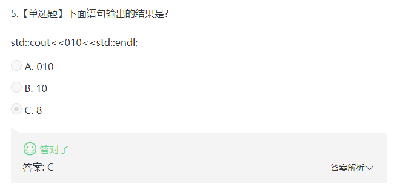
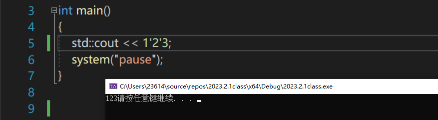
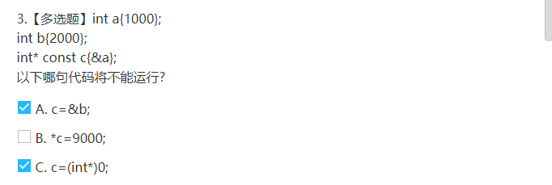
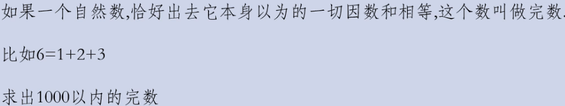

## 数字输出问题

4【基础知识】-习题与解析



0开头的数在Cpp当中一律视为8进制。

0x开头的数带Cpp当中一律视为16进制。

std::cout输出语句输出整形数据时，一律输出其十进制形式也就是类似%d格式控制符

cout十进制数字时，可以用‘来进行三个三个数分隔，但不是三个也可以用其分割，输出时’忽略输出




## 常量指针，指针常量




## 不用if比较大小

不用if，switch，三目等。

1-考虑使用abs平均值法

```cpp
int fMax1(int a, int b) 
{     
    return  ((a+b)+abs(a-b)) / 2;  
} 

or
    
//a<b时，a/b=0，所以前面为b*(b/a)，后面为b/a，那么结果就是b
//a=b时，a/b=1，所以前面为a+b=2a，后面为2，那么结果就是a
//a>b时，b/a=0，所以前面为a*(a/b)，后面为a/b，那么结果就是a
int fMax2(int a, int b) 
{ 
    int larger = (a*(a/b) + b*(b/a))/(a/b + b/a); 
    //long smaller = (b*(a/b) + a*(b/a))/(a/b + b/a); 
    return larger; 
} 
```

2-移位法

```cpp
int a{ 0 }, b{ 0 };
    std::cout << "请输入一个整数：";
    std::cin >> a;
    std::cout << "请再输入一个整数：";
    std::cin >> b;
    int c{ a - b };
    //c>>31，留下的就是全0或全1
    //若移位31位后留下的是0，则代表a-b>0，
    //将差值c&(c>>31) == c&0 == 0，用a减后等于本身

    //举例250 350
    //右移运算正数补0负数补1，若a-b<0,则右移31位后为全1（补码形式）
    // 全1补码的真值为-1，c&(c>>31) == c&-1 == c
    // 一个负数的差值与上-1(补码全1），压根不会改变其本身的值
    //故用a {250}减差值（-100），就得到的最大值350

    int d{ a - (c & (c >> 31)) };
    std::cout << "大一点的数是：" << d << std::endl;
```


## 政府采购系统代码优化

高级桌子300r，普通桌子300r，椅子三把100r，

一共需采购100件家具，需花完1w元，问采购方案，


码农代码：

```cpp
unsigned short a{}, b{}, c{};
	for(a=0;a<20;a++)
		for (b = 0; b < 34; b++) {
			int c = 100 - a - b;
			if ((c%3 == 0)&& 500 * a + 300 * b + 100 * c / 3 == 10000)
				std::cout << "a:" << a << "\tb:" << b << "\tc:" << c << std::endl;
		}
```

优化后：

```cpp
for (int num{}; num <= 3; num++) {
		std::cout<< "a:" << 4*num << "\tb:" << 25-7*num << "\tc:" << 75+3*num << std::endl;
	}
```

方法就是分析

a+b+c = 100

500a+300b+100c/3 = 10000

二式x3/100：

15a+9b+c = 300；

a+b+c = 100；

联立相减，上式-下式：

14a + 8b = 200

化简：7a+4b = 100   ===> b = 25 -  7/4a

又由于abc都得是整数，c还得是3的倍数呢，

由上式可以看出a必须是4的倍数，且b不能取负数，

a = 4*num

b = 25-7num

c = 100 - a - b = 75+3*num

又可以缩短num的取值，起码25-7x必须大于0嘛，num只能取0、1、2、3


## 最优解判断是否质数

判断一个数是否是质数，只要判断从3开始到sqrt(N)为止就行。

最好拿一个bool值做标志位，中间循环完在输出是否质数。

从三开始可以俩个数俩个数的加。

性能再次优化，如果该数能整除2，则一定不是质数。

不能整除2时才进入for循环

```cpp
bool flage = num %2 != 0;
for(int i=3;flage && i<=sqrt(num);i+=2){
	if(num %2 == 0){
		flage = false;
        break;
    	}
}
if(flage) std::cout<<"是质数"<<std::endl;
esle	std::cout<<"非质数"<<std::endl;
```


## 找出完数



```cpp
	for (int i = 4; i < 1000; i++) {
		int sum{};
		for (int j = 1; j < i; j++) {
			if (i % j == 0)	sum += j;			//找到从1到i之间能被i整除的数的和(0不能当除数)
		}
		if (sum == i)   std::cout << i << "是完数" << std::endl;
	}
```


## 不管正序倒序均能排序

自己写的：

```cpp
int main() {
	int RankArray[]{ 105,98,73,58,32,31,25,22,3,1 };
	//int RankArray[]{ 1,3,22,25,31,32,58,73,98,105 };
	int* ptrRank = new int[11];
	memset(ptrRank, 0, sizeof(int)*11);
	std::cout << "请输入新ranker的分值：";
	int Value{};
	std::cin >> Value;
	memcpy(ptrRank+1, RankArray, sizeof(RankArray));
	for (int i = 0; i < 11; i++) {
		std::cout << *(ptrRank + i) << " ";
	}
	std::cout << "\n";

	if (*(ptrRank + 1) < *(ptrRank + 10) && Value < *(ptrRank + 1) ||
		*(ptrRank + 1) > *(ptrRank + 10) && Value > *(ptrRank + 1)) {//顺序且最小，或逆序且最大
		*ptrRank = Value;
		goto Lable;
	}

	for (int i = 1; i < 11; i++) {
		*(ptrRank + i - 1) = *(ptrRank + i);											//先往前移一位
		if (*(ptrRank + i) < Value && Value< *(ptrRank + i + 1) ||		//只要value夹在有序序列相邻位之间。
			*(ptrRank + i)>Value && Value > *(ptrRank + i + 1)) {
			*(ptrRank + i) = Value;
			break;
		}
	}
Lable:

	for (int i = 0; i <  11; i++) {
		std::cout << *(ptrRank + i) << " ";

	}
	system("pause");
	return 0;
}
```

要提前空出一位，且因为首位永远是0，所以要特殊处理正序最小，逆序最大的情况；该情况不会出现value夹在中间的情况。


老师思路：主要在循环中得到该插入的index，然后前面后面都用memcpy搞定就行。

```cpp
int main() {
	int Rank[]{ 105,98,73,58,32,31,25,22,3,1 };
	//int Rank[]{ 1,3,22,25,31,32,58,73,98,105 };
	int count = sizeof(Rank) / sizeof(int);
	int* ptrNewRank = new int[count+1];
	memset(ptrNewRank, 0, sizeof(int)*11);
	int value;
	std::cout << "请输入新人Rank值: ";
	std::cin >> value;

	int getIndex{ count };
	for (int i = 0; i < count; i++) {
		if (Rank[0] > Rank[1]) {
			if (value > Rank[i]) {
				getIndex = i;
				break;
			}
		}
		else {
			if (value <  Rank[i]) {
				getIndex = i;
				break;
			}
		}
	}
	memcpy(ptrNewRank, Rank, sizeof(int) * getIndex);
	*(ptrNewRank + getIndex) = value;
	memcpy(ptrNewRank + getIndex + 1, &Rank[getIndex], sizeof(int) * (count - getIndex));
	std::cout << getIndex<<std::endl;
	for (int i = 0; i < count + 1; i++) {
		std::cout << *(ptrNewRank + i) << "\t";
	}
	system("pause");
	return 0;
}
```


老师优化后：（主要优化了for里的俩个if用异或合一起了）

```cpp
int main() {
	int Rank[]{ 105,98,73,58,32,31,25,22,3,1 };
	//int Rank[]{ 1,3,22,25,31,32,58,73,98,105 };
	int count = sizeof(Rank) / sizeof(int);
	int* ptrNewRank = new int[count+1];
	memset(ptrNewRank, 0, sizeof(int)*11);
	int value;
	std::cout << "请输入新人Rank值: ";
	std::cin >> value;
	int getIndex{count };
	bool bcase = Rank[1] < Rank[count - 1];		//是否正序
	for (int i = 0; i < count; i++) {
		if (bcase && value < Rank[i] || !bcase && value >Rank[i]) {
			//该if符合严格一真一假，可以改成bcase^value>Rank[i]
			getIndex = i;
			break;
		}
	}
	memcpy(ptrNewRank, Rank, sizeof(int) * getIndex);
	*(ptrNewRank + getIndex) = value;
	memcpy(ptrNewRank + getIndex + 1, &Rank[getIndex], sizeof(int) * (count - getIndex));
	std::cout << getIndex<<std::endl;
	for (int i = 0; i < count + 1; i++) {
		std::cout << *(ptrNewRank + i) << "\t";
	}
	system("pause");
	return 0;
}
```


## x&(x-1)、x&(-x)

```CPP
int func(int x) {
	int countx = 0;
	while (x) {
		countx++;
		x = x & (x - 1);
	}
	return countx;
}
int main() {
	std::cout << func(999) << std::endl;
	system("pause");
}
```

答案是8，x&x-1深层意思就是，判断该数2进制形式有多少个1

x&(x-1)：消除二进制下最后出现1的位置，其余保持不变

x&(-x)：保留二进制下最后出现的1的位置，其余位置置0


## 数字转字符串

```cpp
int val = 123456;
	char str[12]{};
	int index{};
	bool bfs = val<0;	//负数标志
	if(bfs) val = -val;	//先变成正数再说
	while (val) {
		str[index++] = val % 10 + 48;	//'0' asci码：48
		val /= 10;
	}//str中为逆序val
	if(bfs)	str[index++] = '-';
	//倒置
	for (int i = 0; i < index / 2 ; i++) {//6/2 = 3	123456
		char base = str[i];
		str[i] = str[index - i - 1];
		str[index - i - 1] = base;
	}
```

仅介绍一个思路，不要忘记处理负数
