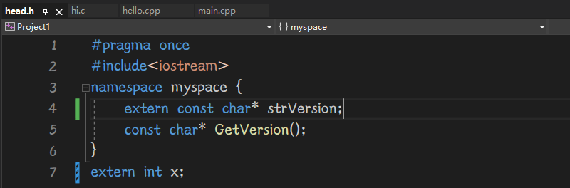

# 基本概念

## 作用域

作用域（scope）描述了名称在文件（翻译单元）的多大范围内可见。例如：函数中定义的变量可在该函数中使用，但不能在其他函数中使用；而在函数外文件内定义的变量则可以在所有函数中使用。

如果全局变量与局部变量重名，则采用就近原则，或者使用::来唤起全局变量。


例如：

```cpp
int a{10};		//或static int a{10};与之不同的仅链接性为内部
void func(){
	int a{20};
	a = 30;
	::a = 5;
}
```


## 链接性

链接性（linkage）描述了名称如何在不同文件（翻译单元）之间共享。链接性为外部的名称可以在文件间共享，链接性为内部的名称只能在一个文件内共享。自动变量没有链接性，他们不能共享。

函数也有链接性。下例改为内部链接性

```cpp
static int p(double x);
```


在被调用变量有外部链接性的同时，在调用文件（翻译单元）中使用extern来引用该变量，注意，使用extern声明的变量，它不给变量分配内存空间，因为他引用已有变量。

例如：

```cpp
被调用文件：
#include<xxxx>
xxxx
int a{10};	//链接性一定要为外部
int main(){
}
```

```cpp
调用文件：
#include<xxx>
xxxx
void func(){
	extern int a;
	a = 20;
}
```


## 存储持续性

在默认情况下，在函数中声明的函数参数和变量的存储持续性为自动，作用域为局部，链接性为无；

存储持续性为自动的情况下，存储持续性仅在离变量最近的{}内生效。

存储持续性为静态的情况下，存储持续性为整段程序，不初始化也会自动赋值为0，且仅初始化1次。


存储持续性应与作用域区分开来，例如

```cpp
int b{10}；
void func(){
	static int a{};
}

int main(){
}
```

变量a的基本情况是：作用域为局部，链接性为无，存储持续性为静态

即：a的内存一直在直到程序执行结束才会销毁；但他仅在func()函数内部可见。


变量b的基本情况是：作用域为全局，链接性为外部，存储持续性为静态

没错，在函数外声明的变量，即使没有加static也是静态的，也很好理解吧，因为作用域需要在全局


# 辨析表格


| 存储描述         | 持续性 | 作用域 | 链接性 | 如何声明         |
| ---------------- | ------ | ------ | ------ | ---------------- |
| 自动             | 自动   | 局部   | 无     | {}中直接声明     |
| 寄存器           | 自动   | 局部   | 无     | {}中使用register |
| 静态，无链接性   | 静态   | 局部   | 无     | {}中使用static   |
| 静态，外部链接性 | 静态   | 全局   | 外部   | {}外直接声明     |
| 静态，内部链接性 | 静态   | 全局   | 内部   | {}外使用static   |


- extern强调引用，extern int x；强调引用x这个东西。而不进行定义.可以用它只声明变量在头文件中，在多个翻译单元中展开也不会重定义。
- 凡使用const修饰过的变量，其链接性都会变成内部，故常量存在于每个翻译文件内，也许可以考虑将他写入头文件
- 


# 常见错误

## 重复定义

直观的重复定义不容易犯，但跨文件间一不小心会重复定义

此外，函数也有链接性，仅内部可见也需要加static

例如

```cpp
文件A：
int errors = 20;
...
int main(){}
```

```cpp
文件B：
int errors = 30;
...
int main(){}
```

gcc 文件A 文件B -o a.out

就会报错重复定义，违反了单定义原则，因为俩个errors都具有外部链接性，可以在其他文件中使用。

如果仅需要对该文件可见，需要改成'static int errors = 20;'


## extern强调引用

直接声明变量的同时，相当于定义了变量，例如：

```cpp
int x;
```

这样往往使得变量的使用更加快捷，但有些时候并不是这样的

例如在头文件里，我们都知道，头文件中最好只声明某物，不要定义，否则obj链接后容易重定义

倘若仅仅是全局变量还好，在想要用的翻译文件里extern 某物就可以告诉编译器这地方引用某物

设想一个场景，在某翻译文件中定义了某名称空间，你想在该工程下另一个翻译文件中使用该名称空间，

你就需要在头文件中声明该名称空间，名称空间里少不了变量，此时你有且只能有extern解决该问题


