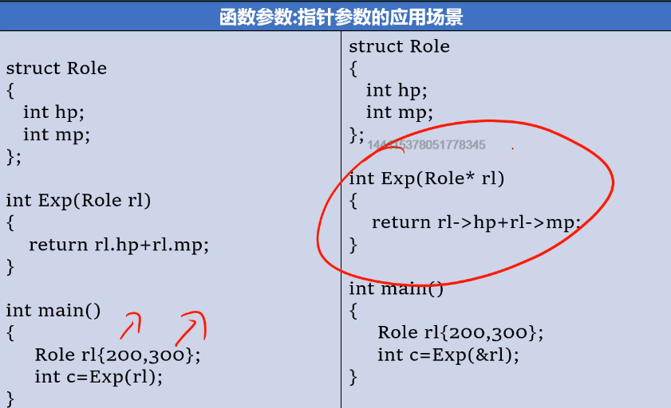

# 函数参数

函数带来的好处：

代码模块化，便于阅读维护，实现分工合作。

减少重复代码，降低工作量，实现低耦合。


函数的语法基本与C相同，不再多言，讲的简单点。


## 指针传参

指针传参的优越性再于，函数接收不需要开辟一个完整的超大的结构体形参之类的，只需要申请一个地址大小的指针变量，节约了内存，提升了效率。




## 数组传参

数组在被当作参数传递时，将会退化为指针。

指针指向原数组所在的内存空间。

因为反正要退化成指针，那么在函数形参方面，可以不带下标例如int ar[]就可以。或者直接用指针接收int*a

这俩种方法一模一样，前者可读性更高。


二维数组传参时，第二维度要写清白。例如int arr[\][3]


## 引用传参

引用相当于是Cpp的一个语法糖，其底层实现就是指针

其传参时与指针需要鉴别开的一点就是

引用&在使用时一定要初始化，仅int& a;是会报错的。在某些时候刚开始并没有初始化时不能用

而指针可以先传一个空指针过来，以后想怎么办怎么办，更灵活更容易出错。


引用前面当然也可以用const之类的修饰。


### 常见用法

```cpp
bool Act(const Role& acter,Role*& beActer)
{}
```

其中role*& xxx这样的写法是很常用的

从前往后解读，是一个role类型的指针 这个东西的引用，也就是role*的引用，可以修改指针本身，而不需要调二级指针。


### 引用数组传参

数组的引用当函数形参时，需要注明后续的数量

```cpp
int ave(int(&array)[10]) {		//非int(&array)[]
	std::cout << sizeof(array);
	return 0;
}
----------------
40
```


## 默认实参

除了函数重载，还可以通过设置默认实参来让外界不传某个参数时按某种方法执行

```cpp
void Sort(int arr[],unsigned count,bool bigSort = false)
```

像以上写法，如果不传入第三个参数bigSort，就会默认其为false。


注意！默认参数只能放到最后，但可以有多个默认参数，要按顺序传参。


## 不定量参数

简陋版类似main函数的接收参数，用一个字符指针数组来接受后续的各种参数

```cpp
main(int argc,char* argv[])
```

小注意点，如果路径中含有空格！！！，那么得把你认为一体的用“”引用起来，不然会被当作命令的不同组成部分而分开！


高级一点就像scanf()之类的函数，你压根不知道要传入多少个变量，就需要用到不定量参数的使用

```cpp
scanf("%d %d %d",&a,&b,&c);
```

需要包含cstdarg库文件，在定义函数时在后续加上，...

例如

```cpp
int add(unsigned count,...){//count为参数个数
    int rt{};
    char* c_arg;	//或者va_list c_arg；
    va_start(c_arg,count);//将参数数据指针赋值给c_arg
    for(int i=0;i<count;i++)	rt += va_arg(c_arg,int);//以int来读取c_arg
    va_end(c_arg);//释放指针
    return rt;
}
```

神奇之处在于，你每用一次va_arg来读取参数，函数结束后会自动给你指向下一个，

所以不要乱读取哟。


# 函数返回

- 要注意不要返回临时数组，栈变量会及时销毁
- 不要随意返回结构体本身，会带来多次不必要的性能开销，可以在函数里new结构体，并返回其地址的指针
- 

## 返回引用

Cpp较之C还有返回引用这种操作，例如

```cpp
Role& creatRole(const char* name, int hp, int mp) {
	
	return *(new Role{ (char*)name,hp,mp });
}

int main(int argc,char* argv[]) {
	Role& p = creatRole("seohyun", 10, 10);
	system("pause");
	return 0;
}
```

返回引用类型，可以作为左值而被修改

```cpp
#include <iostream>
using namespace std;
double vals[] = {10.1, 12.6, 33.1, 24.1, 50.0};
double& setValues(int i) {  
   double& ref = vals[i];    
   return ref;   // 返回第 i 个元素的引用，ref 是一个引用变量，ref 引用 vals[i]
}
// 要调用上面定义函数的主函数
int main ()
{
   cout << "改变前的值" << endl;
   for ( int i = 0; i < 5; i++ )
   {
       cout << "vals[" << i << "] = ";
       cout << vals[i] << endl;
   }
   setValues(1) = 20.23; // 改变第 2 个元素
   setValues(3) = 70.8;  // 改变第 4 个元素
 
   cout << "改变后的值" << endl;
   for ( int i = 0; i < 5; i++ )
   {
       cout << "vals[" << i << "] = ";
       cout << vals[i] << endl;
   }
   return 0;
}
```


# 函数底层的本质

详细参考：[C/C++ 函数调用是如何实现的？ - 知乎 (zhihu.com)](https://zhuanlan.zhihu.com/p/394009663)

随便看一段函数的反汇编代码，其中会有

call	函数名，（地址）

这样的写法，


顺着地址过去，就能发现，这其实是这个函数实现的首地址。

函数名就代表了首地址，指针也可以指向这地方。


而函数的最末尾一般都是ret


会让执行光标回到原来的地方


函数帧的组成基本结构，得记住


临时空间

临时变量2

临时变量1

上一个函数的EBP值		---	esp=ebp	

EIP地址返回值				--- call指令后一条的地址，

实际参数1						---先写的参数反而后入栈，通过ebp+8等取参

实际参数2

...

临时变量2

临时变量1


小于等于4字节的返回值用eax寄存器存，小于等于8子节点用edx寄存器存，再大就得用指针指，寄存器存地址


函数返回的整体流程：

原来栈帧：


首先通过

```
mov esp,ebp
pop ebp
```

就能销毁当前栈帧，详解：

esp指向ebp原来指向的值（上一个函数的EBP值），然后pop出栈，

ebp直接掉到上一个ebp值，esp也回掉一个，指向EIP返回地址值，此时esp，ebp指向


再然后就可以指向ret指令，再pop一个出来赋给EIP寄存器，此时栈帧：


此时程序控制权又回到了调用者手里（例子中的main手里），从EIP中的值作为地址开始执行，一般来说下一个指令会是add esp，0Ch之类的，因为此时实际参数已经没用了。早点出栈好。

如果函数调用前有保存过eax，ecx，edx寄存器的值，那么调用者main函数现在可以pop掉以恢复当时的值，这个动作后，栈顶就回到了开始整个函数调用过程前的位置，也就是esp再一次等于了ebp：都指向了双虚线位置


## 栈帧图


# 函数调用约定

函数调用约定是函数调用与被调用者之间的一种协议，这个协议主要规定以下俩个内容：

如何传递参数，如何恢复栈平衡

---

```cpp
int __cdecl ave(int,int);
```

__cdecl风格：

传递参数：参数入栈从右到左，

堆栈平衡：谁调用谁平衡，

正因为__cdecl这种堆栈平衡方式，才能够支持不定量参数，支持了谁调用谁恢复，谁调用了，就知道用了几个参数，恢复栈平衡时就清楚

---

```cpp
int __stdcall ave(int,int);
```

__stdcall风格：

参数传递：参数入栈从右到左

堆栈平衡：由被调函数自身平衡。

这种函数显然是不能支持不定量参数的。

Windows编程中WINAPI CALLBACK都是__stdcall的宏

---

```cpp
int __fastcall ave(int a,int b);
```

__fastcall风格：

参数传递：参数优先使用寄存器传入，（前俩个参数）

第三个参数还是用栈，依然是参数传递从右到左

堆栈平衡：由被调函数本身负责恢复。

---

```cpp
int __thiscall ave(int a,int b);
```

用作C++中类的访问，在学习C++类的底层知识时会普及该知识。


# 查看/设置栈大小

## linux

linux可以通过ulimit命令查看系统用户栈上限和设置上限

```cpp
ulimit -a 查看进程所有资源上限
ulimit -s xx 修改栈上限，单位bytes
```


也可以通过程序中调用函数修改
每个进程都有一组资源限制，其中一些可以用getrlimit和setrlimit函 数查询和更改。

```cpp
#include <sys/resource.h>
int getrlimit(int resource, struct rlimit *rlptr);
int setrlimit(int resource, const struct rlimit *rlptr);两个函数返回值:若成功，返回0;若出错，返回非0
这两个函数在Single UNIX Specification的XSI扩展中定义。进程 的资源限制通常是在系统初始化时由0进程建立的，然后由后续进程继 承。每种实现都可以用自己的方法对资源限制做出调整。
```

对这两个函数的每一次调用都指定一个资源以及一个指向下列结构 的指针。

```cpp
struct rlimit {
rlim_t rlim_cur; /* soft limit: current limit */
rlim_t rlim_max; /* hard limit: maximum value for rlim_cur */ };
}
```

在更改资源限制时，须遵循下列3条规则。
(1)任何一个进程都可将一个软限制值更改为小于或等于其硬限 制值。
(2)任何一个进程都可降低其硬限制值，但它必须大于或等于其 软限制值。这种降低，对普通用户而言是不可逆的。
(3)只有超级用户进程可以提高硬限制值。


## Windows

简单来说，就是在编译的时候加入一条形如 `-Wl,--stack=SIZE` 的指令即可。

SIZE 的单位：byte

例如，我要进行单文件编译，文件名为 `a.cpp`，给予该可执行文件最大 `256MB`的栈空间。

指令：


```
g++ a.cpp -o a.exe -Wl,--stack=268435456
```


# static与inline

利用static可以声明一个静态变量，static如果没指定初始化值，将自动初始化为0，且static只初始化一次

static与inline都可以用来声明定义函数。

我们都知道函数默认是外链的，也就是你不可以在不同文件（翻译单元）中定义相同的函数，如果你想将这些文件一起编译。会提示重定义

但允许以下情况：

头文件：

```cpp
#pragma once
#include<iostream>
void func();
void hello_func();
```

一个文件中

```cpp
int sos{ 10 };
static void func() {
	std::cout << "it's static func to sos:" << sos << std::endl;
}
void hello_func() {
	func();
}
```

另一个：

```cpp
void func() {
	std::cout << "it's hi func to sos:" << sos << std::endl;
}
```

main.cpp中：

```cpp
#include"head.h"
int main()
{
	hello_func();
}
-----------------------------
it's static func to sos:10
```

也就是说存在静态函数和普通函数的时候，函数调用也采取就近原则。


而且，还有些程序员喜欢讲静态函数写在头文件里，这样，该函数的作用域都仅在调用该头文件的源文件中，便不会相互冲突。


inline基本没人用了。

我们可以用inline声明一个内联函数，

内联函数会建议编译器讲这个函数处理成内联代码以期望提升性能，

仅建议，是否采纳编译器决定。


举例：

```cpp
int add(int a,int b){
	return a+b;
}
int main(){
	int c = add(1,2);
}
```

如果是普通的add()函数，则他的操作一般是：

push 2

push 1

call add

add esp 8

一套常规的唤起函数的操作，如果函数前面加了inline，则有可能会直接给你mov c 1+2之类的

但之所以现在不用inline了，因为现在编译器较之以前更智能了，一般都会打开优化代码，即使你不加inline，他也会给你自动优化，且inline只是一个建议，编译器看心情采用

 

内联函数不要用递归，这是显而易见的


# 函数重载

C语言本身不能函数重载，得自己设计。

但Cpp本身有了重载这一概念，它根据函数及其形参类型对每个函数名进行加密例如：

```cpp
long MyFunctionFoo(int,float);
-->
?MyFunctionFoo@@YAXH
```

这一过程称之为：*名称修饰*。修饰规则因编译器而不同。

如此，编译器就不会call错函数啦。

函数重载，您在使用过程中您需要注意：

- 仅返回值的不同，是不足以成为重载的条件，函数重载的关键是函数特征标，仅由函数名及参数决定


- 编译器在检查函数特征标时，将某个**类型**与该**类型的引用**视为同一特征指标


- 除去char*与引用以外，不能重载其类型与const类型：

```cpp
void Func(const int a) {
	std::cout << "it's const int Func" << std::endl;
}
void Func(int a) {
	std::cout << "it's int Func" << std::endl;
}
```

以上内容非法，

但对于char*来说，

以下内容合法：并且将会区分俩者进行匹配

```cpp
void Func(const char* a) {
	std::cout << "it's const char* Func" << std::endl;
}
void Func(char* a) {
	std::cout << "it's char* Func" << std::endl;
}
```

对于int&来说，

以下内容合法，且能正确区分匹配，但意义貌似不大：

```cpp
void Func(const int& a) {
	std::cout << "it's const int& Func" << std::endl;
}
void Func(int& a) {
	std::cout << "it's int& Func" << std::endl;
}

```


- 辨析char*形参，在未重载的情况下，

```cpp
void dribble(const char* bits);
可以接收
const char*		与		char*
```

主要是因为，非const值赋值给const变量是合法的，但反之非法。

但倘若该函数重载：

```cpp
void dribble(const char* bits);
void dribble(char* bits);
```

则const值与非const值将分别匹配不同的函数；


- 在Cpp中没有匹配的原型不会自动停止使用其中的某个函数，因为Cpp将尝试使用标准类型转换强制进行匹配，如果add()作为唯一原型，则函数调用将会尝试自动将0.1，0.2参数强转匹配，而现在有俩种匹配方案，所以Cpp会报错，将拒绝这种函数调用


- 特别的，实参为char型在匹配重载函数，且重载函数没有char形参时，会优先匹配int

```cpp
void Func(float f) {
	std::cout << "介是一个floatFunc" << std::endl<<f;
}
void Func(int f) {
	std::cout << "介是一个intFunc" << std::endl<<f;
}
void Func(short f) {
	std::cout << "介是一个shortFunc" << std::endl<<f;
}
---------------
char x{ 61 };
Func(x);
---------------
介是一个intFunc
61
----------------
char x{61};
Func((float)x);
----------------
介是一个floatFunc
61
```


- 强转与引用

当强转与引用碰撞在一起时，注定要发生一些需要理解的东西

```cpp
void Func(float f) {
	std::cout << "介是一个floatFunc" << std::endl<<f;
}
void Func(int& f) {
	std::cout << "介是一个int&Func" << std::endl<<f;
}
-----------------------
char x{ 61 };
Func((int)x);
-----------------------
介是一个floatFunc
61
```

强转局部变量时，x本身没有变化，临时变量是没有引用实体的，所以不会被引用匹配


- 不能以默认参数的不同而重载

```cpp
void Func(const int a = 10) {
	std::cout << "it's a=10 Func" << std::endl;
}
void Func(const int a = 20) {
	std::cout << "it's a=20 Func" << std::endl;
}
```

以上是非法的，因为默认函数不用传参，相当于Func()就可以用，编译器不知道call哪个

# 函数模板

C++编译器实现了C++新增的特性——函数模板，函数模板是对函数的描述，他们使用<泛型>来定义函数，其中的泛型可以用具体类型进行替换，

由于模板允许以泛型（而不是具体形式）的方式编写函数，则有时也被成为泛型编程/通用编程；

```cpp
template<typename Type>
void Swap(Type& t1, Type& t2) {
	Type temp = t1;
	t1 = t2;
	t2 = temp;
}
---------------------------
    or
---------------------------
template<typename Type> void Swap(Type& t1, Type& t2) {
	Type temp = t1;
	t1 = t2;
	t2 = temp;
}
```

其中template和函数需要写在一起，不能分开写，但可以写作一行


在进行函数声明时，也应该带上template

```cpp
template<typename T>
void Swap(T&, T&);
--------------------
template<typename T> void Swap(T&, T&);
```

其中Typename可以和后面定义的函数typename不同，但是！！你最好写成一样的


此外，C++98标准前，人们没有typename，使用的时class代替typename,

在这种情况下，您基本可以认为这俩者等效

```
template<class T>
void Swap(T&,T&);
```


模板是很灵活的，不要忘记他还可以代指针，

```cpp
template<typename T> T Add(T, T);
int a{100},b{200},c{300};
c = *Add(&a,&b);
```

但往往，盲目简单的用模板代指针时就会狠狠的出错，

很大原因是因为，指针需要反复的自己*或&，而模板不会特殊处理指针


以上例子是a，b的地址相加再返回，错的明显

类似例子还有比大小，用指针就会变成，比较俩地址谁大谁小，没意义，还不报错！


## 模板中多个不定量

倘若要进行当前ave函数改写成模板，

```cpp
int ave(int a,int b){
xxxxxxxxxxxx
}
```

很容易可以想到：

```cpp
template<typename T> T ave(T t1, T t2) {
	return (t1 + t2) / 2;
}
```

但如果是这种，返回值，参数有多个类型的，其实模板也支持多种不定量：

```cpp
int ave(float a,int b){
xxxxxxxxxxxx
}
```

可以写成：

```cpp
template<typename T1,typename T2> T2 ave(T1 ta,T2 tb){
xxxxxxxxxxxxx
}
```

上例返回值的类型由第二个参数决定


## 显示指定函数模板

```cpp
template<typename T> T Add(T, T);
------------
Swap<int>(192.5f,153.0f);
```

以上函数Swap通过指定为int模板，即使参数时俩float型数据，也会扔相当于Swap（int，int）里

通过上面的例子你可能觉得这是个sb操作，没啥用，多此一举，不如让编译器自己判断

但有时候，事情不是那么恰好全是Type的，就需要自己指定

例如：

```cpp
template<typename T> T Add(T, T);
------------
Add(10.5f,5);		//非法    
```

无论T取啥类型都匹配不上，但让人类来判断却很简单，不如让他后面的int强转成float就行了

但模板一旦套用就比较死板，他不敢擅自行动给你改了，就需要你来指定一些，显示的为函数模板指定一个类型：

```cpp
template<typename T> T Add(T, T);
------------
Add<float>(10.5f,5);		//合法    
```


显示实例化可以显示具体的指定多个模板量：

```cpp
myAdd<float,int>(a,b);
```

之类的写法，前提是定时是有多个typename


有一种情况必须显示指定模板才行：

```
double ave(int a,float b){
	return (a+b)/2;
}
```

例如将以上改写成模板：

```cpp
template<typename T1,typename T2,typename TR>
TR ave(T1,T2);
```

此时问题在于若不指定TR，则编译器无法根据进来的参数判断TR的类型。

若想使用则必须：

```cpp
ave<int,float,double>(100,29.5f);
```

参数的指定可以只指定一个或一部分，但顺序不能变

若想要将返回值与参数/函数结果挂钩，可以用后续decltype

```cpp
template<typename T1, typename T2> auto ave(T1 ta, T2 tb) -> decltype(tb) {
	return (ta + tb) / 2;
}
```


模板与函数指针合用仿写qsort：

```cpp
template<typename t> void ifBiggerSwap(t& t1, t& t2) {
	if (t1 > t2) {
		t temp = t1;
		t1 = t2;
		t2 = temp;
	}
}


template<typename type, size_t count> 
void mySort(type(&array)[count], void (*compare)(type&, type&)) {
	for (int i = count; i > 0; i--) {
		for (int j = 0; j < i -1; j++) {
			compare(array[j], array[j + 1]);
		}
	}
}
```


## 模板的例外处理

从之前的例子可以知道，模板是很灵活的操作，但有时却过于死板，例如比较两数的模板：

```cpp
template<typename T>int myAdd(T t1,T t2) {
	return t1+t2;
}
```

传进来的如果是基本数据类型，那基本上是可以正确运行的，

但如果传进了指针数据，您的本意是可能是想：将俩个指针指向的地址中的值相加

而程序会默默的将俩指针，也就是俩处地址相加，自然会发生错误。

为了规避这种错误，我们可以利用：template<>定义一种函数的例外情况

```cpp
template<typename Type> Type myAdd(Type t1, Type t2) {
	return t1 + t2;
}
--------------------------------------------
例外处理，又称显示实例化：
template <> int* myAdd(int* a, int* b) {
	int* pvalue = new int{ *a + *b };
	return pvalue;
}
还有一种写法：函数名后括号前再加一个<>，等效以上
template <> int* myAdd<int*>(int* a, int* b) {
	int* pvalue = new int{ *a + *b };
	return pvalue;
}
```

需要注意的是，类型需要和模板统一，如上例，返回值为Type，参数为俩个Type，则特殊实例化只能将这三个Type改为一样的，且

调用函数在匹配时，优先非模板函数，其次特殊实例化函数，最后才是普通模板函数

在例外显式化时，template<>中可以添加非类型参数


## 模板重载

函数模板也可以重载，满足重载的基本要求即可：

```cpp
template<typename Type> Type myAdd(Type t1, Type t2) {
	return t1 + t2;
}
//模板重载
template<typename Type> Type myAdd(Type t1, Type t2,int x) {
	return t1 + t2+x;
}
//模板显式实例化（特殊处理）
template <> int* myAdd(int* a, int* b) {
	int* pvalue = new int{ *a + *b };
	return pvalue;
}
//函数
int* myAdd(int* a, int* b) {
	int* pvalue = new int{ *a + *b };
	return pvalue;
}
//函数重载
float* myAdd(float* a, float* b) {
	float* pvalue = new float{ *a + *b };
	return pvalue;
}
```

以上内容同时存在合法：函数重载，函数模板，函数模板重载，函数模板显示实例化，


调用函数在匹配时，优先非模板函数（重载），其次特殊实例化函数，最后才是普通模板函数


## 模板参数

### 模板参数默认值

函数模板的参数也可以设置默认值，就像普通参数一样，而且

普通参数的默认参数需要写最后，而模板参数默认没这个规则：

```cpp
template<typename TR = int ,typename T1,typename T2>
TR ave(T1 a,T2 b){return (a+b) / 2;}
```

也可以默认成其他typename参数成员,

这个时候需要写在后面，因为需要前者出现才能指向

```cpp
template<typename T1,typename T2,typename TR = T1 >
TR ave(T1 a,T2 b){return (a+b) / 2;}
```


### 非类型的模板参数

函数模板可以有非类型的模板参数

```cpp
template<int max,int min,typename type>
bool ChangeHp(type& hp,type damage){
	hp -= damage;
    if(hp >max)	hp = max;
    return hp <min;
}
------------------------------------------
int hp{2500};
ChangeHp<2000,1000>(hp,100);
```

感觉就是函数传参换了个地方变成非类型模板传参；

但是和传参进去的底层有所区别，这个max，min时用2000，1000替换掉的

不是变量，没有临时变量空间，不能做到max = 100；这样，max，min不是左值，不是变量

非类型的模板参数是一个常量，可以用const int类型的数据传进去。

const int x = 1000;

ChangeHp<x,1000>(hp,100);


且可以设置默认值

```cpp
template<typename type,int max = 2000,int min = 1000>
bool ChangeHp(type& hp,type damage){
	hp -= damage;
    if(hp >max)	hp = max;
    return hp <min;
}
```

非类型模板参数可以用前面的typename声明

```cpp
template<typename type,T max = 2000,T min = 1000>
bool ChangeHp(type& hp,type damage){
	hp -= damage;
    if(hp >max)	hp = max;
    return hp <min;
}
```


### 巧妙使用非类型处理固定大小数组

以前函数中经常使用指针来接受数组参数，这样往往需要额外传入一个count参数说明该数组大小，

例如：

```cpp
int ave(int* array,size_t count){
}
```

如果用引用数组，则会写死下标大小

```cpp
int ave(int(&array)[10]){
}
```

但利用非类型模板参数，则可以巧妙的让编译器自己算出count。

甚至不需要自己设置模板中count的值

```cpp
template<typename type, int count>
type ave(const type(&array)[count]) {
	type all{};
	for (int i = 0; i < count; i++) {
		all + = array[i];
	}
	return all / count;
}
---------------------
int a[5]{1,2,3,4,5};
ave(a);
```

这个引用是不可或缺的，如果去掉应用，函数定义将等同于：

```cpp
type ave(const type* array){}
```

count就失去了它的意义。


真是巧妙而又让人摸不着头脑的东西。


## 模板的本质

```cpp
template<typename T>
T ave(T a,T b){
	return a+b;
}
------------------
ave(100.200);
ave(short(100),short(200));
```

反汇编如下：


可以清楚的发现啊，同一个模板，call函数的地址不一样，

说明了编译器根据我们的模板自动生成了俩函数。

以及，对于例子

```cpp
template<typename type,T max = 2000,T min = 1000>
bool ChangeHp(type& hp,type damage){
	hp -= damage;
    if(hp >max)	hp = max;
    return hp <min;
}
------------------
ChangeHp(hp,200);
ChangeHp<int,2000,1000>(hp,200);
```

以上俩函数call地址也不同。。


# auto  ->  decltype

之前知道auto可以声明一个变量，让编译器根据值来推断类型，但这样真的不建议，

顶多也只在foreach时用来接收数据时用auto，或者

用auto声明变量，还可以声明函数的返回值，但也不能是参数，

```cpp
auto myAdd(float a, int b) {
	return a + b;
}
```

但这并不是发明auto的痛点，不管是函数还是变量都不建议使用auto来声明。


## 了解auto

auto的一些小特性

- 首先auto有去const化，不会自动判断const

```cpp
const int a{100};
auto b = a;//此时b的类型是int
```


- auto在推断类型时，不会推断&

```cpp
int a{100};
int& b = a;
auto c = b;//此时c的类型是int
```


- auto可以利用函数返回值来确定类型

```cpp
auto x = add(1,2);//add返回什么类型，x就是什么类型
```


## auto与拖尾->

```cpp
auto bigger(int&a , int&b){
	return a>b?a:b
}
---------------
bigger(a,b) = 500;
```

上例中，我们希望bigger函数返回的是一个int&类型，达到谁大就把谁改成500的效果

但auto在推断类型时，会优先成非引用类型int

为了达到预想目的，我们可以使用拖尾函数：

```cpp
auto bigger(int& a,int& b) ->int&{
	return a>b?a:b;
}
```

拖尾函数可以指定函数的返回值：

```cpp
auto myAdd(float a, int b) ->double{
	return a + b;
}
---------------------
auto x = myAdd(1.5f, 5);    
std::cout << typeid(x).name() << std::endl;
----------------------
double
```

拖尾函数只能与auto合作，不能强改具体的返回类型


## decltype

### 概念

在[C++程序设计语言](https://zh.wikipedia.org/wiki/C%2B%2B程序设计语言)中，`decltype`作为[操作符](https://zh.wikipedia.org/wiki/操作符)，用于获取[表达式](https://zh.wikipedia.org/wiki/表達式)的[数据类型](https://zh.wikipedia.org/wiki/数据类型)。[C++11](https://zh.wikipedia.org/wiki/C%2B%2B11)标准引入`decltype`，主要是为[泛型编程](https://zh.wikipedia.org/wiki/泛型)而设计，以解决泛型编程中有些类型由[模板](https://zh.wikipedia.org/wiki/模板_(C%2B%2B))参数决定而难以（甚至不可能）表示的问题。


在泛型编程中，若类型由函数参数决定，则获知之常非易事，在需要获取函数模板实例化的返回类型时尤然，所以decltype在C++11中应运而生。


从语义上说，`decltype`的设计适合于通用库编写者或编程新手。总体上说，对于变量或函数参数作为表达式，由`decltype`推导出的类型与源码中的定义可精确匹配。而正如`sizeof`操作符一样，`decltype`不对操作数求值。


decltype关键字可以得到表达式的类型,但decltype并不是一个函数哦，和sizeof一样是操作符

语法：

```cpp
decltype(表达式)
```

是不是会让你想起typeid(变量).name();

但这个不能让你作为类型来声明变量，而decltype就是干这个的！

常用

```cpp
int a{};
unsigned int b{};
decltype(a - b) x{10};//相当于unsigned int x{10}；
```

灵活的是decltype()括号里不仅仅可以是变量，还可以是表达式，各种各样的指针/函数等，

他会自己推断出来

```cpp
auto myAdd(float a, int b) ->double{
	return a + b;
}
-------------------
int a{ 10 };
float b{ 19.2f };
decltype(myAdd(b,a)) x{ 5.5f };

-------------------
输出：double
```

以及很常用的，

将decltype用于拖尾函数，而这个拖尾decltype里有函数，且这个函数的参数根据模板值变化

```cpp
int& foo(int& i);
float foo(float& f);

template <class T> auto transparent_forwarder(T& t) −> decltype(foo(t)) {
  return foo(t);
}
```

`decltype`便是本段代码的核心部分，用于保存“包装函数是否返回一个引用类型”这一信息


### 处理原则

编译器处理decltype关键字时的原则：

- 第一原则：

如果decltype内的表达式没有经历任何运算，那么得出的数据类型等同表达式内的数据类型，并且decltype可以保留const和&；这是auto比不了的。


- 第二原则

如果decltype内的表达式经历了运算，那么得出的数据类型时根据运算结果是否有固定的内存地址（左值）来决定，如果是左值，则提供为该类型的引用类型，如果是没有固定内存地址，则提供该类型作为结果。


*pa，pa[0]也算进行了运算，运算结果是a的值，显然，a的值有专门的存储地址，是左值，故提供其int&

例如&a，得到结果是a的地址，然而a的地址这个值，并没有在内存中有专门的存储地址，于是decltype得到int*

例如*pa+1，这显然是个临时值仍在栈临时空间里，非左值，于是decltype提供int

例如pa[5]，这个地方存的值室友固定内存地址的，只是这个地址不归你访问，所以decltype提供int&

注意：就算加一个（），也会当作一次运算


decltype（a++）	得到int

decltype（++a）	得到int&


- 第三原则

如果decltype内的表达式是一个函数，那么得到的数据类型是根据函数的返回值来确定的；

注意！decltype不会真正执行表达式的运算，不需要编译，所以里面的函数不会执行

```cpp
int& foo(int& i);
float foo(float& f);

template <class T> auto transparent_forwarder(T& t) −> decltype(foo(t)) {
  return foo(t);
}
```


### C++14新写法

同样的函数，C++11时：

```cpp
auto bigger(int& a, int& b) -> decltype(a > b ? a : b) {
	return a > b ? a : b;
}
```

C++14新写法：

将decltype放到前面,简洁一些

```cpp
decltype(auto) bigger(int& a,int& b){
	return a>b?a:b;
}
```


### 常见的与模板搭配的错误

返回值与模板某参数挂钩时：

```cpp
template<typename T1, typename T2> auto ave(T1 ta, T2 tb) -> decltype(tb) {
	return (ta + tb) / 2;
}
```

返回值与模板函数结果挂钩时：

```cpp
template<typename T1, typename T2> decltype(auto) bigger(T1 t1, T2 t2) {
	return t1 > t2 ? t1 : t2;
}
```

注意了decltype是编译器推断的，它不需要程序的运行，

这也导致了它没有你想的如此灵活，例如

```cpp
template<typename T1, typename T2> decltype(auto) compare(T1 t1, T2 t2) {
	return t1 > t2 ? t1 : t2;
}
----------------
int a{ 50 };
float c{ 100.5f };
compare(a, c) = 0.5f;    //非法，该compare返回float型，无引用
-----------------
```

为什么！你一定大吃一惊，不是说好了会根据返回值的类型来定，而且能识别const和&么？

这就需要注意：

---


编译器错误C3487：所有返回表达式必须推导为相同类型

返回值也会，参数也好，必须在编译阶段就定下来，不能在运行时动态确定

编译器不知道这俩谁大，提前准备好某一种类型的引用（本质指针），却有可能指向另一个值是不可以的

如果要返回引用，则返回的表达式都得是相同的类型

否则只能返回基本类型

同理，也不能返回不定的指针（char\*,int*）之类的


存在类型转换问题，就没办法传指针/引用了

---


