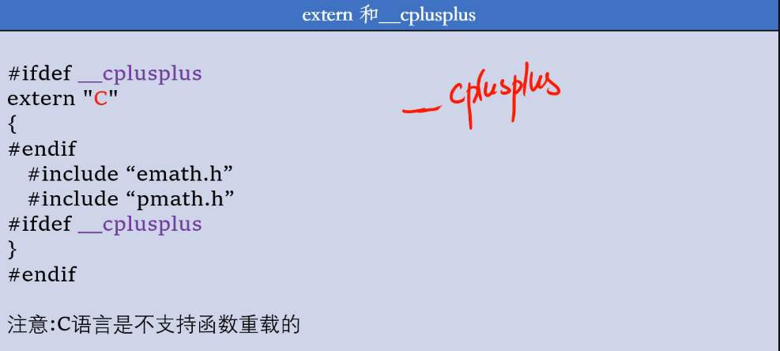

# 头文件

头文件编译器不会主动编译它，除非有源文件调用相关的头文件。

源文件调用头文件其实就相当于将该头文件里的东西复制一份到源文件中。


### 头文件定义变量

不要企图在头文件里定义变量，很容易造成重复，

顶多可以在头文件中引用全局变量：extern int x；

也就是说，头文件里，声明可以，定义打咩。

头文件里其实可以勉强用static定义静态变量的，原因同static定义静态函数，作用域仅在引用源文件可见，则不会冲突，

但这样在其中一个文件中++该变量，对另一个文件是没有影响的。

### 头文件定义函数

#### 普通函数

头文件里仅供声明函数，最好不要具体定义函数

因为极有可能不同文件include该同一头文件展开，

而将他们一同编译的时候就会产生函数重定义。

#### 静态函数

有些程序员喜欢讲静态函数写在头文件里，这样，该函数的作用域都仅在调用该头文件的源文件中，便不会相互冲突。我只能说这也算合法。。。

#### 内联函数

以及，记一句，inline内联函数也可以写在头文件里，

inline函数（即内联函数）对编译器而言必须是可见的，以便能够在调用点展开该函数，与非inline函数不同的是，inline函数必须在调用该函数的每个文件中定义。当然，对于同一程序的不同文件，如果inline函数出现的话，其定义必须相同。

正因为如此，建议把inline函数的定义放到头文件中，在每个调用该inline函数的文件中包含该头文件。这种方法保证了每个inline函数只有一个定义，且程序员无需复制代码，并且不可能在程序的生命周期中引起无意的不匹配的事情。
																															——摘自《C++ Primer》


### 防止嵌套引用

在同一个文件（翻译单元）中，只能将同一个头文件包含一次。

如果情况简单，那么谁也不会犯这个错误，

而如果多个头文件直接有相互include的倾向时，就很容易犯这个错，

所以我们一般通过以下预处理编译指令来管理这种情况

```cpp
#ifndef COORDIN_H_
#define COORDIN_H_
#include<stdio>
....
    
#endif
```

ifndef即if not define，如果在本文件中未define某个东西，则照常，否则直接跳到endif。

\#ifndef的方式受C/C++语言标准支持。它不光可以保证同一个文件不会被包含多次，也能保证内容完全相同的两个文件（或者代码片段）不会被不小心同时包含。

 由于编译器每次都需要打开头文件才能判定是否有重复定义，因此在编译大型项目时，ifndef会使得编译时间相对较长，因此一些编译器逐渐开始支持#pragma once的方式。


第二种方法：

```cpp
#pragma once
```

 \#pragma once一般由编译器提供保证：同一个文件不会被包含多次。注意这里所说的“同一个文件”是指物理上的一个文件，而不是指内容相同的两个文件。你无法对一个头文件中的一段代码作pragma once声明，而只能针对文件。
  其好处是，你不必再费劲想个宏名了，当然也就不会出现宏名碰撞引发的奇怪问题。大型项目的编译速度也因此提高了一些。
  对应的缺点就是如果某个头文件有多份拷贝，本方法不能保证他们不被重复包含。当然，相比宏名碰撞引发的“找不到声明”的问题，这种重复包含很容易被发现并修正。


# 联合编程

在之前函数重载我们知道了一个知识，编译器之所以不会弄混重载的函数，

是因为编译器根据函数名和参数列表经过了一个叫“名称修饰”的过程，根据名称修饰后的：

```cpp
?functhion@@YAXXZ
```

进行区分重载的函数

而且，名称修饰的规则，根据编译器不同而不同，

糟糕的是，当您期望.c文件和.cpp文件混用联合编程的时候，这就会出问题，

同一个函数在.c和.cpp文件中，编译器识别不出这是同一个函数而默默执行

.c文件中定义的函数一般会被编译器处理为：

```cpp
_functhion
```


## extern “C”

举一个实际场景例子：

head.h：

```cpp
void func( );				//如此声明不行
extern "C" void func();		//合理的
```

hello.cpp：

```cpp
#include<iosteam>
#include"head.h"
int main(){
	func();
}
```

hi.c：

```c
#include<stdio.h>

void func(){
	printf("hi world\n");
}
```

extern "C"将会告诉编译器，按照C语言风格声明，处理成：_func()

于是就找得到hi.c中的具体定义了。


## extern"C"{}

当多段代码都需要用C风格声明时，可以这么写：

```cpp
extern "C" {
	void func();
	void hello_func();
}
```

甚至于将头文件里所有的按C风格解释：

```cpp
extern "C" {
	include"hello.c"
    include"hi.c"
}
```


## __cpluscplus

Cpp文件中可以识别标识符__cpluscplus，可以通过这个判断该文件是否是cpp文件



这种写法，如果是Cpp文件，则会extern“C”，如果是c文件，则会仅#include

一旦这么做，要注意函数重载的问题，C语言可不会重载。


## 典型错误

C和C++源文件混用很容易出现以下问题：

报错：LNK4042;LNK2019;LNK1120;


头文件：head.h

源文件：hi.cpp	hi.c

源文件在编译过程中会编成.obj目标文件再进行链接，而此时hi.cpp和hi.c这么一搞全成了hi.o文件

于是就报错了。


# 从编译器角度

### One Definition Rule


注：此处const 变量特殊，可以在不同转换单元中有多个const变量，他们拥有不同的内存地址


### 转换单元/翻译单元


编译器单独负责将每一个转换单元生成对应的对象文件（.obj)，对象文件包含了转换单元的机器码和转换单元之间的某些引用信息（不在转换单元内定义的对象）

最后链接器将各个转化单元的对象文件链接起来，生成最后的目标程序


### 连接属性


### 定位错误

很多时候需要搞清楚，到底是编译成目标文件阶段发送了错误，还是obj之间链接出现了错误。

一般来说LNK2019等link型错误，且错误发生的文件标识为XXX.obj，则为链接错误。


而C2004等C型错误，且错误发生文件标识为XXX.cpp，则为编译错误


### 未定义行为


下面例子，尽量要用无符号数做位运算。


# assert

## 基本概念

assert被最初的那一批翻译成：断言，真是让人摸不着头脑。。


assert本身是一个宏，需要头文件cassert

我们在写代码的时候可以通过assert来检测某些条件（而你又不确定这个东西的值）

assert内bool值若非false即会调用std::abort()来弹窗警告


## 取消assert

您可以在cassert引用之前定义一个

```cpp
#define NDEBUG
```

会使得后面的assert()失效掉。


## static assert

assert是动态的，动态是我们程序运行起来，根据情况而定

static assert不需要头文件cassert，用法和assert基本一致

```cpp
static_assert(bool值，"报错信息");
-----------
static_assert(sizeof(int*) == 4,"it's not x86");
```

static说明了，前面这个bool值一定要是一个常量，不能是一个变量


# sdk:

## 概念

首先我需要辨析一下sdk与我之前了解到的dll有什么区别：

SDK 是一种软件开发工具包。

SDK包含各种工具来帮助应用程序开发过程等。

API 是应用程序编程接口，例如 Win32 API。

微软为开发人员提供的方法 编程驱动程序和应用程序等都包含在动态链接库 （DLL） 中。

DLL 基本上是可以从可执行代码调用的函数和过程的集合 - 它不是可执行文件，不能单独运行。

---

DLL代表动态**链接**库：顾名思义，它是代码和/或资源（如图标，位图，光标等）的集合，其组织和编译方式使得可以随时加载库（单词“动态”） 正在运行的程序需要使用它;DLL 也称为“进程内服务器”，因为它的作用类似于服务器程序，提供可调用以执行操作和任务的代码，除了加载 DLL 的事实（“进程中”一词）和 在加载它的程序的同一地址空间中执行（相反，可执行 EXE 文件称为“进程外服务器”）。


SDK代表**软件开发工具包**，一组开发工具，允许为操作系统和/或软件或硬件平台创建应用程序。
SDK 是 API（应用程序编程接口，开发人员可用于开发应用程序源代码的非常大的库和函数集）和工具（如编译器和链接器，用于创建可执行文件）的集合 对于从开发人员编写的源代码开始的应用程序）;拥有SDK，开发人员可以构建针对SDK构建平台的任何应用程序（使用或不使用像Microsoft Visual Studio这样的开发环境，允许 开发人员以更舒适的方式使用 SDK 提供的工具）。

---


## 建立过程


## 使用过程

别人下载好该sdk到D盘后，该如何使用呢

得让编译器知道有了新的库


把自己的lib和.h所在的文件夹路径放进来就行了，记得用分号分割不同路径。

放进来后就可以#include<>中查找到自己的xxx.h了

然后库目录也得加进来，路径写法与上面相同


加了这一些还是不能调用，您只告知了编译器，在这个路径下有库文件，编译器不会主动用该库文件

有俩种方法使用该库文件：

预编译指令：

```cpp
#pragma comment(lib,"xxx.lib")
```

或者不加预编译指令，手动将其配置到其编译器里。


# 创建自己的项目

看到黑土档案局项目了吗，这就是属于自己哒项目模板，挺好玩的

可以在这里面提前引用好自己的库目录，包含目录，链接器附加依赖项等等，以后就可以套用这个啦


操作过程：

项目--导出模板--


