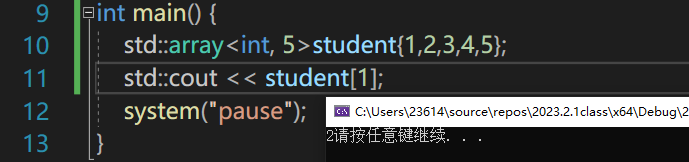
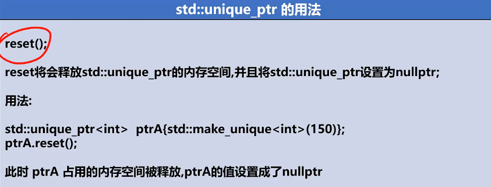
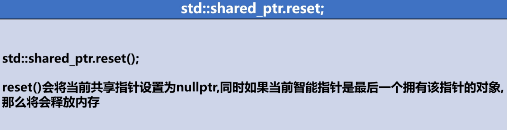
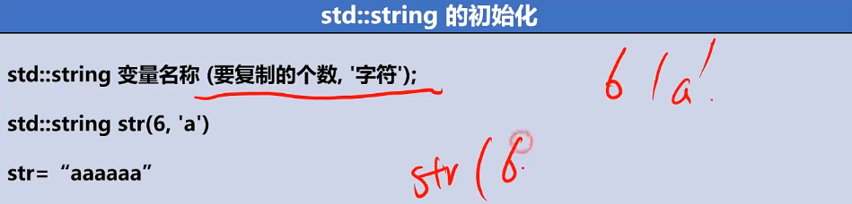
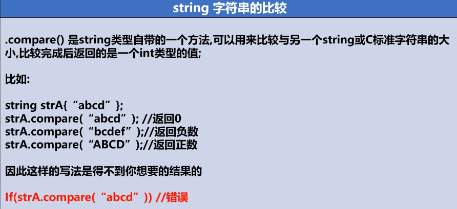

# 数组

数组的本质是按照所申请的数据类型，向操作系统申请了一段连续的内存空间。

原生的数组具有越界的风险。

.

常见的数组辨析：

```cpp
int *ptrs[10];    // ptrs是含有10个整型指针的数组，普普通通的指针数组
 
int &refs[10]=/* ?*/;   // 错误, 不存在引用的数组
 
int (*Parray)[10] = &arr;   // Parray 指向一个含有 10 个整数的数组，
							//数组指针，Parray相当arr的别名
 
int (&arrRef)[10] = arr;   // arrRef是一个含有 10 个整数的数组的引用
 
```

多嘴一下，数组的引用当函数形参时，需要注明后续的数量

```cpp
int ave(int(&array)[10]) {		//非int(&array)[]
	std::cout << sizeof(array);
	return 0;
}
----------------
40
```


## foreach

c++11新增了foreach循环写法，和java一样：

```cpp
int student[5];
for(int i: student){
	std::cout<<i<<std::endl;
}

char name[]{"hello"};
for (char i : name) {
	std::cout << i << std::endl;
}
```

foreach语法适用于原生数组、array、vector向量。

能将数组student/name中的成语元素逐一赋值给变量i（自主声明该i类型），

并不一定俩者类型要匹配，根据实际需求自我把握。

当然你也可以auto，让编译器自己推断。


foreach不适用于多维数组，要用，也只能一次用一个维度

```cpp
int student[3][5];
for（int x: students[0]){
}
```


## 多维数组

```cpp
int students[3][5]{
		{1,2,3,4,5},
		{1,2,3,4,5},
		{1,2,3,4,5}
	};
```


## std::array

C++标准委员会就提供了一种容器：array

这种容器主要是仿照了原生数组的功能，加入了额外的功能。

使用该容器需要引用array头文件，不然会报错：不允许使用不完整的类型


```cpp
#include<array>
std::array<int, 5>student{1,2,3,4,5};

```

array和原生数组的一点细微区别：

1-原生数组传参过去会退化成指针，而array不会退化

2-原生数组初始化不能直接用拷贝和赋值，数组的传递只能是遍历形式

​	而array可以使用拷贝、赋值的形式传递给另一个array对象


3-标准库中的vector、string和array对于下标的运算要求下标必须是无符号类型，

​	而数组则没有这个限制，数组的下标可以为负数；

4-显而易见的，array可以使用成员函数，例如swap()交换俩者元素

5-原生数组显然不可以直接用==来判断，而array对象可以。


同时array容器也能用原生数组的[]下标来取值，也可以用at(1)来取值。




## std::vector

vector--直译向量，也是一种容器，也是类似数组的一种容器

想要使用，首先得引用头文件vector

基本概念：


vector的几个新用法：

1-可以动态添加元素成员进去


# 数组/array/vector的辨析

## 共同点
（1.）都和数组相似，都可以使用标准数组的表示方法来访问每个元素（array和vector都对下标运算符[ ]进行了重载）
（2.）三者的存储都是连续的，可以进行随机访问


## 不同点
（0.）数组是不安全的，array和vector是比较安全的（有效的避免越界等问题）
（1.）array对象和数组存储在相同的内存区域（栈）中，vector对象存储在自由存储区（堆）
（2.）array可以将一个对象赋值给另一个array对象，但是数组不行
（3.）vector属于变长的容器，即可以根据数据的插入和删除重新构造容器容量；但是array和数组属于定长容器
（4.）vector和array提供了更好的数据访问机制，即可以使用front()和back()以及at()（at()可以避免a[-1]访问越界的问题）访问方式，使得访问更加安全。而数组只能通过下标访问，在写程序中很容易出现越界的错误
（5.）vector和array提供了更好的遍历机制，即有正向迭代器和反向迭代器
（6.）vector和array提供了size()和Empty()，而数组只能通过sizeof()/strlen()以及遍历计数来获取大小和是否为空
（7.）vector和array提供了两个容器对象的内容交换，即swap()的机制，而数组对于交换只能通过遍历的方式逐个交换元素
（8.）array提供了初始化所有成员的方法fill（）
（9.）由于vector的动态内存变化的机制，在插入和删除时，需要考虑迭代的是否有效问题
（10.）vector和array在声明变量后，在声明周期完成后，会自动地释放其所占用的内存。对于数组如果用new[ ]/malloc申请的空间，必须用对应的delete[ ]和free来释放内存


# 指针

## 概念

这个东西真的已经反复学了很多遍，学吐了已经。仅做少量笔记

具体要混淆了就去看王道C训练营的笔记

（注：指针不适用foreach）

```cpp
int* a,b;
int *a,b;
```

这两种写法是一样的，有人可能用第一种来迷惑你，

即使是第一种写法，第一个a是int型指针变量，第二个b是int型，不要搞混了。


```cpp
*p，是p指针指向的地址中存的值
&p，是p指针自己的地址
p，是p指针指向的地址
```

指针占4B

x64环境下8B

x86环境下4B


```cpp
j = *p++;
等价于
j = *p
p++;//指针往后指了。
```

以及*++p是合法的。。


## 指针数组

指针的本质也就是一种存放地址的变量，既然是变量，就可以构成数组。

```
char* argv[];
int* ptrStudent[5];
```

每一个数组成员都是指针类型，可以存放地址。

```cpp
int Student[]{ 1,2,3,4,5 };
	int* ptrStudent[5];
	for (int i = 0; i < 5; i++) {
		ptrStudent[i] = &Student[i];
	}
	putchar('\n');
	for (int* i : ptrStudent) {
		std::cout << "0x" << i <<"\t"<<"值："<<*i<< std::endl;
	}
```


new一个时不能Person *p[]，只能**，

```cpp
Person** p = new Person *[10];
```

但后续使用时，仍可以大胆使用数组形式的下标法

```cpp
ptr[i]->value
(*(ptr + i))->value//最外层那个（）不能省略
```


贴一个通过二级指针（指针数组）索引排序的过程

```cpp
for (int i = RoleVector.size(); i > 0;i--) {
		for (int j = 0; j < i - 1; j++) {
			if ((*(ptr + j))->exp >= (* (ptr + j + 1))->exp) {
				Person* temp = ptr[j];
				//ptr[j] = ptr[j+1];
				*(ptr + j) = *(ptr + j + 1);
				//ptr[j+1] = temp;
				*(ptr + j + 1) = temp;
			}
		}
	}
```


## 指针补充

- x64环境下8B（64位操作系统）

  x86环境下4B（x86一般指类win32）

- 32位的操作系统，最大仅能识别2^32=4GB大小的内存，编址大小就是0-4GB，这么个大小，4字节就足以独立标识，32位bit。

- 64位操作系统，最大识别2^64大小内存，编制大小就这么大，64bit能独立标识，即8B就够了，所以指针需要这么大。

- *ptr会按照该指针的类型来解释该指针指向内存空间的值，而不一定是原始变量的类型。

- *ptr++,先显示ptr指向内存的值，在让ptr++，会移动一个指针对应数据类型的大小，例如指向int型，+4；

- 


## 一些绕晕的指针概念

### 常量指针

const int*：常量指针

指针指向常量的内存地址，指针的指向可以改变，但不能改变*ptr，也就是指针指向地址中的值不能改变。

常量指针可以指向非常量值int a{}；const int* ptr {&a}；

但即使是指向非常量值，也不能通过*ptr来修改值，


### 指针常量

int* const ：指针常量

这个指针本身是个常量，无法修改指针的指向，但能修改指针指向地址中存放的数据，即修改*ptr


### 辨析口诀

常量指针，指向常量的指针，故不能修改指针指向地址中存放的值。

指针常量，这个指针是常量。故不能修改指针的指向。


### const int* const ptr

双重不能改，指向也好，值也好。


# 函数指针

C语言给提供的排序接口常用的

qsort		（stdlib中）

指针用来传数据，传变量

函数指针用来传递一种行为，一种操作


将函数当作参数传来传去。

函数名做参数，传递了啥，其实也就是这个函数的入口地址

再函数名后面加一个小括号，就是去执行这个函数入口地址了。

例如qsort中有一个int（*compare）（const void *，const void *）的参数，

实际上这就是函数指针，指针名compare（实际上加括号也当函数名）


一种面向接口编程的思想

谁来调用我这个fun_pointer()函数，那这个时候，你必须给我实现一个东西（某个行为）

以qsort为例

qsort能排序很多东西，整形数，浮点数，结构体，什么都行。

但排不同的东西，算法是它写好的，但你这个compare这个规则。


## 例子

函数，最重要的就是参数和返回类型，

所以函数参数，需要完整的讲这俩类表达出来

```cpp
int (*pFunc)(int,int){add};
```

函数指针也可以强转，将Add函数

```cpp
(char (*)(int,int))Add;
```

当然也可以typedef，但不是以前正常的写法！是全新版本。。


一个函数指针，返回char，参数为int，int

```cpp
//声明一个函数指针类型
typedef (char (*)(int, int)) pfAdd;//非法
typedef char(*pfAdd)(int,int);	   //合法
```

可以用Cpp写法，易读性更高一些

```cpp
//声明一个函数指针类型
using pfAdd = char (*)(int,int)		//此处不能用{}
```


```cpp
int add(int a,int b) {
	return a + b;
}

void readBase(int (*readLine)(int,int)) {
	int value = readLine(10,15);
	std::cout << value << std::endl;
}

int main(int argc,char* argv[]) {
	int (*pFunction)(int,int){add};
	readBase(pFunction);
	system("pause");
	return 0;
}
```

诀窍，要写指向某个函数的指针，就将其声明部分扒下来，将函数名替换成（*xxx）就可以了

指向以后，就可以基本发挥和函数名一样的效果，也可以pFunction(1, 2);


函数指针与指针函数


# 智能指针

智能指针区分与原生指针，


## unique_ptr

```cpp
std::unique_ptr<int[]> intPtr{ new int[5] {5} };
std::unique_ptr<int> int2ptr{new int{10}};
std::cout << *intPtr << std::endl;std::unique_ptr
```


C++14以后新的声明方法：

```cpp
std::make_unique<int>(5);		//make了新指针指向地址初始化为5
std::make_unique<int[]>(5);		//这个时候5是相当于new int[5]
```


## 优势

唯一智能指针可以约束住指针的指向，用unique_ptr指向的内存，就不能再用别的指针指了。

保证了唯一性。


如果您使用原生指针，也许会遇到的问题：（跨作用域，指针变量没了，但申请空间并没有得到及时释放）


当您改用unique_ptr时：


倘若使用unique ptr，您将在其越过作用域时，即使没有reset也会给您释放空间。保证了安全性。

满满的可靠感！！


## reset()

```cpp
ptr.reset();
```

reset不仅清空，而且释放内存空间。




## get()

```cpp
int* p = ptrA.get();
```

呃，这个get就是打脸唯一的。。


## release()

```cpp
int* p = ptrA.release();
```

release主要作用是：

将智能指针指空nullptr，但不释放内存，函数返回内存首地址


## move()

```cpp
```

move()保证了转移时的唯一性。


## shared_ptr

共享智能指针

一块内存，多个shared_ptr可以指。


但make_shared<int[]>()是非法的，make shared是不支持数组的，

如果要指向数组首地址，可以在里面new


## use_count()


## unique()

判断是否唯一指向

C++17时unique()已经被废除了。。。


## reset（）

只有最后的智能指针reset()才会释放内存。




# 引用

引用是创建一个变量的引用名称，引用的本质也是指针，一种阉割的指针，本质也是dword ptr [引用内存] [指向内存]，

对引用名称的一切操作都会相当于对原始变量的操作。

一个变量可以有多个引用名称。

这些引用名称用取地址符得到的地址都是同一个地址，但汇编底层，引用变量本身也有自己的地址的。

引用一旦绑定，就不能再更改绑成别的变量的引用

la = b；这样的操作被译为将b的值赋给a；

常量的引用也得是常量引用const int& la{a}；


一般用来函数传递参数按值传递时，引用就能改变实参值。

还可以在foreach循环中用引用变量来改变数组成员值。

```cpp
for(int& x:array){
	x = x+1;
}
```


引用数组时

```cpp
int a[100];
int (&b)[100] = a;//（合法)
int &b[100] = a;//非法
int (&b)[90] = a//非法
```

引用数组传参后，在函数里sizeof会得到数组真实的size，而非退化指针。


# 左值右值

左值有着明确的内存空间，譬如c

```cpp
int c = 100+200;
```

会有一句汇编大概类似dword ptr [ebp -8] , 12Ch

会有一块明确的存放地址（此处在栈上），可以往里写东西的，就是左值


右值是没有专门分配ptr指向的，一般是临时放在某寄存器里eax，例如上例中的100，200


左值引用大家都知道可以用单个引号

```cpp
int& a = b;
```

此后a就能代表b


而右值引用也存在：

```cpp
int&& a = 320 + 250；
```

连续&&可不叫做引用的引用，是一个独立的运算符，叫右值引用，可以指向临时的东西，不能指左值


一般传参进来可能会存在这个用法：右值引用可以省掉一个变量的空间

以及结构体返回传参时可能用到

```cpp
void add(int &&a){
}

int main(){
	add(350+250);
}
```

此处若用左值引用则传参时不能使用350+250这种写法，只能老老实实传左值

```cpp
void add(int &a){
}

int main(){
	add(350+250);//非法
    int a = 350+250;
    add(a)
}
```


# 内存分配

## C语言

C语言实现

```cpp
void* malloc(size_t size);
```

### malloc


原始


### calloc


calloc分配count x size_t个字节，但重点不在于此，

重点是calloc将分配的内存区置0；


### realloc


realloc重新分配，用来扩容用的，如果后面内存够用会直接给你在原来的基础上扩容，如果不够，会给你换一个够的内存地址并将你把原来的数据拷贝过去。

realloc函数和上面两个有本质的区别，

```cpp
 int *p = (int *)realloc(p, size*sizeof(int));

```


用于对动态内存进行扩容(及已申请的动态空间不够使用，需要进行空间扩容操作)，ptr为指向原来空间基址的指针， new_size为接下来需要扩充容量的大小。


### free

C语言中用进行释放分配的内存。

释放之后指针的指向还是不变的，但此时是悬挂指针了。要及时置0，防止悬挂指针的产生。


## C++

C++就俩个

### new


如果在声明数组时使用未知变量

```cpp
std::cin>>x;
int p[x];
```

这是非法的。

```cpp
std::cin>>x;
int *p = new int[x];
```

这是合法的。

new的底层还是malloc(),可以在反汇编中看到。


malloc分配内存失败时返回NULL，我们可以通过判断返回值可以得知是否分配成功；

new内存分配失败时，会抛出bac_alloc异常，它不会返回NULL，分配失败时如果不捕捉异常，那么程序就会异常退出，我们可以通过异常捕捉的方式获取该异常。


### delete


用new int分配的，就只需要delete ptr;

如果用的时new int[10]；则需要告诉delete，用delete[] ptr；


## nullptr

C语言内存分配失败时返回0，我们常用NULL来进行判断，

在C++中我们使用nullptr来进行标识空指针。

为什么要引入nullptr，因为C++是强类型语言，不会允许隐式转换


在C语言中，NULL通常被定义为：**#define NULL ((void \*)0)**

所以说NULL实际上是一个空指针，如果在C语言中写入以下代码，编译是没有问题的，因为在C语言中把空指针赋给int和char指针的时候，发生了隐式类型转换，把void指针转换成了相应类型的指针。

```cpp
#ifdef __cplusplus
#define NULL 0
#else
#define NULL ((void *)0)
#endif
```


在Cpp中，NULL被认为只是单纯的0，在函数重载时会引发二义，示例：

```cpp

#include <iostream>
using namespace std;
 
void func(void* i)
{
	cout << "func1" << endl;
}
 
void func(int i)
{
	cout << "func2" << endl;
}
 
void main(int argc,char* argv[])
{
	func(NULL);
	func(nullptr);
	getchar();
}
```


为解决NULL代指空指针存在的二义性问题，

在C++11版本(2011年发布)中特意引入了nullptr这一新的关键字来代指空指针，

从上面的例子中我们可以看到，使用nullptr作为实参，确实选择了正确的以void*作为形参的函数版本。


## 内存分配的风险

### 悬挂指针

```cpp
int*p = (int*)malloc(sizeof(int)*5);
p[0] = 250;
delete[] p;

此时p就是悬挂指针，指向了一处没有操作权限的内存地址。
```

解决方式就是在释放内存后要记得即使将原指针置NULL

以上程序压根不报错，但如果用new来分配内存，如此悬挂指针时将会报错。

但这也不意味着用new分配内存就不会出现悬挂指针。

```cpp
int* p = new int[5];
int*ptr = p;
delete[] p;
ptr[1] = 1;
```

这也是悬挂指针，且程序检测不到。


### 野指针

```cpp
int* p;
未进行初始化的指针叫做野指针。
```

解决方法就是在声明时及时给它赋值nullptr


### 混合使用

摘自《Effective C++》：

把new和delete 与malloc和 free混在一起用也是个坏想法。对一个用new
获取来的指针调用 free，或者对一个用 malloc 获取来的指针调用 delete，其后
果是不可预测的。大家都知道“不可预测”的意思：它可能在开发阶段工作良
好，在测试阶段工作良好，但也可能会最后在你最重要的客户的脸上爆炸。


## 内存操作

### memcpy()

```cpp
memcpy(void* _dest,void* _src,size_t size);
```


### memset()

```cpp
memset(void* dest,int val,size_t size)
```

虽然这个val是int型，但他单位设置是size个字节，所以val取值最多只有0xFF。

如果将val设置成0x1234，只有后面的0x34会被写入dest。

通常用来初始置0，或者置-1；


## 自由存储区与堆

- 从技术上来说，堆（heap）是 C/C++ 语言和操作系统的术语，堆是操作系统所维护的一块特殊内存，它提供了动态分配的功能，使用malloc()、free() 来申请/释放内存。
- 自由存储是 C++ 中通过 new 和 delete 动态分配和释放对象的抽象概念。基本上，所有的 C++ 编译器默认使用堆来实现自由存储。也就是说，默认的全局运算符 new 和 delete 也许会使用 malloc 和free 的方式申请和释放存储空间，这时自由存储区就位于堆上。但程序员也可以通过重载操作符，改用其他内存来实现自由存储，例如全局变量做的对象池，这时自由存储区就不位于堆上了。


# string

## 初始化

C语言中用字符数组实现的字符串实在是太麻烦了

例如字符串的拼接等，于是就有了std::string

```cpp
std::string str{"吃葡萄hello123"};
```

中英数字混合无所谓，无所谓什么担心数据溢出啥的。使劲输入。


另一种初始化方法：截取方法


这种截取的方法还可以设定开始下标，和需要截取长度。


另一种初始化方法：圆括号

想要6个a




## char[]与string的相互转换

string最后面C++11规定了一定是0


char*，char[]转string

直接初始化方法就可以初始化一个string类型的跟刚刚char数组一样的对象

```cpp
char* argv[];
std::string str{argv[0]};
```


string转char*

使用类函数c_str()即可。

```cpp
str.c_str();
```


string转char*，char[]的大小必须写死，可变性太差就不管了

```cpp
std::string str{ "hello123" };
char* arr = new char[str.length()+1];
memset(arr, 0, str.length());
strcpy_s(arr,str.length()+1, str.c_str());
std::cout << arr << std::endl;
```

其中

```cpp
strcpy_s(arr,str.length()+1, str.c_str());
```

length+1的原因是得把str最后面的\\0也拷贝进来。


## 访问字符元素


仍然可以使用数字下标来访问string中的元素成员

可见string也是连续的内存空间


## 指针数组字符串

一个简易的实验，说明了string存放字符数组虽然也是一串连续的内存空间，

但不完全等同于字符数组，前面4字节放了别的东西。


并且，当字符串内容长度发生变化时，很可能会重新分配存储字符数组的内存位置，不一定是+4B

但&str的位置却没有变化


## 功能

### 连接字符串

可以直接+。。简单暴力

直接两个字符串“hello”+"world"是不行，一定要有一个字符串是string类型的，才能重载这个+号

+法结合是从左到右的，需要注意。


但俩个字符串常量可以不写中间的+号，也可以合法链接。


还有string自带的方法拼接：


append()返回的也是一个字符串对象，可以和cin.get(c)一样无限往后面.append()

也可以和初始化一样，多带1-2参数，支持的作用和初始化多带参数一样。


### 截取字符串


substr不会改变被截字符串本身


### to_string()

数字不能和字符串直接拼接，需要转换再接。

数字转换字符串


### length()


就像java的length一样捏。

该length当然不计算最后的\0，


### 比较字符串

在C语言中，直接比较字符数组，字符指针时，会变成比较指针指向的地址。

而string重载了这些运算符，使之可以用来比较字符串。


string自带的方法：compare()



简单来说，跟C语言的strcmp()返回机制相同。


其扩展用法：


### find()/rfind()


返回的第一个找到的对应字符串首字符下标。

没找到会返回std::string::npos，可以if(getIndex == std::string::npos){}处理未找到时的情况。


rfind()就是倒着搜索，例如rfind("\\",str.length())就是从最后位置往前搜反斜杠


find中的参数可以是字符串变量


### insert()


用的时候再看吧，，，麻了。。


### c_str()/data()


### replace()


### erase()


### stoi

字面意思string to int


```sql
select 
```


## stringstream

字符串流stringstream


可以跟数字之类的任意组合，并且可以跟std::hex之类的搭配，后续字符串/数字等流入字符串流


