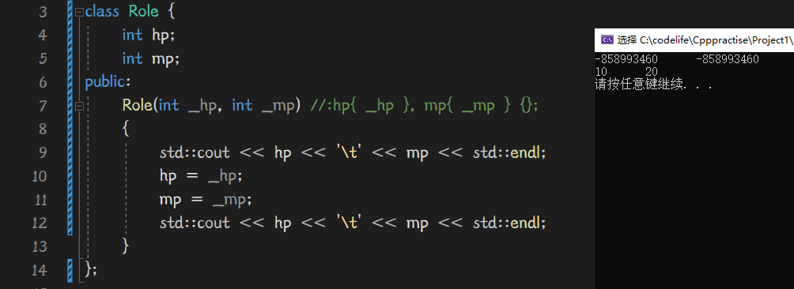

# OOP

OOP，Object Oriented Programming，面向对象编程，

OOD（面向对象设计）

OOA（面向对象分析）

三特性：封装，继承，多态


# SOLID

solid--稳定的

六大设计原则：

- Single Responsibility Principle：单一职责原则

- Open Closed Principle：开放封闭原则

- Liskov Substitution Principle：里氏替换原则

- Law of Demeter：迪米特法则

- Interface Segregation Principle：接口隔离原则

- Dependence Inversion Principle：依赖倒置原则

  


## 单一职责原则

就一个类而言，应该仅有一个引起他变化的原因


## 开放封闭原则

函数、类等都应该对扩展开放，对修改关闭。


## 里氏替换原则

派生类必须能够替换掉它的基类


## 依赖倒置原则

高层模块不应依赖于底层模块，高层模块和底层模块都应该依赖于抽象。


## 接口隔离原则

接口应该内聚，避免出现“肥胖的”接口


##


# 类基础

类和结构体差不多，

类是将同类对象的共同属性和行为抽象出来形成的一个相对复杂的数据类型, 这与结构体一样，都是为了描述一个相对复杂的对象。

接下来我们会围绕着类与结构体的异同进行分析类的特性。

（tips：纯C当中，结构体内不允许嵌套函数，但Cpp中结构体内部也可以写函数,模板之类的哦，虽然写的人不多）


## 与命名空间辨析

在不同的编译单元中定义相同的函数，将他们链接起来会报错重定义。

在不同的编译单元中定义相同的命名空间，将他们链接起来会报错重定义。


在不同的编译单元中定义相同的类，将他们链接起来不会报错。


## 初始化

在类成员变量全是public的情况下（函数private无所谓），可以和结构体一样用{}进行初始化

这一举动并无调用构造函数

```cpp
class Role {
public:
	int hp{ 100 };
	int mp{ 50 };
private:
	template<typename type>decltype(auto) getHp() {
		return hp;
	}
};
int main() {

	Role r{ 50 };
	std::cout << r.hp<< std::endl;
    std::cout << r.mp<< std::endl;
	system("pause");
}
--------------------------
  50
  50
```

但倘若其中有一个变量是private，那么这种方法就不能用了

（结构体内也可以用public，private哦）


还可以用构造函数初始化，详情见后续构造函数


继承方式：在结构体中，继承默认为公共继承，而在类中，默认为私有继承。


## 类成员

### 成员变量

类的成员既可以有变量也可以有函数，与结构体一样，

但结构体的成员，默认是可以用结构体.的方式访问的，

```cpp
struct Person {
	int hp{255};
	int mp{114};

	template<typename type>decltype(auto) getHp() {
		return hp;
	}
};
int main() {

	Person p;
	std::cout<<p.getHp<int>()<<std::endl;
	system("pause");
}
```

而类的成员，默认不能被访问，若想正常访问，需要一定要标明public，

```cpp
class Role {
public:
	int hp{ 100 };
	int mp{ 50 };
	template<typename type>decltype(auto) getHp() {
		return hp;
	}
};
int main() {

	Role r;
	std::cout << r.getHp<int>() << std::endl;
	system("pause");
}
```

以及类成员变量，不能跟名称空间中一般使用extern声明


### 成员函数

成员函数的定义不一定只写在class内，

可以通过和命名空间的方法一样，class内有该函数声明

函数定义在外部用俩个冒号限定引用即可，

```cpp
class Role {
public:	
	int mp{50};
	int getMp();	//函数声明还是得在里面
};
int Role::getMp() {	//函数定义可以在外部用::
	return mp;
}
```

从功能角度上来看，即使是不同实例化对象调用类成员函数，函数的功能作用参数等都是一样的，因此不需要为每一个实例化对象都分配各自独立的函数内存。

实际在内存上来看：确实如此，俩次调用call同一个地址。

（注：在结构体中定义函数时，不同结构体call的函数也一样是同一个地址）

```cpp
Role r1,r2;
r1.getMp();
r2.getMp();
```


在进行sizeof时，会发现写在类（结构体）内的函数是不占该类（结构体）的内存的

注意，如果你sizeof一个空类，什么也没写的类，会得到1字节（结构体同）

原因是编译器需要区分不同的实例化是谁，所以给了1字节内存，使其有了不同的存储地址


成员函数允许重载，但注意，该重载能够区分匹配是否有const修饰成员函数。


### 成员内联函数

成员函数中，类似getHp()这种函数（在每个翻译单元中都是一样的定义，且不会修改该函数），

会被建议写成内联函数，将其定义在写在头文件里，而不是源文件详细定义。

而在C++里怎么写get/set函数呢，给出一个模板

```cpp
inline int Role::getHp(){
	return hp;
}
```

```cpp
inline Role& Role::setHp(int newHp){
	hp = newHp;
	return *this;
}
```

通常set函数会返回对象本身，这样就可以连续set

```cpp
user.setLv(100).setHp(200).setMp(100).Act(monster);
```

一定要是Role的引用哦，不然如果返回的是Role本身的话，会复制大量内存，返回一个跟原对象一样但不是同一个的东西。


内联函数通过将函数的代码直接嵌入调用函数的代码中，而不需要另外调用函数，从而减少了函数调用和返回开销。

以及频繁的转跳地址会使得cache命中很低，性能上有损耗。

在头文件中定义getter/setter函数，将被多次引用，而使用inline修饰后，编译器会将函数体嵌入每个引用位置中，从而减少调用次数，提高程序性能。


## 访问私有属性

```cpp
Role* Role::biggerHp(Role* rp) {
	return (rp->hp > this->hp ? rp : this);
	
}
```

请看这个rp->hp，该hp声明为私有变量

在某个类实例化对象的成员函数里，其传入的参数（与该类相同）可以直接用->访问私有属性，

为什么呢？

前面我们知道了不同的实例化对象调用类里的函数时，本质上是call同一个地址。

所以既然该实例化对象能在他的类函数中，就像在类里一样顺利访问类的各个成员。

那么从本质上来看，无论是调用成员函数的对象，还是被调参数，

他们进入成员函数后，都在相同的地址，所以在访问私有变量上，

调用者本身可以，那么被调者只要与调用者是同一类，那么自然而然也可以访问类成员


结论：类中变量的私有还是公有，是相对以类为界的，而不是以对象为界的。

---


## this指针

this为关键字，可以在其成员函数里使用this指针来访问当前类的成员

但不用this也可以访问啊，有必要这么写么？

在你函数作用域内只有一个该类对象时确实如此，但请看下面情况：

```cpp
//头文件内
class Person{
public:
	int hp;
	int harm;
    Person* biggerHp(Person* r);
}
```

倘若在Person源文件中详细定义该biggerHp()函数，

```
Person* Person::biggerHp(Person* p){
	p->hp > hp ? p : this
}
```

倘若没有this，会发现压根确定不了当前对象自己的指针如何描述。


您还可以将其写为：使其可读性更高

```cpp
Person* Person::biggerHp(Person* p){
	p->hp > this->hp ? p : this
}
```


在const修饰成员函数内，this将变成const型指针


## const与类

成员函数有较为特殊的一种，const 成员函数；

### const修饰成员变量

就是将成员变量变成不可更改的const类型。


### const修饰对象/类指针

const在之前的内容里常被我们用来声明一个常量，禁止改变const修饰的变量。

当const修饰对象时：

该对象所在的一整片内存都被const修饰了，不能修改其中内容

当然，创建后调用构造函数改变成员变量还是可以的。

```cpp
const Role user;
user.hp = 10;		//非法
```

且const修饰的对象 OR 类型指针，都不能用调用成员函数（结构体同）

```cpp
const Role user;
const Role* rp = new Role;
-----------------------
user.函数()	//非法
rp->函数()	//非法
```

但这样只要是对象常量就不能调用函数实在是一刀切，

我们可以通过在函数名后面加上const修饰，使得即使是const对象也可以调用该函数


### const修饰成员函数

注意辨析，

```cpp
const int test(){}	//const修饰int型返回值
```

```cpp
int Role::roleTest() const {}	//const修饰成员函数
```

const不能修饰普通函数哦，只能修饰成员函数。

在const修饰的成员函数内，this（自身）被视为const类型不可以修改任何属性


1，这样自然而然不可以直接修改成员属性

2，这样不允许调用别的函数间接修改成员属性（此时调用setHp()相当于this->setHp()，this是const Rle*指针，而setHp必然不是const成员函数，所以不能调用理所当然）


以及const修饰的成员函数，可以在const型对象时调用。

当然，非const对象访问const成员函数完全没问题


在返回值上，const修饰的成员函数不允许返回该对象的引用，或该对象的某位成员的引用。（因为传出去了就意味着可以在外面随便改嘛，不可以理所当然），

如果您想返回引用，需要返回const int&这样的，用const修饰后的引用值


一条持中立意见的约定：

我们应该将所有没有修改成员变量的函数声明为const；


成员函数可以重载，const修饰的函数与非const修饰的函数被名称修饰为不同的，call地址也不同


注：我们可以使用const_cast<int&>之类的来解除const修饰，从而修改。(C语言方式也可以强改)

const_cast<> 中的类型必须是指针、引用或指向对象类型成员的指针

```cpp
	const int ca{ 10 };
	const_cast<int&>(ca) = 100;
```


## static与类


### 静态成员变量

根据以前的知识储备，我们很清楚的可以知道static修饰的变量只会被初始化一次，生命周期与程序一样长，不会中途销毁。

我们可以在类中用static生命一个静态成员变量

静态成员变量有以下特点：

- 声明一个类的静态成员变量不能赋初始值，需要在外部全局区自己赋值【即使static在私有区】。（老语法）
- 可以通过inline在类里具体定义：inline static int count = 100；（C++17新语法）
- 所有类的实例中，共享类中静态成员变量。（本质：该变量内存地址只有一个，被多个对象一起用）
- 类的静态成员变量在没有类的实例的情况下，仍然可以被访问（既可以类型名::静态变量来访问，也可以对象名.静态变量来访问），说明它的内存分配不关类的事情
- 在类中的static int count；sizeof也不会算他的内存
- 类的静态成员变量并不完全属于类

- 尽管它是static，但他具体定义在外部全局区，不能在不同编译单元int Person::count = 1000;


一般用来统计个数之类的，您需要在构造函数中count++，析构函数中count--；


还可以与const组合：成员静态常量

```cpp
inline const static int count = 100;
```

实际上如果有了const关键字，您就不需要再使用inline也可以在类中实例化了。

```cpp
const static int count = 100;
```


### 静态成员函数

可使用static修饰一个成员函数，使之成为静态成员函数


它有以下特点：

- 不管有没有创建类的实例，都可以访问类的静态成员函数
- 类的静态成员函数不能访问非  静态成员变量（逻辑上理所当然，没实例化就能调用函数哦）
- 类的静态成员函数不能是const，（没有任何意义）
- 类的静态成员函数不能使用this指针（没实例化就可以用的函数，怎么会有this指向自身对象的用法）


## mutable

mutable声明的变量可以被const成员函数修改。


典例：统计某函数被调用次数，且该函数重载了各个样子（其中包含const修饰该成员函数与非const）

```cpp
private:
	mutable int getHpCount;
...
int Role::getHp() const{
	getHpCount++;
    ...
    
}
```


## explicit

explicit是一个用于类构造函数的关键字，可以防止隐式类型转换，使类构造函数只接受显式类型转换。

用来防止以下情况：

```cpp
class Role{
public:
	bool isBig(Role r){return hp>r.hp}}

	Role(int _hp){
		hp = _hp;
    }
}
---------
Role r1,r2
r1.isBig(r2)		//正确用法
r1.isBig(50)		//错误用法，且不报错
```

为什么不会报错呢？其实这用法还阴差阳错的会正确执行：

r1.isBig(50)时，在函数内头部相当于Role r = 50；

相当于Role r(50);

于是执行了一次构造函数，完成了hp赋值，然后就可以继续执行下面代码了

这样很危险，有些时候你压根不想发生这样的隐式类型转换


于是你可以在该构造函数前用explicit

```cpp
explicit Role(int _hp){
		hp = _hp;
    }
```


## 管理类

一般来说，我们会在头文件中声明类，且每一个类有其独有的翻译单元：

（源文件右键--添加类--填入必要信息）


在Role.h该类的头文件中，定义好类的成员变量及声明好函数。

在Role.cpp该类的实现源文件中，实现好该类中的文件。


### 示例：

Role.h：

```cpp
#pragma once
class Role {
private:
	int hp{ 100 };
	int mp{ 50 };
	int exp{ 30 };
public:
	int ss{};
	void Message();
	int getHp();
	int getMp();
	int getExp();
};
```

Role.cpp

```cpp
#include<iostream>
#include"Role.h"
void Role::Message() {
	std::cout << "Role Message:" << std::endl;
	std::cout << hp << '\t' << mp << '\t' << exp << std::endl;
}
int Role::getHp() {
	return hp;
}
int Role::getMp() {
	return mp;
}
int Role::getExp() {
	return exp;
}
```


# 构造函数析构函数

## 构造函数


构造--constructor--创造

当一个类在创建实例化对象时（声明定义此时一体化），构造函数被自动调用，

一个类从分配内存以后，马上就通过构造函数赋予了对象生命。


默认构造函数是公有的，创建实例化对象时自动调用，

也可以手动声明为私有的，单例设计模式就是如此。

定义一个单例类：

1. 私有化它的构造函数，以防止外界创建单例类的对象；
2. 使用类的私有静态指针变量指向类的唯一实例；
3. 使用一个公有的静态方法获取该实例。


由前文类--初始化；可知：

当一个类中既有public成员变量，又有private成员变量时，就不能用{}对成员一一赋值了，

但还可以这样：（但总之不是一一赋值了）

```cpp
Role r1;
r1.hp = 100;
Role r2{r1};
```

本质是还是调用了构造函数（Role&副本构造函数）


### 概念

构造函数是类的一个成员函数，构造函数在类被创建时自动被调用，


一般用来创建新的类实例执行初始化操作，构造函数与它所在的类同名，并且没有返回值，任何类都至少有一个构造函数；

```cpp
class Role{
private:
	int hp;
public:
	Role(){}
	}
```

用变量名加小括号调用：user();

如果希望调用默认构造函数，就别加括号


没写编译器自动给你生成一个空的。(VS是生成三个)

分别为：

```cpp
Role();				//无参默认构造函数
Role(Role&);		//拷贝构造函数
Role(Role&&);		//移动构造函数
```

只要定义过构造函数，编译器就不会给你自动加了。（vs里剩下俩&和&&的还在！）


也可以自己定义默认构造函数（有必要的，有了这个才可以用Role r；声明默认的对象）

```cpp
Role(){}
Role() = default;	//推荐，效率更高
```


### 构造函数重载

构造函数可以不只有一个，可以根据类型来匹配重载构造函数

```cpp
...
Role{}
Role(int _hp,int _mp){
    hp = _hp;
    mp = _mp;
}
....
Role user(100,200);
Role* pr = new Role(100, 200);
```

也可以用另外一个类对象/另一个实例化本类对象来构造自己哦，不要局限想象力，但要记得加引用

```cpp
Role(Role& role){
	hp = role.hp;
	mp = role.mp;
}
```


### 列表初始化

一般的使用构造函数完成成员初始化

```cpp
Role(int _hp,int _mp){
    hp = _hp;
    mp = _mp;
}
---------------------------
Role r(100,200);
```

我们还可以用成员初始化列表完成初始化

```cpp
Role(int _hp, int _mp) :hp{ _hp }, mp{ _mp } {};
```

此处{}当然可以展开往里加东西。

总的来说，使用列表初始化可以帮助避免不必要的初始化和赋值操作，从而提高程序的效率。

#### 优势

成员初始化列表的优势：

- 效率更高
- 某些情况下，只能使用这种方式进行初始化（类的继承之后）


效率更高：

普通的构造函数初始化，会先生成形参分配好对应空间，然后再赋值给某段空间

而列表初始化会一步到位，在函数体执行之前就完成了赋值




某种特殊情况下只能如此：

类的继承时：


#### 劣势

```cpp
class Role {
	int hp;
	int mp;
public:
	Role(int _hp, int _mp) :hp{ mp*5 }, mp{ _mp }
	{
		std::cout << hp << '\t' << mp << std::endl;

		std::cout << hp << '\t' << mp << std::endl;
	}
};
```

使用列表传参时顺序不是依据代码谁写在前面，谁在后面，

而是根据该变量在类中出现的顺序

如果和上一样，mp还没初始化就以mp为因数初始化hp，自然得到的也是错误的


### 委托构造


```cpp
Role(int _hp, int _mp) :Role(_hp)
	{
		std::cout << hp << '\t' << mp << std::endl;
		std::cout << hp << '\t' << mp << std::endl;
	}
	Role(int _hp) :hp{ _hp } {
		std::cout << "it's Role(int);" << std::endl;
	}
```

委托构造后，先进行形参赋值，然后进行委托函数的调用，最后执行原函数的函数体。

委托构造只能请一个。

且用了委托构造就不能再用列表初始化。

```
Role(int _hp, int _mp) :Role(_hp),mp{_mp}	//非法
```


### 副本构造

就是用一个类实例化对象来初始化另一个新的。

```cpp
Role user(100,200);
Role userA(user);
```

且这个副本构造函数,是编译器自己为我们生成的三个构造函数之一

```cpp
Role(const Role&)
```

Role&确保我们传进来的是一个真正的Role类型，const确保我们不会改动传进来的参数

不要误以为用此方法构造的对象时传进来参数的引用类型，他们俩已经是独立的了。


### 移动构造


### 注意项

当你有个某构造函数：

```
Role(int _hp) {
		hp = _hp;
	}
```

那么还有一种神奇的初始化方法

```cpp
Role r1 = 50;//这样写会正确的调用上面的Role构造函数完成hp赋值
Role r2(50);

--------------------
Role r(20,30);
Role r2 = r;
相当于：Role r2(r);//当然只有第一次这样才调用副本构造函数，后续都相当于普通赋值
```

所以你要注意使用explicit避免某些情况


## 析构函数

析构--destructor--破坏者

析构函数在类的生命周期结束时，被自动调用，

在该对象生命结束前（例如局部类对象即将离开最近的{}），一般用来做扫尾工作，比如释放内存，关闭句柄等等；

析构函数只能有一个；


析构函数一般不设置成私有。如果析构函数设置成私有，不能在栈上创建对象。可以动态创建对象。可以使用友元函数来显示销毁动态创建的对象


例如在构造函数中动态的分配了一段内存，如果在最后只是把类中的各种变量.函数所占内存给抹掉了，而忘记了该段内存，则会造成内存泄漏。


### 初始化

如果一个类没有定义析构函数的话，那么编译器就会自动添加一个空的析构函数，

析构函数只能有一个；

手动定义：

```cpp
~类名(){
}
```

析构函数没有返回类型，没有参数，函数名为~类名，如果构造函数为空，则最好使用default来定义。

例如：

```cpp
~Role() = default;
```


### 典例应用

```cpp
class Role{
	int* p;
public:
	Role(){
		p = new int[100];
    	std::cout<<"类被创建"<<std::endl;
    }
    
    ~Role(){
		delete[] p;
    	std::cout<<"类被销毁"<<std::endl;
    }
    
}
```


# 友元

友元---朋友类---friend class

对于类来说，也可以交朋友，可以像朋友分享自己的一些所有物

（注：友元会破坏类的封装性，除去别无他法请不要使用友元，友元也不是一种相互关系）

## 友元函数

类的一个朋友是函数

```cpp
class Role {
	int hp;
	int mp{100};
	int GetHp() {
		return Hp;
	}
	friend void SetHp(Role&);
};

void SetHp(Role& r) {
	r.hp = 250;
	std::cout << r.GetHp() << std::endl;
}
```

声明了友元函数后，可以在该函数内访问该类的成员（无论属性）

一个类可以很多个友元，且反过来该友元也可以跟别的类交朋友。


注意这个friend void SetHp（）在类中的private下，但这并不妨碍外界访问友元函数


类的出现顺序也是有关的，如果你定义了：`

```cpp
	friend void SetHp(Role&,Person&);
```

而编译器走到这里，他不知道你这个Person是个类，就会报错，所以需要在前面声明：

```cpp
class Person;
```

类似的例子还有:

当您期望重载运算符<<将其作为友元函数时，乍看没有错，

但此时myString.h若不包含iostream头文件，则识别不了std之类的。

```cpp
friend std::ostream& operator<<(std::ostream& os, myString& _str);
```


## 友元类

类的一个朋友类

```cpp
class Role {
	int hp;
	int mp{100};
	int GetHp() {
		return Hp;
	}
	friend class Person;
};
```

此时Role将Person类视为朋友，在Person类中可以访问Role类的各级成员

友元不是相互的，Person可不一定将Role视为朋友。


# 嵌套类（内部类）


## 嵌套类的概念

当你有一个类的存在只服务于另一个类，那就可以写在该类里面：

```cpp
class Role{
public:
	class Weapon{		//武器类
		short lv;
    	WeaponLv wlv;	//一个enum枚举体
    }
	int hp;
    int mp;
    Weapon leftHands;	//左手武器
}
```

此时Weapon这个类定义在类Role里，作用域也只在这个Role中，链接性为无，外界访问不到

由于作用域在Role类中，所以需要通过：：在特定作用域下使用：

（收到类的属性管辖，只有public的内部类才能被这样访问）

```cpp
Role::Weapon wpl;
```

内部类可以在类中仅声明，在类外详细定义：

(全写在里面层次感有了，但没有了整洁度)


## 定义时易错点

易错点1：注意作用域对内部类函数/参数/返回值的限定，要记得：：

```cpp
class Role{
public:
	class Weapon;	//是public还是private不妨碍外部对于Weapon的定义
	int hp;
    int mp;
    //Weapon leftHands;	//左手武器
};

class Role::Weapon {	//作用域不要忘记
	int lv{1};
	int wlv{0};
    Weapon* returnWeapon();		//声明一个返回值为Weapon*的函数
	Weapon() {
		std::cout << "it's Weapon class." << std::endl;
	}
};

Role::Weapon::Weapon(){		//注意作用域
	std::cout<<"这是一个weapon构造函数"<<std::endl;
}

//容易写错的点，返回值，参数之类的用到Weapon都得写明白作用域，而不单单是函数
Weapon* Role::Weapon::returnWeapon(){	//错误！
}	
Role::Weapon* Role::Weapon::returnWeapon(){	//正确！
}	
```


易错点2：不允许使用不完整的类型

```cpp
class Role{
public:
	class Weapon;	
	int hp;
    int mp;
    Weapon leftHands;	//报错，不允许使用不完整的类型，哪怕你已经class Weapon
};

class Role::Weapon {	
	int lv{1};
	int wlv{0};

	Weapon() {
		std::cout << "it's Weapon class." << std::endl;
	}
};
```

解决方法为：你还是得把类的详细声明部分给加到类里面，整洁度只能交给在外面写内部类函数了.

```cpp
class Role{
public:
	class Weapon {
	public:
		int lv{ 10 };
		int wlv{ 100 };

		Weapon();
	};
	Weapon w;
	int hp;
    int mp;
    Weapon leftHands;	
};
Role::Weapon::Weapon() {
	std::cout << "it's Weapon class." << std::endl;
}

```


枚举也是一个类：

```cpp
enum class Today{}；
```

枚举类也可以嵌入类中，收到外部类作用域，及公有私有管辖


易错点3：您想拥有一个内部类的实例化对象当做外部类的一个成员变量时，

不可能，因为类只声明/定义并不会分配内存空间，需要实例化对象时才会分配，

在一个暂未分配内存空间的东西里塞一个实例化对象当变量，前后矛盾的很，

如：直接在外部类中Weapon w(100,200);会直接报错，

可以用委托构造在外部类实例化的同时，实例化内部类对象当成员变量：

```cpp
#include <iostream>
 
using namespace std;
 
class OuterClass
{
public:
    OuterClass()
    {
        cout << "OuterClass constructor" << endl;
    }
 
    class InnerClass
    {
    public:
        InnerClass(int x, int y)
        {
  cout << "InnerClass constructor with parameters x=" << x << " and y=" << y << endl;
        }
    };
 
    InnerClass inner;		//此处相当于仅声明
 
    OuterClass(int x, int y) : inner(x, y)		//委托构造
    {
   cout << "OuterClass constructor with parameters x=" << x << " and y=" << y << endl;
    }
};
int main()
{
    OuterClass outer(10, 20);
    return 0;
}
```


易错点4：内部类模块化头文件时遇到的问题

要记住几点：

- 一定是内部类include“外部类.h”，此举相当于把外部类.h的内容粘贴到自己前头
- 然后main函数中，一定是include"内部类.h"一个就够了（因为内部类需要外部::，则必须include外部类），若include多个则一定重定义class


- 实在搞不清楚，前头加pragma once，然后只需要记得一件事情，外部类用include展开后一定要在内部类前头。否则报错未定义类型xxx


## 访问权限


内部类可以访问外部类中所有静态成员，

外部类只能访问内部类中公有静态成员。


以及内部类中，完全可以创建一个外部类的实例，通过该实例可以访问外部类的私有成员

（逻辑上，内部类属于内部成员了，其本身作用域就在外部的类里，所以在这个地方访问私有属性正常）

```cpp
class Role{
	static int hp;
    class Weapon{
		int lv;
    	void Test(){
			Role r;
        	r.hp = 100;		//可以！
        }
     void Test1(){
		Weapon w;
     	w.lv				//打咩！
     }
    }
}
```


内部类也不能在某函数中访问外部类的普通成员变量，报错：非静态成员引用必须与特定对象对应。

字面意思，非静态的内部成员函数中用外部类中的普通成员变量需要传入具体对象

```cpp
class Outer
{
private:
    int x;
public:
    Outer(int x) : x(x) {}

    class Inner
    {
    private:
        int y;
    public:
        Inner(int y) : y(y) {}

        void printXY(Outer& o)
        {
            // 访问外部类的非静态成员
            std::cout << "x: " << o.x << ", y: " << y << std::endl;
        }
    };
};
```


# 局部类

挺少用的一种类型

注意点：

- 局部类的定义必须写在类里	（函数里不能再声明函数）
- 局部类中不允许使用静态成员变量
- 局部类可以访问全局变量


# malloc与new系列

常见的面试初级题之一：

malloc和new有什么区别？等内存区别系列。


## mallolc与new区别

对于普通数据类型来说，malloc和new的区别很细微

对于类来说，malloc仅分配内存，不会初始化类的默认成员变量，

而new除了分配内存以外还会调用构造函数

再详细点说说？

[c++ new 与malloc有什么区别 - ywliao - 博客园 (cnblogs.com)](https://www.cnblogs.com/ywliao/articles/8116622.html)


## free和delete区别

free仅仅只能释放内存空间，不会调用析构函数

delete除了释放内存以外，还会调用类的析构函数。


## delete和delete[]区别

delete[]一般和new xxx[]对应使用，

对于类来讲，delete仅释放内存空间且调用第一个元素的析构函数，

而delete[]不仅释放内存空间，还会调用每一个元素的析构函数，从后往前销毁。


# 从底层理解类


## _thiscall调用约定

类的函数调用约定_thiscall:

特点是：

- 寄存器ecx用来存放对象本身地址，传入函数
- 参数从右至左传入
- 堆栈由调用者负责恢复


唤醒一下汇编记忆

```cpp
lea exc,[person]
    将第二个操作数的有效地址 保存到第一个操作数中
    
```

贴出this call的汇编代码：

```
	Person p;
	p.Add(100, 200);
000F1895 68 C8 00 00 00       push        0C8h  
000F189A 6A 64                push        64h  
000F189C 8D 4D F8             lea         ecx,[p]  
000F189F E8 8D F8 FF FF       call        Person::Add (0F1131h)  
```

成员函数，一般通过一个类的实例化对象调用，

在这句汇编代码中体现，将该对象的地址传入ecx

```
000F189C 8D 4D F8             lea         ecx,[p]  
```

然后call了某处函数

```c
class Person {
	int hp;
    int mp;
public:
	int Add(int a, int b) {
/*00DC1764 EC                   in          al,dx  
00DC1765 CC                   int         3  
00DC1766 00 00                add         byte ptr [eax],al  
00DC1768 00 53 56             add         byte ptr [ebx+56h],dl  
00DC176B 57                   push        edi  
00DC176C 51                   push        ecx  
00DC176D 8D 7D F4             lea         edi,[ebp-0Ch]  
00DC1770 B9 03 00 00 00       mov         ecx,3  
00DC1775 B8 CC CC CC CC       mov         eax,0CCCCCCCCh  
00DC177A F3 AB                rep stos    dword ptr es:[edi]
00DC177C 59                   pop         ecx                  */
        分析代码：

00DC177D 89 4D F8             mov         dword ptr [this],ecx  
  /*
00DC1780 B9 66 C0 DC 00       mov         ecx,offset _B86051EA_main@cpp (0DCC066h)  
00DC1785 E8 87 FB FF FF       call        @__CheckForDebuggerJustMyCode@4 (0DC1311h)*/  
		return hp + mp + a + b;
0059178A 8B 45 F8             mov         eax,dword ptr [this]  
0059178D 8B 00                mov         eax,dword ptr [eax]  
0059178F 8B 4D F8             mov         ecx,dword ptr [this]  
00591792 03 41 04             add         eax,dword ptr [ecx+4]  
00591795 03 45 08             add         eax,dword ptr [a]  
00591798 03 45 0C             add         eax,dword ptr [b]    
```

其中

```cpp00DC177D 89 4D F8             mov         dword ptr [this],ecx  
00DC177D 89 4D F8             mov         dword ptr [this],ecx    
```

this指针指向的ecx值，也就是对象的地址

```
0059178A 8B 45 F8             mov         eax,dword ptr [this]  
```

eax中存入this指向的值（对象地址）

```
0059178D 8B 00                mov         eax,dword ptr [eax]  
```

通过eax中对象地址（此处对象中仅有int hp一个成员变量）取出值，赋值给eax，

也就是说此时eax中的值是对象的第一个成员变量hp的值

```cpp
0059178F 8B 4D F8             mov         ecx,dword ptr [this]
00591792 03 41 04             add         eax,dword ptr [ecx+4]      
```

ecx中存入对象地址，eax = eax+【ecx+4中存放的值：第二个成员变量mp】

由此可见，取成员变量的值是通过对象自身指针this放入ecx寄存器，然后不断往后偏移得来

```
00591795 03 45 08             add         eax,dword ptr [a]  
00591798 03 45 0C             add         eax,dword ptr [b]    
```

eax = eax +a +b;完成求和


分析本例也可知道，this call，call一个类成员函数，除了会将参数用ebp+8，ebp+0C传入以外

还会额外传入一个数据：调用者本身地址，用一个寄存器存起来

进入函数后，this指针指向该寄存器值

取成员变量是通过this值偏移得到。（相当于this->hp等）【基址+偏移】


## 自定义类函数调用约定


可以在类成员函数前面自定义函数调用约定

```cpp
void _stdcall BeAct(int a){}
```

使用stdcall（或者_cdecl）后，虽然不会和典型的thiscall一样通过ecx寄存器记录对象地址，

但如上例，虽然只有一个参数，但会把该地址当作一个参数先lea再push，

当作参数传递，使之后续符合stdcall调用规则。

（如果是cdecl调用，则后续add  esp 08h（会也当参数恢复栈平衡））


## 静态成员底层


### 静态成员函数

```cpp
public:	
	static void StaticMemberCall(int a, int b) {
		std::cout << __FUNCSIG__ << std::endl;
	}

----------------------
运行结果：
    void __cdecl Person::StaticMemberCall(int,int)    
```

结论，静态成员函数的函数调用和普通函数一样默认为cdecl，

复习一下_cdecl把！

- 谁调用谁恢复栈平衡
- 从右到左传入参数

汇编：

```cpp
	p.StaticMemberCall(1, 2);
00262524 6A 02                push        2  
00262526 6A 01                push        1  
00262528 E8 10 EF FF FF       call        0026143D  
0026252D 83 C4 08             add         esp,8  
```

没有thiscall的特征：ecx存对象本身地址。

即：对象本身地址都没传入，故类的静态成员函数不能使用this指针，

不能使用this指针，所以他也不能通过基址+偏移的方式访问成员变量，

一切都理所应当起来了。


### 静态成员变量

```cpp
class Person{
	static int count;
public:
	static void StaticMemberCall(int a,int b){
		count++;
    }
}
int Person::count = 1;
int main() {
	Person p;
	p.StaticMemberCall(1, 2);
}

```


有关汇编代码：

```
		count++;
002C23C1 A1 14 C0 2C 00       mov         eax,dword ptr ds:[002CC014h]  
002C23C6 83 C0 01             add         eax,1  
```

可以发现啊，这个count的地址就是：ds:[002CC014h] 

一般情况下，可以粗略的认为，只有全局变量才能这么写，有着固定的内存地址，与类对象并无关系

所以才可以有：

类::静态成员这样的写法，归属上是类的，但本质与全局变量差不太多


## 类一定要有构造函数吗？

看反汇编时，发现默认定义类实例化对象时，压根没有调用函数。

类一定要有构造函数是C++标准委员会的规定，

没有调用函数是编译器的优化，

原则来讲每个类都有默认构造函数


但如果类的成员变量设置了默认值，

编译器还是会老老实实调用默认构造函数给成员变量赋默认值

没错，即使你什么都没写，

类成员变量赋默认值这件事情是在构造函数中实现的

```cpp
class Person{
	int hp  = 10;
	}
```


```cpp
	Person p;
00A42125 8D 4D F4             lea         ecx,[ebp-0Ch]  
00A42128 E8 15 F3 FF FF       call        00A41442  
```

call的地址就是构造函数
