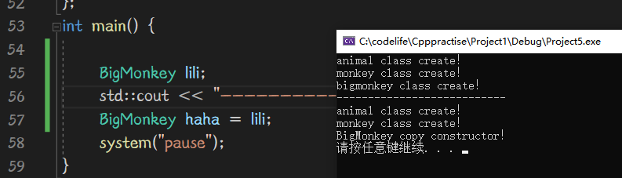
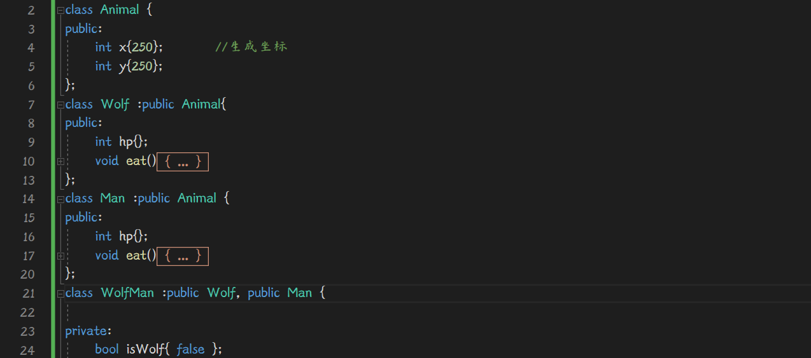
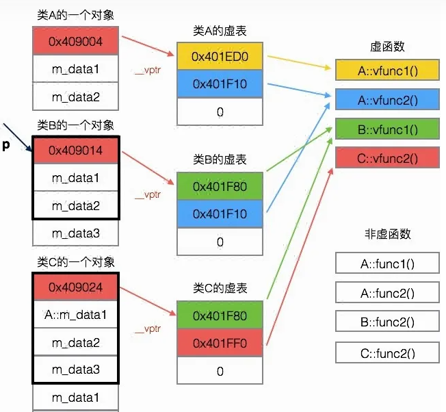

在做游戏之类的项目之前，往往会进行程序设计文档的编写，将致力于尽可能的提高开发效率，清晰的逻辑关系


# 类的继承

## 概念


基于animal类创造了一个新类monkey，

我们称animal类是monkey类的基类（父类），monkey类是animal类的派生类（子类）

子类会自动继承包含了父类的成员函数及成员变量,其公私有属性也同样继承过来了。


如果我们继续基于monkey创造一个新类bigMonkey，那么monkey是bigMonkey的直接基类，animal是bigMonkey的间接基类（爷爷类了。。）


继承要表达的是一种演变的意义，而不是意味着包含，是人与动物的意义，不是胳膊与人。

包含关系应该做成嵌套类


## 使用

继承的语法：

```cpp
class Monkey:public Animal{

}
```

public不是必须的，现阶段加上，后续会介绍他这里的具体说法。


### protected

在单个类里和private一样，外界访问不了，

与private区别在于：有关继承相关问题

如果该成员是protected，那么继承后可以被访问


及protected的成员我不想让外界访问，但能够被子类继承后访问


### final

如果这个类你认为已经进化到头了，不愿再给人继承了，请用final声明

```cpp
class Monkey final{
}
```

冷知识，final虽然是关键字，但可以当变量名。。。


## 派生类继承权限


需要明确辨析的点为：

哪些成员时继承了但不可访问的，哪些类时继承后改变了访问权限但能访问的。


也就是：xxxx的类别

```cpp
class Monkey:xxxxx Animal{
}
```

### public

如果是xxxx = public的访问级别，相当于把父类的东西复制粘贴过来一份，不会改变任何访问权限

例如：

```cpp
class Animal {
public:
	int age{};
	int kg{};

protected:
	int ani;
private:
	char name[20];
	
};
```

```cpp
class Monkey :public Animal {
public:
	int x;
	int y;
protected:
	int z;
private:
	int xxx;
};
```

```cpp
class BigMonkey : public Monkey {
private:
	int hp;
	int mp;
	
public:
	BigMonkey() {
		hp = 100; mp = 50; 
        this->		//此时可用成员为：hp,mp, x,y,z, age,kg,ani
	}
};

------------------------------
int main(){
	BigMonkey lili;
	lili.			//此时算在外界，protected成员都不可用，
        			//可用成员为祖祖辈辈都是public的：x,y,age,kg
}
```


### protected

如果是protected的访问权限：

例如将BigMokey类改为：

```cpp
class BigMonkey : protected Monkey {
private:
	int hp;
	int mp;
	
public:
	BigMonkey() {
		hp = 100; mp = 50; 
        this->		//此时可用成员为：hp,mp,(private) x,y,z,(protected) age,kg,ani(pro)
	}
};
------------------------------
int main(){
	BigMonkey lili;
	lili.			//此时算在外界，protected成员都不可用，
        			
}
```


也就是说，才此处派生类继承权限等级若是protected，

则把父类的无论public还是protected都变成protected继承过来，

父类privact虽然继承过来，但即使在子类中也无法控制这段内存


### private

```cpp
class BigMonkey : private Monkey {
private:
	int hp;
	int mp;
	
public:
	BigMonkey() {
		hp = 100; mp = 50; 
		//this->	hp,mp,x,y,z,age,kg,ani(全是private)
	}
}
----------------------------------------------
int main(){
	BigMonkey lili;
	lili.			//此时算在外界，private成员都不可用，
        			
} 
```


解析一下：

当继承权限为private时：

父类的private会继承过来，但即使在子类中，也无法访问，你基本拿这段内存没辙了。

父类的public及protected会继承过来，然后全改成private访问权限，但子类中可以访问

您猛然发现，这不和protected一样了嘛，

目前为止确实差不多，但是在进行一次迭代继承，就差远了


理解一下就记住了。

主要要分清楚，那些是继承过来，成为自己的私有属性，

哪些是继承过来，但你在类中也无法访问的属性。


## 继承权限与向上转型

如果是public继承，则用户代码和后代码类都可以使用派生类到基类的转换。

如果类是使用private或protected继承派生的，则用户代码不能将派生类型对象转换为基类对象。


## 修改成员权限

假设此处有爷爷类-父类-子类

爷爷类的private，父类无论怎么继承过去用都别想用，自然更改变不了其访问属性了

但爷爷类中的protected，或public属性；如果被父类继承过去后成了父类的public或protected成员

可以使用

```cpp
public:
using 父类::protected变量；
```

此时，父类中原protected变量就变成public变量了。

就可以在外界访问了

注意，不要试图using 自己基类的private成员

能改的是你在类中可以访问的属性

函数也一样，using 父类::函数名;			不要加括号


# 继承中的构造函数

## 调用顺序

派生类的默认构造调用顺序：

继承下来这一套的构造执行顺序由基类到派生类，一层一层从最底层开始调用该类的构造函数


由animal--》monkey--》bigmonkey


## 指定基类构造函数

在派生类中指定基类的构造函数：

Monkey类中构造函数：

```cpp
	Monkey() {
		std::cout << "monkey class create！" << std::endl;
	}
	Monkey(Monkey&) {
		std::cout << "Monkey copy constructor！" << std::endl;
	}
	Monkey(int x,int y) {
		std::cout << "Monkey(int,int) constructor！" << std::endl;
	}
```

Monkey的派生类BigMonkey：

可以通过指定Monkey的构造函数。

```cpp
BigMonkey() :Monkey(100,100) {	//此处还可写成Monkey{100，200}
		hp = 100; mp = 50; 
		std::cout << "bigmonkey class create！" << std::endl;
		//this->
	}
```

由此可见，其调用顺序是由基类至派生类，但是调用逻辑是：

要创建BigMonkey对象，根据参数匹配BigMonkey构造函数，

若匹配的BigMonkey类构造函数并无指定委托构造之类的做法指定基类构造函数，则基类一律调用默认构造

若有指定，则按照指定调用。


## 向上转型

派生类的副本构造函数调用时：

前面的基类调用的是默认构造函数，只有最后的派生类调用了副本构造函数




有一种奇特的写法：

```cpp
	Animal(Animal&) {
		std::cout << "animal copy constructor！" << std::endl;
	}
```

```cpp
	Monkey(Monkey& obj):Animal(obj) {
		std::cout << "Monkey copy constructor！" << std::endl;
	}
```

```cpp
	BigMonkey(BigMonkey& obj):Monkey(obj) {
		std::cout << "BigMonkey copy constructor！" << std::endl;
	}
```

obj是BigMonkey类型的引用类型，在没有做类型转换的情况下，

可以顺利传入Monkey(Monkey& obj):函数，

这就是继承的另一大优点：

向上转型，（可以由编译器自动完成，安全）

类也是一种数据类型，可以发生数据类型转换，不过这种转换只有在基类和派生类之间才会有意义，

并且只能将派生类赋给基类，（包括派生类对象赋给基类对象，派生类指针赋给基类指针等）


通俗来说，从逻辑上来讲：把大猴子类赋值给猴子类并无问题，猴子类赋值给动物类并无问题

反之则有可能出现问题（某些动物不是猴子，不能赋值给猴子类）


```cpp
Monkey monkey = bigmon;
```

上句实则调用了Monkey的副本构造函数，完成了：Monkey& obj = bigmon。这一向上转型


## 强制继承构造函数

可以在派生类中使用：

```cpp
public：
	using 基类::基类构造函数；  【不要加函数括号】	（自动把基类所有的构造函数都继承过来了）
```

来强制继承基类的构造函数。

在使用时会被当作派生类构造函数被调用，完成给基类的一系列成员赋值等操作

且通过继承来的构造函数，是public就是public，不会因为派生类的公私有属性而变化

利用{}对对象进行赋值的本质还是调用相应构造函数。


# 继承中的析构函数

就像之前分析的，若要构造一个派生类对象，则得从最开始的基类开始调用构造函数，但前面可以是默认构造函数，最后要契合构造参数，当然，前面调用基类构造也可以指定。

而派生类的析构函数也有相应调用顺序


从最近的派生类开始析构，直到基类析构

构造就像建房子，从基层往上盖，析构就像拆房子，从上面往基层拆


# 继承中的重名问题

在基类中有一变量int x，派生类中又有一个int x；

这是不会重名的，父亲有儿子变量，不代表他的儿子不能有儿子变量。

但这么写了在使用上需要有所区别，加上作用域限定符

类中使用：

```
x = 250;		 //派生类的x
父类::x = 350;	//基类的x
```

类外使用：

```cpp
BigMonkey bgm；
bgm.x=250				//派生类bigmonkey的变量x
bgm.Monkey::x = 350		//基类monkey的x    
```


派生类和基类的函数也是可以重名的，

一般情况下，派生类中有和基类函数重名，基类函数会被重写，从外界上调用只能看到重写后的函数。

但也和变量一样，可以使用::来访问（当然！你这个函数继承过来得是public外界才能访问嗷！）


要引入后不是public或者你不想用引用符号，可以在类中用using直接引入该父类函数：

```cpp
using Mnokey::show;		//会拉入Monkey中所有重载的show函数
```

若这俩show参数不一致，此时相当于函数重载，派生类中有俩show，外部调用也会出发重载选项

若参数也一致，

那么此时即使用using也没用，只认派生类的。（你还是可以用::来访问父类的）


类型的引用可以逐级添加（层次感理解更好），也可以直接引用想要的基层：

```cpp
bigmon.Monkey::Animal::test();
bigmon.Animal::test();
```


# 多重继承问题

多重继承也就是：一个子类有多个父类的问题

【ps：这也是现在越来越不讲父类子类，而讲基类派生类的原因吧...一子多父亲实在有点拎不清】

例如设计一个游戏，狼类，人类，

人类被狼咬了可以变成狼人类，此时狼人类就可以继承以上俩类。


```cpp
class WolfMan : public Wolf,public Man{

};
```

看起来逻辑清晰很舒服，

但多重继承会面临种种问题哟


## 变量重名


此时jack.hp不明确，编译器将报错

第一种解决方法：外界用限定符指定

```cpp
jack.Wolf::hp = 10;
```

第二种解决方法：内部用using引入某一个，此后hp就代表这个，另一个要用就用限定符强调

```cpp
public: Man::hp;
```


第三种解决方法，也是最常用的方法：明确告诉编译器你要哪个

分俩套系统，需要哪套调用哪套，（在按情况调用方法时更好用）


## 参数重名

函数重名也是如此，并且继承后编译器不会根据参数类型分辨


您也可以通过isWolf的bool值调用不同的eat：


## 重复继承问题

如图下所示，在这次多重继承中，重复继承了动物类




此时：

```cpp
WolfMan jack;
jack.x = 10;
```

编译错误，x指代不明确

这个时候可以别一根筋只想着Animal::，俩个都是Animal，也指代不了

```cpp
jack.Wolf::x = 10;
jack.Wolf::y = 20;
```

用wolf指代即可。

注意了，此时内存分布情况大概是：


这俩相同的x，y所在的内部内存地址可不重叠

如此一来，多继承会引入大量重名的，很多时候无意义的多余变量/函数


## 虚基类

可以使用virtual声明虚基类

```cpp
class Wolf :public virtual Animal{
}
class Man :public virtual Animal{
}
```

此举可以会将重复继承的类的内存地址并入，此时：

```cpp
jack.Wolf::x = 130;
```

将会改变Wolf的x也会改变Man的x；

```cpp
jack.x = 19;	//合法，并无指代不清
```


# 从内存理解继承

每一次派生，在内存布局上都是相当于把基类成员贴到该派生类前面，

内存分布基本就像这张图：


但wolf与man类用虚基类重复继承animal类，再正常多重继承wolf和man类时情况：


会发现俩件事，1：重复的1，2没有了（animal类的成员）取而代之的是一长串数字

​							2：重复的虚基类放在了最后，不再是之前派生内存基类放最前面了

虚基类继承后内存视图由上到下：

wolf类，man类，wolfman类，animal类（只出现一次了）

并且此时对比animal类的成员赋值与别的成员赋值汇编代码：


明显虚基类继承过来的成员赋值用到了指针类技术实现

eax先等于从00CFF730中的值：15113224；

然后ecx等于eax+4【15113228（十进制）】地址中的值；

最后往jack+ecx中的值 这个地址里写入1，完全可以合理推断，这个里存的地址就是成员x的地址，

提前透露一下：

虚基类的成员变量地址是通过虚函数指针获取的。虚函数指针是一个指向虚函数的指针，它包含了指向虚函数的地址，以及指向虚基类的成员变量的地址，通过这种方式，就可以确定虚基类的成员变量地址。


但若animal，man，wolf，wolfman统统用虚基类继承


但即使如此，构造顺序仍然是从基类到派生类不会变，只是内存上存放位置不一样了


# 多态

一个事物能表现出多种形态就是多态

多态一般分为对象多态和方法多态：

## 对象多态

对象多态：

### 向上转型

向上转型：父类  =  子类（用Animal表达Monkey对象）

向上转型，（可以由编译器自动完成，安全）

类也是一种数据类型，可以发生数据类型转换，不过这种转换只有在基类和派生类之间才会有意义，

并且只能将派生类赋给基类，（包括派生类对象赋给基类对象，派生类指针赋给基类指针等）


通俗来说，从逻辑上来讲：把大猴子类赋值给猴子类并无问题，猴子类赋值给动物类并无问题

反之则有可能出现问题（某些动物不是猴子，不能赋值给猴子类）


如果贸然直接向上转型，编译器虽然支持，但会触发内存切片问题


如果该类中只有数据，那么切片就切片吧，反正丢掉的数据也是animal类没有的，

但如果该类中有虚函数之类的，则不能这样做。

应该用指针，引用之类的来完成向上转型，则不会引发内存切片（推荐做法）


如果继承方式是private或protected，则无法完成向上转型（除了强转）


注意，向上转型有可能会指代不明确，此时不能完成向上转型（即使强转也不能）

什么是指代不明确呢，例如有俩组继承关系（动物-人，动物-狼，人/狼-狼人）前者为基类，后者派生类，

此时如果想：

```cpp
Wolf* pWolf= new WolfMan();			//合法的向上转型
Animal* pAni = new WolfMan();		//非法
```

这是不可以的，您可以尝试从内存角度分析这个，此时内存中有俩段动物的内存，向上转型编译器不知道用哪个才好

此时如果 狼人虚基类继承狼和人属性，则可以顺利向上转型。(animal类将合并内存)


您知道的，虚基类继承后将不会出现重复的animal类内存段，此时可以顺利的

```cpp
Animal* pAni = new WolfMan();
```


### 向下转型

向下转型：子类  =  父类

直接这样转，编译器是不支持的，用指针技术也不能直接

```cpp
Human* pLaowang = &animal;
Human laowang = animal;
```

以上均不合法，只能强转才能运行：

```cpp
Human* plaowang = (Human*) & ani;
```

但这样显而易见的很危险，plaowang指针中的money成员，ani中压根没有，很容易修改了不能修改的内存。


那向下转型这项技术还有存在的必要？还是有的，

完成强制性的向下转型往往可以调用函数。（但也并不推荐）


如果是private，protected继承属性，则仍可以使用强转，

如果是虚基类继承，则即使强转也不被允许

原因在于：

在使用虚基类继承时，派生类会共享基类中的虚基类子对象。

这种共享可能导致基类子对象的布局发生变化，从而使得基类对象无法转型成派生类。


## 方法多态

方法多态：

允许不同的对象对同一消息做出不同的响应，也就是同一消息可以根据不同的对象接收者产生不同的行为。

例如，一个基类型可以定义一个虚函数，而不同的派生类型可以重写这个虚函数，使其产生不同的行为。


方法多态一般分为静态多态，动态多态。

静态多态：在编译阶段还未运行就已经确定了多态

动态多态：在程序运行阶段才确定的多态

### 静态多态

函数重载：


及可以通过函数重载实现根据传入对象不同，做出的反应也不同

如此多态是在你写下代码编译还没运行就已经存在的，这就叫做静态多态


函数模板同理，也是静态多态，从编译层面就决定了多态（不同对象不同反应）


### 动态多态（多态类）

多态类指的就是动态多态

动态多态指的是在程序运行过程中，根据对象的不同而执行不同的行为，它是一种行为多态的一种具体实现方式。

举例，试图根据cin>>id的不同，而将beActer指向不同类型的对象，最后调用beActer->BeAct();

倘若直接写，由于beActer声明为Animal类，则无论id是0还是1，是否向上转型，调用的都是动物被攻击。


而若将函数声明为虚函数：则可以满足根据是否向上转型而调用不同类中函数 该点需求。


虚函数具体怎么用后面介绍，这里着重于多态的概念介绍


# dynamic_cast

dynamic_cast<>()运算符可以用来转换类（只能用于多态类：即有虚函数的类）

这是因为需要访问对象的虚函数表才能进行类型检查。


用于将指向父类的指针/引用转换为指向子类对象的指针/引用（向下转型）

该运算符在运行时会进行类型检查，以确保转换是安全的，若不安全，返回nullptr

如果使用引用进行转换，转换失败会抛出bad_cast异常


## 向下转型

那么，什么样的向下转型是“安全”的？

```cpp
#include <iostream>

class BaseClass {
public:
    virtual void print() {
        std::cout << "This is the base class." << std::endl;
    }
};

class DerivedClass : public BaseClass {
public:
    void print() override {
        std::cout << "This is the derived class." << std::endl;
    }
};

int main() {
    BaseClass* base = new DerivedClass;
    DerivedClass* derived = dynamic_cast<DerivedClass*>(base);
    if (derived) {
        derived->print();
    } else {
        std::cout << "Conversion failed." << std::endl;
    }
    delete base;
    return 0;
}

```

base指向的本体是一个DerivedClass，此时再将它转回DerivedClass，完全没有问题，合理合法！


## 跨类转换

并不是天马行空的跨类转换被允许，

跨类转型要求实际指向对象内存中包含要转换的类。

如果wolfman没有继承boss类，那么这种转换也无从谈起了.


# 虚函数

## 简单应用场景

没有声明virtual的函数与类的绑定是静态绑定，在编译阶段就根据类型而调用相应函数，

```cpp
void BeAct(Animal& obj) {
	obj.BeAct();
}

int main() {
	Human laowang;
	Animal dog;
	BeAct(laowang);
	BeAct(dog);
}
```

BeAct()中只需写基类引用，传入派生类系统会自动向上转型，

但Animal与Human类中的BeAct()函数均为普通函数，静态绑定，根据

```cpp
Animal& obj
```

就在编译阶段确定了，obj调用的BeAct()是Animal类的BeAct()；


而此时我们可以在基类中声明BeAct()函数为虚函数。实现动态绑定，则在调用时会根据其派生类类型不同而执行不同行为。

```cpp
class Animal {
public:
	int age{10};
	void virtual BeAct() {
		std::cout << "动物被攻击" << std::endl;
	}
};
```

如果后续派生类重写了BeAct()则会用派生类重写的，如果没重写，则会继承原有的


## 使用条件


- （位置）虚函数只能写在类的内部声明或定义，不能把virtual写在类的外部定义中。

​		可以在类内部声明时带上虚函数，在外部定义时就不用带了。

- （重点）调用类的对象是无法使用虚函数的，必须使用基类指针/引用来实现虚函数的调用


- （参数）虚函数在派生类和基类中必须有相同的参数列表


- （返回值）虚函数在派生类和基类中返回值要求一致，但返回类型为指针和引用可以混用，

  返回基类和派生类可以混用(称之为协变)，但平行关系不能算协变

  （动物-狼：协变，动物-人：协变，狼-人：平行非协变）

```cpp
virtual Animal* Move(){}
Monkey* Move(){}
```


- 虚函数不能是函数模板


- 虚函数是public，即使派生类中重写虚函数为private，再通过基类访问时也可以顺利访问到，反之不能

## override

在函数后加一句override告诉编译器这是你重写虚函数得来的

```cpp
Human*  BeAct() override{
		std::cout << "人物被攻击" << std::endl;
		return this;
}
```

此时如果出现参数没对上之类的错误，编译器将报错提醒您，及时发现错误，不要让错误滚雪球


派生类的虚函数，后面最好一定加上override。


## 不能为虚函数

共有五种函数不能声明为虚函数，即**普通函数（非成员函数）、构造函数、内联函数、静态成员函数、友元函数**


#### 静态成员函数

静态成员函数不能被声明为虚函数。虚函数的实现依赖于动态绑定机制，它只适用于非静态成员函数。静态成员函数没有this指针，因此它们无法利用动态绑定机制，因此也不能被声明为虚函数。

当我们声明一个成员函数为虚函数时，编译器会在对象的内存布局中添加一个虚函数表指针(vptr)，该指针指向一个虚函数表(vtable)，存储了该类的虚函数的地址。这个虚函数表是每个对象所拥有的，而静态成员函数并不属于某个具体的对象，因此它们无法访问这个虚函数表。

因此，无论是在基类中还是在派生类中，静态成员函数都不能被声明为虚函数。


#### 友元函数

友元函数不能使虚函数，因为友元函数不属于类的成员函数，不依赖于类的继承关系。虚函数的实现依赖于类的继承关系和动态绑定机制，只能在类的成员函数中使用。因此，虚函数必须是类的成员函数，而不能是友元函数。


#### 内联函数

C++内联函数可以是虚函数，但是内联函数的特性和虚函数的特性相互矛盾，因此这样做的意义并不大。

内联函数的目的是尽可能地减少函数调用的开销，通过在编译时将函数的调用代码替换为函数体来实现。而虚函数则需要在运行时进行动态绑定，以便在继承关系中正确地调用派生类中的函数实现。因此，内联函数需要在编译时确定函数的实现，而虚函数则需要在运行时确定函数的实现，两者的实现方式是不同的。

此外，将虚函数声明为内联函数还会带来其他一些限制和问题，例如虚函数的地址需要在运行时确定，但内联函数在编译时就被展开了，所以无法在运行时获取其地址。

因此，一般来说，将虚函数声明为内联函数是没有必要的，也是不推荐的。


## 虚函数调用辨析

1：派生的this指针

在基类Animal中添加构造函数：

```cpp
Animal() {
		std::cout << "this :" << this << std::endl;
}
```

派生类Human中添加构造函数：

```cpp
Human() {
		std::cout << "this :" << this << std::endl;
}
```

main()函数中：

```
Human laowang；
-----------------------
this :0073FA04
this :0073FA04
```

通过之前的知识可以很轻松的知道，此处会先调用基类的构造函数，再调用派生类的构造函数；

但有一个易错点在于，您可能会认为这俩处的this指针指向地方不同，毕竟他们俩是不同的类。

实际上this指针指向无论调用哪个类的构造函数时都只指向一个地址：&laowang


2：通过类函数调用虚函数时：

```cpp
class Animal {
public:
	int age{10};
	virtual Animal*  BeAct() {
		std::cout << "动物被攻击" << std::endl;
		return this;
	}
	void test() {
		BeAct();
	}
	
};
```

```cpp
class Human :public Animal {
public:
	int money{1000};
	Human*  BeAct() override{
		std::cout << "人物被攻击" << std::endl;
		return this;
	}
};

```

```cpp
int main() {
	Human laowang;
	laowang.test();
}
---------------------------------------
人物被攻击
```

您也许会误认为调用的是Animal中的BeAct()函数，给自己一个就近原则/作用域的理由

实际上该处Animal类中的test()函数等同于这样写：

```cpp
void test() {
	this->BeAct();
}
```

而此时this是既定的，是指向&laowang的，所以test()函数中调用BeAct()最后肯定是override的函数


3：在基类和派生类的构造函数中调用虚函数

```cpp
class Animal {
public:
	int age{10};
	Animal() {
		std::cout << "this :" << this << std::endl;
		this->BeAct();
	}
	virtual Animal*  BeAct() {
		std::cout << "动物被攻击" << std::endl;
		return this;
	}	
};

```

```cpp
class Human :public Animal {
public:
	int money{1000};
	Human*  BeAct() override{
		std::cout << "人物被攻击" << std::endl;
		return this;
	}
	Human() {
		std::cout << "this :" << this << std::endl;
		this->BeAct();
	}
};
```

main():

```cpp
Human laowang;
-------------------------
this :0116FAB8
动物被攻击
this :0116FAB8
人物被攻击
```

在基类的构造函数中this->BeAct(),此时this虽然就是指向&laowang，但此时基类才刚刚构建，

尚未调用派生类的构造函数，也就是说派生类的那些新东西还未实例化，未有override虚函数，

所以此时调用基类中虚函数本身。


4：在基类与派生类的析构函数中调用虚函数

代码便不贴出来了，仅比上例中在析构函数中多调用个this->BeAct();

如果上例的原因捋清了，那么本例也理所应当了，

在析构中，先析构派生类后析构基类，

在Human派生类的析构函数中调用this->BeAct()，肯定是调用派生类中重写的虚函数

而派生类析构完后，析构基类时，派生类都不存在了，

所以在Animal基类的析构函数中调用this->BeAct(),只能是基类中虚函数本身。


## 调用基类虚函数

如果您在某些特定时候就要用到基类的虚函数版本，则在虚函数前强调基类版本：

```cpp
Animal::BeAct();
```


## 默认实参错误

虚函数也可以正常函数一样拥有默认参数，但往往会把握不住而犯错

举例：

```cpp
class Animal {
public:
	int age{10};
	
	virtual void AutoMove(int step = 2) {
		std::cout << "Animal AutoMove Step = " << step << std::endl;
	}
};

```

```cpp
class Human :public Animal {
public:
	int money{1000};
	
	void AutoMove(int step = 2) override {
		std::cout << "Human AutoMove Step = " << step << std::endl;
	}
	
};
```

main():

```cpp
Human laowang;
laowang.AutoMove();
------------------------
Human AutoMove Step = 2    
```

您可能会摸不着头脑，明明时Human AutoMove，但step却等于2；


默认实参一定是以基类版本为标准，改写override函数的默认实参大小是没用的


## 纯虚函数

虚函数可以使派生类覆盖基类的方法，而纯虚函数则需要在派生类中实现

纯虚函数是一种在基类中声明但没有实现的虚函数，需要在派生类中实现。将一个虚函数声明为纯虚函数可以让基类作为一个接口来使用，而不需要提供具体的实现。

```cpp
virtual 返回类型 函数名(参数列表) = 0;
```

```cpp
class Shape {
public:
    virtual void draw() = 0;
};

class Circle : public Shape {
public:
    void draw() {
        cout << "Drawing a circle." << endl;
    }
};
int main() {
    Shape* shape = new Circle();
    shape->draw();
    delete shape;
    return 0;
}

```


# 虚函数/虚基类的底层

https://zhuanlan.zhihu.com/p/75172640

虚函数、虚基类等操作是通过虚函数表（virtual table，简称vtable）来实现的。

在C++中，当一个类中定义了虚函数时，编译器会在该类的虚函数表中为每个虚函数创建一个对应的函数指针，这些函数指针指向实现了该虚函数的具体函数。每个对象在创建时都会有一个指向其所属类的虚函数表的指针（即vptr指针），当调用虚函数时，实际上是通过vptr指针来查找该对象所属类的虚函数表，然后根据虚函数的位置来调用相应的虚函数。

为了指定对象的虚表，对象内部包含一个虚表的指针，来指向自己所使用的虚表。为了让每个包含虚表的类的对象都拥有一个虚表指针，编译器在类中添加了一个指针，`*__vptr`，用来指向虚表。这样，当类的对象在创建时便拥有了这个指针，且这个指针的值会自动被设置为指向类的虚表。


虚表是一个指针数组，其元素是虚函数的指针，虚表是属于类的，而不是属于某个具体的对象，一个类只需要一个虚表即可。同一个类的所有对象都使用同一个虚表。

虚表内的条目，即虚函数指针的赋值发生在编译器的编译阶段，也就是说在代码的编译阶段，虚表就可以构造出来了。

A为基类，B继承了A，C继承了B



由于这三个类都有虚函数，故编译器为每个类都创建了一个虚表，即类A的虚表（A vtbl），类B的虚表（B vtbl），类C的虚表（C vtbl）。类A，类B，类C的对象都拥有一个虚表指针，`*__vptr`，用来指向自己所属类的虚表。

类A包括两个虚函数，故A vtbl包含两个指针，分别指向`A::vfunc1()`和`A::vfunc2()`。

类B继承于类A，故类B可以调用类A的函数，但由于类B重写了`B::vfunc1()`函数，故B vtbl的两个指针分别指向`B::vfunc1()`和`A::vfunc2()`。

类C继承于类B，故类C可以调用类B的函数，但由于类C重写了`C::vfunc2()`函数，故C vtbl的两个指针分别指向`B::vfunc1()`（指向继承的最近的一个类的函数）和`C::vfunc2()`。


## 为什么虚函数可以实现多态

仍是上例，若调用代码：

```cpp
int main() 
{
    B bObject;
    A *p = & bObject;
    p->vfunc1();
}
```

我们根据经验可知，虽然 p指针是A类型，但由于做了向上转型，此处调用的vFunc1()是B类虚表中的虚函数。

从底层来看，为什么呢？

当`bObject`在创建时，它的虚表指针`__vptr`已设置为指向B vtbl

程序在执行`p->vfunc1()`时，会发现`p`是个指针，且调用的函数是虚函数，接下来便会进行以下的步骤。

首先，根据虚表指针`p->__vptr`来访问对象`bObject`对应的虚表。虽然指针`p`是基类`A*`类型，但是`*__vptr`是基类和派生类都有的成员变量，在发生向上/下转型时，该变量并不会被切片（隐藏），所以`*__vptr`还是原来的bObject的值，所以可以通过`p->__vptr`可以访问到类B的虚表。


可以看到，通过使用这些虚函数表，即使使用的是基类的指针来调用函数，也可以达到正确调用运行中实际对象的虚函数。


# 向上转型后析构


在向上转型后析构函数，则会有风险

析构函数并不是虚函数，是完完全全的静态绑定，delete pAni；时

调用的肯定是该类型本身的析构函数，

这就并没有析构俩次，还有一段内存切片在内存中苟活，造成了内存泄漏


析构函数也可以声明为虚函数，也可以使用override修饰

加上后，也会具备虚函数的特性，调用基类的虚析构函数时，会根据派生类的不同而执行不同行为。

```cpp
virtual ~Animal() {
		std::cout << " Animal Destructor" << std::endl;
}
```

```cpp
~Human() override {
		std::cout << " Human Destructor" << std::endl;
}
```

在析构派生类时，完成了派生类的析构后，会自动传递到基类的析构。一步步传递下去完成全部析构。


# 成员函数指针

成员函数指针的使用语法：

```cpp
typedef void (WOLF::*pFunc)();		//此处就要加限定符了，这句若在类WOLF前，需声明wolf类

int main(){
	pFunc pFunc =&WOLF::Draw;		//成员函数指针需指向成员函数（加：：限定类）
    //pFunc();			//错误，调用成员函数的还需是对象，此时对象指代不明。
    WOLF* pW = new WOLF();
    (pw->*pFunc)();		//正确调用方法，
}
```

其中*pFunc等同于WOLF::Draw


如果类中有成员函数指针这一成员，则在定义时可以视情况而定限定符

```cpp
class Circle : public Shape {
public:
    pFunc pf;
    Circle() {
        pf = &draw;			//等同于下一句
        pf = &Circle::draw;
        (this->*pf)();		//在类中使用成员函数指针
    }
    void draw() {
        std::cout << "circle draw" << std::endl;
    }
};
```


# typeid用于调试

当编程涉及多态时，类型老是转来转去很有可能会让您把控不住。

typeid().name()可以返回该类的名字，能够直指转型前的真正对象所对应的类名

```cpp
class Circle:public Shap{};

Shap* p = new Circle();
typeid(p).name()		//class Shap*
typeid(*p).name()		//class Circle
Shap& sh = new Circle();
----------------------------------------
Shape& s = new Circle();	//非法，
Circle c;
Shape& s = c;				//合法，
typeid(s),name();			//class Circle
typeid(c).name();			//class Circle		指针，引用能得到转换前的对象对应类
```

如果您要判断指针指向的类型，记得还原，如果时引用，则直接传入即可


类型判断：

```cpp
int a{};
if(typeid(a) == typeid(int))	std::cout<<"right"<<std::endl;
```


# 抽象类

拥有纯虚函数的类就称为抽象类，因为该类没有具体化定义，因此不能创建实例化对象，但可以使用抽象类的指针和引用作为返回或参数。

抽象类的构造函数因为不能直接使用，因此一边推荐把其设置为protected。


- 抽象类是一种特殊的类，它主要用于定义一些接口，强制派生类实现这些接口，从而实现多态。抽象类中通常包含一个或多个纯虚函数，纯虚函数没有函数体，只有函数声明，需要在派生类中实现。


- 抽象类无法被实例化，只能被用作基类，由其派生出的类才可以被实例化。如果一个类从抽象类派生而来，那么该派生类必须实现所有基类的纯虚函数，否则该派生类也会变成抽象类，无法实例化。


- 抽象类可以有非纯虚函数和成员变量，和普通类一样，可以包含构造函数和析构函数。抽象类的纯虚函数可以被定义为保护成员，这样只有基类和其派生类才能访问。


# 接口类

C++中的接口类和抽象类都是用于实现抽象化的概念，但它们有一些关键的区别。

接口类中一般不含有任何数据成员，至多可以定义一些常量

```cpp
class MyInterface {
public:
    virtual void myFunction() = 0;
    static const int MY_CONSTANT = 123;
};

```


1. 纯虚函数的数量

接口类完全由纯虚函数组成，而抽象类可以有一些非纯虚函数。纯虚函数是没有实现的虚函数，必须在派生类中实现，而非纯虚函数有一个默认的实现。在C++中，使用纯虚函数定义一个接口类是一种非常常见的做法。

​	2.继承

接口类只能继承另一个接口类，而抽象类可以继承接口类或其他抽象类。另外，一个类可以继承多个接口类，但只能继承一个抽象类。


总的来说，接口类是为了实现接口隔离原则而设计的，而抽象类是为了实现代码重用和多态性而设计的。


