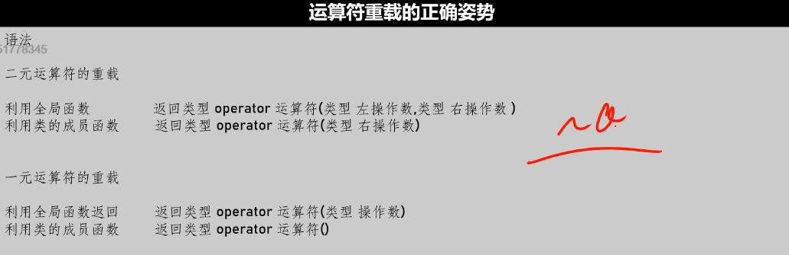
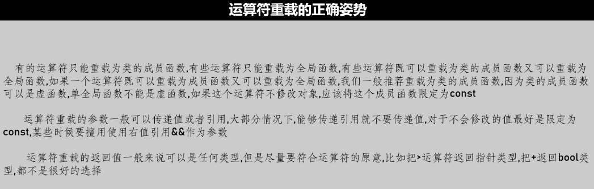

# 定义/调用

在面向对象编程中，我们如何让这些对象能够和普通类型一样实现加减乘除呢？

比如我们学习过的std::string类

```cpp
std::string str = "nihao";
str = str + "world";
```

要实现这个功能我们就要对运算符+进行重新设计，当我们的对象进行——运算时不再是编译器默认的+，而是进入我们制定的函数，这种重新设计运算符规则的技术，就称之为运算符重载。

语法：

非类的成员函数实现运算符重载

一般来说只有俩个参数

```cpp
返回类型  operator运算符()
------------------------------   
bool operator<(const Role& role1,const Role& role2);			//就是个函数叻
------------------------------
调用方法：
role1 < role2
operator<(r1,r2);
```


语法：

用类的成员函数来实现运算符重载

即在类中定义具体operator,但注意了，类中定义重载运算符函数只能有一个参数

当然也可以在类外Person::operator>()

```cpp
class Person {
	int age;
public:
	Person(int _age) :age{ _age } {};
	bool operator>(Person& p) {
		return age > p.age;
	}

};
-----------------------------------
Person p1(100);
Person p2(10);
std::cout << (p1 > p2) << std::endl;    
```

要注意的是此处>是人家p1的函数，p2是作为参数传入的


# 意义/原则/时机


重载运算符的意义：

- 让类也支持原生的运算  比如+-*/
- 提升对程序的控制权，比如重载new delete new[] delete[]

备注：

运算符重载的主要目的是为了让目标代码更方便使用和维护，而不是提升开发效率。


运算符重载的原则：

（1）不要改变运算符本身的意义，比如把加法重载为减法

（2）不建议重载逻辑运算符&&||，取值运算符&，逗号运算符， 

备注：重载后的逻辑运算符将不会进行短路测试


# 运算符重载限制

（1）不能够自创运算符，不是所有符号都能重载（例如===，==》）

（2）以下运算符不能重载：

- 对象访问运算符.（user.hp）
- 作用域解析运算符::  （std::cout)
- 求大小的运算符sizeof
- 三目运算符不能


（3）不能修改运算符本身的优先级，相关性（先乘除后加减不能变的）

（4）C++17以后不能修改运算符的操作数的计算顺序，17以前未定义

（5）除了new/new[]/delete/delete[]外，不能对原生数据类型的其他运算符进行重载

```
int operator+(int a,int b);		//原生数据类型运算符不能重载
```

（6）除了new和delete以外，其他运算符的arity（运算符关联的计算元个数）一律不能修改


# 正确使用建议






注意点：

（1）一个运算符如果既可以重载为全局函数又可以重载为类的成员函数，那么我们推荐您将其重载为类的成员函数，因为类的成员函数可以是虚函数，单全局函数是不可以是虚函数的。

（2）如果这个运算符不修改对象，请尽量将该成员函数限定为const

（3）一般情况下重载运算符参数可以按值传或按引用传，大部分情况下，能传递引用就不要传递值。以及视情况最好加上const，且某些时候要擅长使用&&型作为参数

（4）重载运算符的返回值，最好要返回切合原意的值，不要乱返回


# 重载赋值运算符

赋值运算符的重载必须是类的方法。

## 默认添加

在一个类中，编译器会自动为你的类添加一个默认的赋值运算符重载函数

```cpp
class Role{
public:
	int hp;
	int mp;
	
	Role& operator=(const Role& role){
		hp = role.hp;mp = role.mp;
        return *this;
    }
}
```

大概类似以上内容，于是我们即使没有重载该运算符，也可以使用这样的操作

```
Role r1,r2
r1 = r2;
```

可以在函数后加，可以让类删除这个默认的

```cpp
Role& operator=(const Role& role) = delete;
```


使用赋值运算符进行初始化时，编译器会想办法调你匹配的副本构造函数

为什么？

此时str对象都没实例化，编译器只能给你调副本构造函数

```cpp
myString str = "hello";
等价于
myString str("hello");	
```

而如果分开写：让对象先实例化

```cpp
myString str;
str = "hello"
```

那么，调用的则是类中重载赋值运算符


## 实现重载

赋值运算符的重载必须使用成员函数的方式实现。

当你的类中成员有指针的时候，往往需要自己实现以下=运算符重载，

因为默认的会将成员指针指向别人的地方，而对方若销毁了内存区，则会出现指向内存泄漏区


# 左移右移重载

由于我们不具备重写std::cout类的可能性，因此我们只能用全局函数的方法来实现重载。


## <<

通常在class.h头文件中声明该函数友元（方便取用数据而已）

```
friend std::ostream& operator<<(std::ostream& os, const myString& _str);
```

在myString.h文件中具体定义为：

```cpp
std::ostream& operator<<(std::ostream& os, const myString& _str) {
	os << _str.pstr << std::endl;
	return os;
}
```


辨析：

在main函数中

```cpp
myString str = "hello";
std::cout<<str<<"123"<<"world"<<std::endl;
相当于
先 operator<<(std::cout,str)   
再 operator<<(operator<<(std::cout,str),"123")   
再 operator<<(operator<<(operator<<(std::cout,str),"123"),"world")   
再 (operator<<(operator<<(operator<<(std::cout,str),"123"),"world")<<std::endl     
```

每一次返回的是流std::ostream本身


## >>

呃，由于输入涉及到内存分配，所以要写合适可以写很长，

此处代码只是非常粗糙的应用型，很多情况没有考虑到

```cpp
std::istream& operator>>(std::istream& is, myString& _str) {
	char* baseBuffer = new char[0xffff];
	is >> baseBuffer;
	int baseLength = strlen(baseBuffer);
	//memset();
	memcpy(baseBuffer + _str.length, baseBuffer, baseLength+1);
	memcpy(baseBuffer, _str.pstr, _str.length);
	_str.length += baseLength;
	_str.pstr = baseBuffer;
	return is;
}

--------------------------------------------------
std::cin >> str>>str;
```


# 重载下标运算符

下标运算符[]重载只能是类的方法


```cpp
char& myString::operator[](const int index) {
	if (index > this->length - 1) {
        std::cout << "下标溢出" << std::endl; 
        system("pause");
    }
	return this->pstr[index];
}
-------------------------
str[0] = 'S';
```

只有返回char&，返回的才是可修改的左值，才可以修改

若非本意，可以const char&


# 重载括号运算符

()括号运算符只能重载为类的方法


注意：

- ()重载也称为functor函数对象
- ()不限制参数个数可为0
- ()可以拥有默认实参


此例并未做安全性检测，start及end极有可能不符规定

```cpp
myString myString::operator()(const unsigned short start, const unsigned short end) {
	int baseLength = end - start + 2;//包括尾巴\0
	char* basePtr = new char[baseLength];//1234567 2 5[3,4,5,6]
	
	memcpy(basePtr, pstr+start, baseLength -1);
	*(basePtr + baseLength - 1) = '\0';
	return myString(basePtr);

}

```


