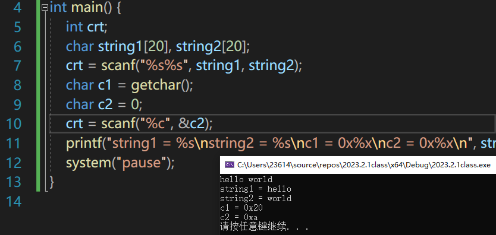

# scanf与%d

已经老生常谈了，

平时只要记住绿字：

scanf %d %f 发现里面有\n 空格  会忽略


## 深入详解：

指定了%d来读取一个整数，scanf()函数开始每次读取一个输入字符，它跳过空白字符(包含空格、制表符和换行符）直到遇到一个非空白字符，并期望发现一个数字字符或者一个符号(+或者-)。

即在scanf开始时：

逗号句号之类的符号也会被scanf()和%d的情况下读入，从而让scanf解除阻塞，但不会被写入内存。输出乱码


若scanf搭配%d已经开始读入数字时：

如果发现一个数字，那么就保存并读取下一个字符;如果接下来的字符是一个数字，再保存，继续读取。如此持续直到遇到一个非数字字符，【此时，该非数字字符不会被吞掉而留在缓存区】

此时函数认为:已经读到了整数的末尾。


此处.被getchar()吞了，scanf并没吃掉它。X正确赋给了c。


scanf会将这个非数字字符放回输入缓冲区。这意味着:下一次程序开始读取输入时，仍将从这个非数字字符开始。如果使用多个%d读取整数，但是不小心在中间输入了非数字字符，那么除了非数字字符之前对应的变量外，后面的变量将不会被赋值。

也就是说，scanf和%d的搭配是无法忽略非整形数字的。即使这次用scanf与%d输出缓冲区中非整形数字字符，该字符仍会留在缓冲区中。


此处，第二个scanf给j赋值时遇到符号，他不能忽视这个符号，只能忽视空格，制表符，回车。

按照前文所说，在scanf函数开始时遇到符号，scanf函数将解除阻塞，步过函数，但不写入内存，输出该处即为乱码。但这个符号，不会被scanf函数吞下，仍留stdin中

等到下一个%c能够匹配他时，就被匹配了，倘若在这之前还有n个%d，也会让这n个%d全部无功而返，逐一步过而符号本身仍存留stdin。


也就是说如果遇到非数字字符，scanf("%d")是会解除阻塞，且认为读入已经结束了，如果是给数组赋值，非数字字符之后的空间其实都没有被成功赋值，如果数组定义在主函数外，那么空间最开始都是为0的，没有被赋值的空间仍然为0，但如果数组定义在主函数内，未被赋值的空间输出来也有值，只不过是一些不知道是什么的数字。


总结一下：

即，忽视空格，制表符，回车；当作不存在

遇到符号，解除阻塞结束函数，符号留存。


## 综合前例


此时12与13中间的空格，貌似被越过了，就当作已经过了。。。

下面的scanf与%c读到的是0a对照ascii码 也就是回车。


以及，scanf搭配%s时，%s对于空格的态度与%d一样，读取前忽视滑过，读取中视为结束字符，不取，留中stdout。

输入hello空格world空格回车



能总结的是，非法字符在读取前一般直接滑过，读取中读到非法字符一般直接结束读取，但非法字符会留在stdin中。

经典的例子就是scanf搭配%s输入时，回车键一般会作为结束识别符号结束掉scanf的输入但会留在stdin，


# 总结整个流程


呃呃，我来尝试着总结一下，

scanf整个函数的执行分为

开始接收标准缓冲区数据、接收中、结束接收标注缓冲区数据

scanf("%d", &i);当scanf与%d搭配时：


1-开始接收标准缓冲区数据：

无视/忽视 缓冲区中的空格，回车；直到找到非空格，回车的字符，即使是,.等会接收错误的字符


（上图为无视前端空格回车）


（上图为接收第一个非空格回车的字符，即使他是错误的）

但如果他是类似,.等错误的非整形数据，会终止函数执行，但不会将逗号等字符的ascii对应码写入内存，该逗号仍在stdin中留存，遇到下一个scanf("%d", &i);仍然会重复以上操作。


好，如果刚开始接收标准缓冲区数据非以上2种情况，也就是说，他tm终于正常接收到了梦寐以求的数字了。

我们来总结一下，接收到后，会出现的情况


（上图为输入12空格13空格回车   的情况）

可以想象，一个程序计数器pc，类似指针一样的东西，指着stdin在滑动。

pc漠然的滑着，指向1，2时scanf("%d", &i);顺利接收，然后遇到随之而来的**空格**

*在scanf("%d", &i);开始接收数据时，会无视空格与回车，

​       但在接收到数字后，再遇到空格，回车，就会结束函数，该空格被留存在stdin中！！

此时stdin中是：空格13空格回车

*然后下一个scanf("%d", &i);函数来了，由上式可知，13前的空格会被无视，pc滑过，继续指向1，3

然后遇到空格，结束函数

此时的stdin中是：空格回车

*然后遇到scanf("%c", &i);函数来了，他可以吃掉stdin中的空格，吃掉一个字节的内存（ASCII码1字节，中文俩字节）就结束掉了，再然后下一个scanf("%c", &i);会吃掉回车。


【此例想说明的时，程序的执行，从stdin中读入数据等时候，是类似pc指针的滑过，

类似：

stdin：空格13回车

scanf("%d", &i);无视了空格，接收到13，遇到回车结束函数，回车留在stdin中

此时若scanf("%c", &i);被吃掉的是回车（0x0a）而不是空格（0x20），指针pc滑过就是滑过了，不会回头的。

】


说的基本说完了，看到这也基本可以预测输入12.13回车  会出现什么情况了


（上图中[2e] 十六进制的0x2e，对应小数点.   [31]，是16进制0x31，ascii码对应数字1，也就是13的1）


# scanf循环读取


## 死循环

scanf的返回值，时成功赋值的变量数量，发生错误时返回EOF,但，经过实验发现是0.。。。可能环境原因吧

在这种循环读取的情况下，如果输入a

scanf和%d将无法处理a而返回失败的0，0！=-1，判断正确，进入while循环

打印i的内容，i的内容因为scanf无法处理a，而一直停留在上一次正确输入的值

再到while判断，此时缓冲区仍有数据待处理（a），于是scanf不会阻塞，

又一次因为无法处理而返回0，又一次判对，又一次进入while循环

至此，进入了死循环。


那如何，刷走那个停留在缓冲区的顽固的a呢，

devc++和vs2012及以前可以用fflush(stdin)；

vs2017及以后得用新接口rewind(stdin);

Linux下得自己实现一个接口

以上作用都是想要清空缓冲区

vs2017以前按一次ctrl+z

vs2017及以后得tm连按读入ctrl+z才能退出判定循环，也就是ctrl+z回车ctrl+z回车ctrl+z回车。ctrl+z要在开头

## 清空实例：


逗号运算符，一个特点，while里面并列判断，执行语句时，居然是用逗号


# getchar()连续读取


可以完美实现行缓冲打印，也可以把他赋给数组之类的连续存储，挺好用的。

离奇的是，这个只要一次ctrl+z退出


# scanf混合输入


## %c

常见错误，%c吞了空格，%f接收不了字符，字符一直留在缓冲区，%d也处理不了，于是一直死循环

总之scanf里有%c就要谨慎。

```c
void scanf_more_type() {
	int i, ret;
	char c;
	float f;
	while ((ret = scanf("%d%c%f", &i, &c, &f)) != EOF) {
		printf("i = %d,c = %c,f = %f\n", i, c, f);
	}
}
```


简易的解决方式就是.%c前面加个空格就行。

```c
	while ((ret = scanf("%d %c%f", &i, &c, &f)) != EOF) {
```


## %f与%lf在输入/输出时

从概念上，以前就知道了，

%f，%lf在scanf输入时，要分清

在输出时，都可以用%f即可。

现在从内存上理解一下：


可以看到前四个字节都是00 00 48 41，读取的时候，scanf貌似正确的放入了数据

但printf函数是根据数据类型来控制读出内存容量，再通过格式控制符，输出相应格式的

d就是double型数据，printf打印时会一口气读8个字节内容，把前面微软置的cc cc cc cc都读进去

再加上小端存储，实际读取的内容是cc cc cc cc 41 48 00 00 

再根据ieee754标准把内存数据翻译成十进制


啊！这就是打印的内容，一切都是，照常进行的呢。

而printf读取float型数据f时，只会从首地址开始读4个字节，也就是41 48 00 00

再根据ieee754标准把内存数据翻译成十进制


这就是打印出来的内容呢。

修改scanf中读入double型对应参数为%lf后，显而易见的，多填了很多00

double的12.5和float的12.5在内存里存的数据完全不一样。


# getchar()/putchar()


同时getchar()也常用来有意识的帮助我们吞空格；

输出getchar的内容可以不用scanf那么繁琐，可以用更轻量级的putchar();

**但putchar()是输出完是不会换行的。**


# gets读取一行


# puts读出一行


以上俩个板块内容知识适合与scanf，fscanf等函数对比学习

gets puts函数的章节目录是 c语言--王道训练营--day03--03文件

fgets fputs fscanf函数的章节目录是 c语言--王道训练营--day08--文件操作

建议全部打开，对比学习其相同不同


# printf

printf和%s搭配时，将标准输出缓冲区里的数据按照字符串形式输出，也就是空格回车无所谓，遇到\0再停止


printf默认右对齐，加负号可以变成靠左对齐

```c
void printf_format() {
	int i = 10;
	float f = 98.3;
	printf("student info num=%3d,score=%5.2f\n", i, f);
	printf("student info num=%-3d,score=%5.2f\n", i, f);
	printf("%10s\n", "hello");
}
```


%3，%5的意思是规定总共输出3、5格子（小数点也算一格），不足的默认向右靠齐。

%3d默认向右靠齐，想要靠左就%-3d

%10s也是一样的，输出10个格子，hello只占5格子，默认向右靠齐


student info num=%04d，就是向右靠齐，前面部分填0（常用月份表示）

student info num=%-04d，由于是向左靠齐，前面填不了0，相当于没效果


