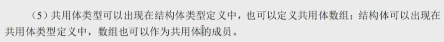
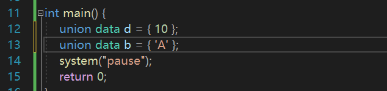
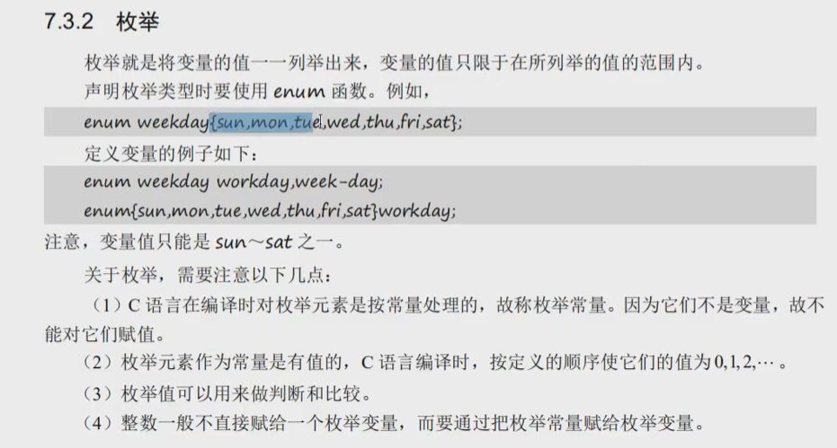
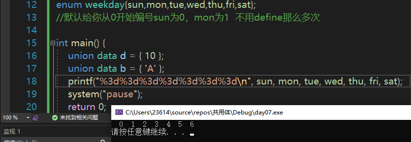
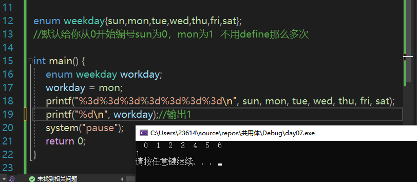
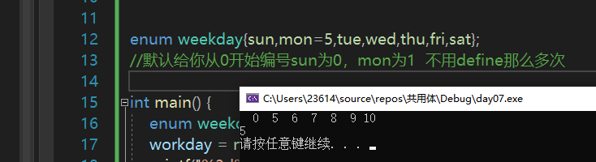

# 昨日总结


# 共用体


几个不同的变量共占同一段内存的结构 叫   共用体（又称联合体）


# 共用体定义





# 共用体赋值

比起用.引用赋值，更常见的是用{}




# 枚举



枚举元素当作常量处理，枚举常量，不能对他们赋值

枚举元素作为常量的值是有序的，从0开始

枚举常量：



为了防止枚举常量被误认为变量赋值，我们一般把枚举元素全部大写、


枚举变量：

做到见名知意



这样也是可以的，后续会默认自增1



代码部分：

```c
enum weekday{sun,mon,tue,wed,thu,fri,sat};
//默认给你从0开始编号sun为0，mon为1  不用define那么多次

int main() {
	enum weekday workday;
	workday = mon;
	printf("%3d%3d%3d%3d%3d%3d%3d\n", sun, mon, tue, wed, thu, fri, sat);
	printf("%d\n", workday);//输出1
	system("pause");
	return 0;
}

```


