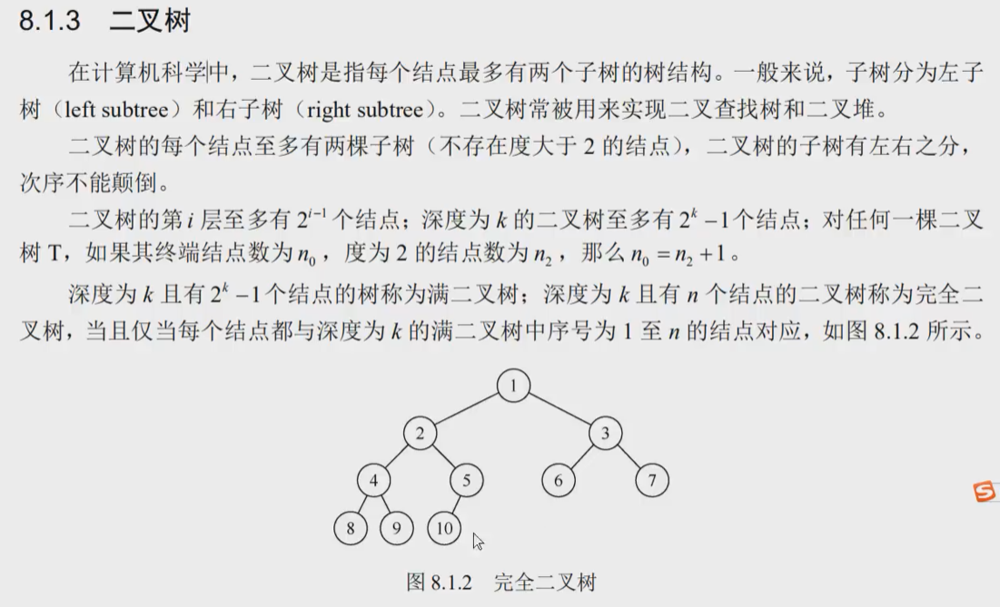

# 栈


栈就是一种操作受限的线性表，可以用数组实现，也可以用链表实现

## 栈的定义

栈的数据结构定义

(链表实现)

```c
typedef int ElemType;
typedef struct tag {
	ElemType  m_val;
	struct tag* next;
}Node,*pNode;

typedef struct {
	pNode phead;
	int size;
}Stack,*pStack;

```

并要求栈有以下功能，对应函数：


## 实现栈的各项函数

```c
#include"head.h"

//用pStack指针修改stack结构体的内容没问题
void init_stack(pStack ps) {
	memset(ps, 0, sizeof(Stack));//这就将phead置空了

}

void push(pStack ps, ElemType val) {
	pNode pnew = (pNode)calloc(1, sizeof(Node));
	pnew->m_val = val;
	if (ps->phead == NULL) {//栈为空
		ps->phead = pnew;
	}
	else {									//用头插法插入,把栈倒过来想象，
												//先插入的就在上面，后插入的永远在phead指针，方便取用
		pnew->next = ps->phead;
		ps->phead = pnew;
	}
	ps->size++;
}

ElemType pop(pStack ps) {//ps = &stack
	pNode pcur = ps->phead;
	if (!ps->size) {		//判断是否为空的另一种方法
		printf("stack is empty.\n");
		return ;
	}
	ps->phead = ps->phead->next;//指针往上移一个
	ps->size--;
	free(pcur);				//易忘，不要忘记链表实现的，要及时free掉弃用的结点
}

int is_empty(pStack ps) {
	return !ps->size;
}

int size(pStack ps) {
	return ps->size;
}


ElemType top(pStack ps) {
	return ps->phead->m_val;
}
//top可以不传地址实参，可以建立一个形参stack
ElemType top_s(Stack s) {
	return s.phead->m_val;
}
```


# 队列

队列的概念就是先进先出

想象成一个管道，永远只在后端插入，前端删除

用链表实现就是如此


循环队列，就像是分块的圆饼


移动队尾指针rear进行插入

即，数组大小为5，但循环队列满只能放4个数

判断循环队列是否满的条件非常经典：

rear+1 % MaxSize  ==  front

而循环队列尾指针移动也很经典：

rear = （rear+1）%MaxSize；


## 循环队列的定义

此处用数组实现，用链表也可以实现.

```c
#define MaxSize 5

typedef int ElemType;

typedef struct {
	ElemType data[MaxSize];
	int front, rear;
}SqQueue;

```


## 循环队列的各项函数

关键就在于那几句：

q->rear = (q->rear + 1) % MaxSize;

循环队列的判满，下标移动，统统要和maxsize挂钩。

```c
void InitQueue(SqQueue* q) {
	q->front = q->rear = 0;
}

void EnQueue(SqQueue* q, ElemType val) {
	//判断循环队列是否满了
	if ((q->rear + 1) % MaxSize == q->front) {
		printf("sq is full\n");
		return;
	}
	q->data[q->rear] = val;
	q->rear = (q->rear + 1) % MaxSize;//循环队列的++方式，普适性
}

ElemType DeQueue(SqQueue* q) {
	if (q->front == q->rear) {
		printf("sq is empty.\n");
		return;
	}
	ElemType val = q->data[q->front];
	q->front = (q->front + 1) % MaxSize;
	return val;
}

```


# 二叉树




二叉树的基本特征要晓得

第i层有2^(i-1)次方个结点，i层二叉树共有2^i -1个结点

以及经典结论：n0 = n2 +1


## 二叉树结构定义

```c
#define Elemtype char

typedef struct node {
	Elemtype elem;
	struct node* pleft;
	struct node* pright;
}Node,*pNode;

```


建立二叉树最常用的方法是层次建树，一层放满后，再放下一层


## 层次建树

层次建树的关键在于，你要知道放在哪个父亲结点的下面


本例以pNode数组做辅助队列

（有限固定数组）

```c
#define N 10
void build_tree() {
	pNode tree_root = NULL;
	char c[N + 1] = "ABCDEFGHIJ";
	pNode p[N + 1];
	for (int i = 0; i < N; i++) {
		p[i] = (pNode)calloc(1, sizeof(Node));
		p[i]->elem = c[i];
	}	//以上为初始化插入数据，pNode[]做辅助队列

	int j = 0;						//j记住往哪个结点放数据
	for (int i = 0; i < N; i++) {
		if (NULL == tree_root) {
			tree_root = p[0];
			j = 0;
		}
		else {
			if (p[j]->left == NULL) {//判断要插入的结点
				p[j]->left = p[i];
			}
			else if (p[j]->right == NULL) {
				p[j]->right = p[i];
				j++;//当结点右边满了后，就要判断下一个结点了
			}
		}

	}
}
```


链式队列辅助层次建树

（无限输入，贴合实际）

就是用队列来辅助寻找父节点，然后判断插入该父节点的左右，记得及时出队

```c
void buildBinaryTree(pNode* treeRoot, pQueue* queHead, pQueue*queTail,Elemtype val) {
	//给树节点申请空间
	pNode treeNew = (pNode)calloc(1, sizeof(Node));
	treeNew->elem = val;
	pQueue queNew = (pQueue)calloc(1, sizeof(Queue));
	queNew->insertPos = treeNew;		//插入结点指向treeNew
	if (NULL == *treeRoot) {
		*treeRoot = treeNew;			//成为根结点的同时，入队列，队头队尾都是queNew
		*queHead = queNew;
		*queTail = queNew;
	}
	else {
		//一个新的结点来了，需要先入队
		(*queTail)->pNext = queNew;
		*queTail = queNew;
		//判断该结点插入父节点的左右
		if ((*queHead)->insertPos->left == NULL) {
			(*queHead)->insertPos->left = treeNew;
		}
		else if ((*queHead)->insertPos->right == NULL) {//也可以不用判，非左即右，父节点由队列控制
			(*queHead)->insertPos->right = treeNew; //放入某个父节点的右边后，父节点要出队
			//父节点左右孩子都有了，出队
			pQueue queCur = *queHead;		//工作指针，让head往后移动后可以free掉前面的
			*queHead = queCur->pNext;
			free(queCur);
			queCur = NULL;
		}
	}

}
```


## 先/中/后序遍历

递归版本：（逻辑符合人脑）

先序遍历

```c
void pre_order(pNode tree) {
	if (tree) {
		putchar((int)tree->elem);
		pre_order(tree->left);
		pre_order(tree->right);
	}
}
```

中序，后续，均只要改变order函数的位置就行了。

概念不要记错了

先序遍历，进来了就打印，再左再右

中序遍历，进来了找左节点，找到底了再打印，再根再右结点

速度中序：把这棵树一脚踩平，按顺序来就是中序hhh

后序就是左右根


# 红黑树


# 数据结构学习技巧


