# 时空复杂度

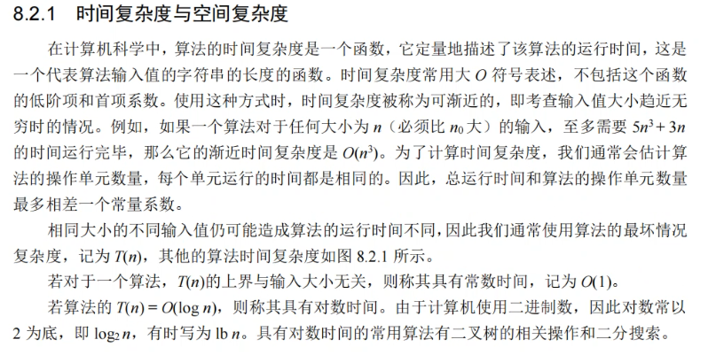

不包括首项系数及低阶项

通常用算法的最坏情况复杂度记为Tn

如果对于一个算法，Tn的上界与输入大小无关，则称其具有常数时间，记为O（1）

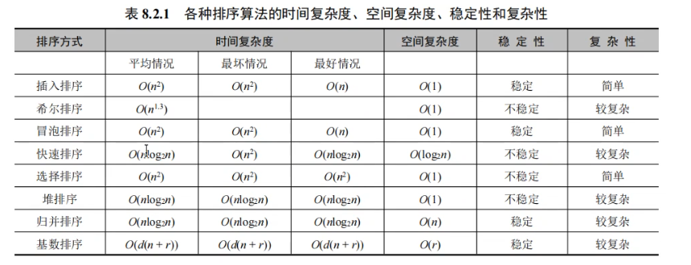


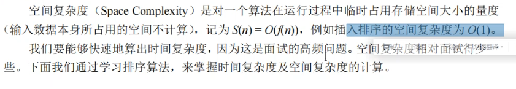

输入数据本身所占的空间不做计算


# 产生随机数

```c
	srand(time(NULL));//产生种子
	for (int i = 0; i < 10; i++) {
		printf("Random number  #%d:%d\n", i, rand()%100);
	}
```

后面的模100，就控制了大小0~99

实际上，rand() 函数产生的随机数是伪随机数，是根据一个数值按照某个公式推算出来的，这个数值我们称之为“种子”

srand()重新播种，每次编译时，time()产生的随机参数不同，则srand()根据time()产生的种子也不同

其中time()函数：

返回的值通常表示自 1970 年 1 月 1 日 00：00 小时（即当前*unix 时间戳*）以来的秒数。


如果要规定上下限：

```c
int a = rand() % 51 + 13;    //产生13~63的随机数
```

0~50 +13即 13~63


# 宏定义函数

预处理操作，不用像函数一样压栈弹栈

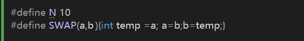


# 冒泡排序

写各种排序算法，熟悉的不熟悉的，简易从内层开始，外层的for暂且闲置


自己写的冒泡：

每一次内层排序，都会讲最大值推到最后

```c
	int a[7] = { 2,5,7,9,3,6,10 };
	for (int i = 0; i < 7; i++) {//外部是下标，轮到哪一个数
		for (int j = i - 1; j > 0; j--) {//内部是比较次数，随着下标而变化
			if (a[j] > a[j + 1]) {
				int temp = a[j];
				a[j] = a[j + 1];
				a[j + 1] = temp;
			}
		}
	}
	for (int i = 0; i < 7; i++) {
		printf("%d  ", a[i]);
	}
```


龙哥的：

逻辑上更好理解了。。一定要先写内层逻辑，再外层

```c
void bubble(int* a) {
	for (int i = N - 1; i > 0; i--) {
		for (int j = 0; j < i; j++) {
			if (a[j] > a[j + 1]) {
				SWAP(a[j], a[j + 1]);//按理来说，应该传&才行，但宏可以no
												//一段比较短的代码，你又不想封装成函数，就可以用宏
			}
		}
	}
}
```

内核逻辑差不多，龙哥的是外层比较次数（无序数的数量），内层函数下标。


改良版：（提前结束排序）

```c
void bubble(int* a) {
	for (int i = N - 1; i > 0; i--) {
		int flag = 1;
		for (int j = 0; j < i; j++) {
			if (a[j] > a[j + 1]) {
				SWAP(a[j], a[j + 1]);//按理来说，应该传&才行，但宏可以no
				flag = 0;					//一段比较短的代码，你又不想封装成函数，就可以用宏
			}
		}
		if (flag) {//冒泡提前结束
			break;
		}
	}
}
```

flag哨兵。

如果有一次遍历发现，后续都是排好了队的，没有存在任何a[j]>a[j+1]的存在，此时冒泡就可以提前结束了。


写完后要记得试一试临界数行不行。


# 选择排序

也要记得，先写内部逻辑，内部也是无序数个数，比较次数。外部写出内部就知道是要控制下标移动了。

```c
void select(int* a) {//找出最小值或最大值，然后交换其到合适的位置
	for (int i = 0; i < N - 1;i++ ) {
		int min_pos = i;
		for (int j = i+1; j < N; j++) {//无序数个数
			if (a[j] < a[min_pos]) {
				min_pos = j;		//只记录，暂不交换
			}
			SWAP(a[min_pos], a[i]);
		}
	}

}
```


# 插入排序

每一次插入后都是有序的

要遍历的是有序数的数列，还是倒着遍历的。

外层控制要拿哪个数去插入

内层控制遍历有序数序列，倒着遍历

```c
void insert(int* a) {
	int insert_val,j=0;
	for (int i = 1; i < N; i++) {					//i外层控制拿哪个数去遍历,下标为0的那个数单独													//拿出来就有序，不需要拿
		insert_val = a[i];								//所以从下标1开始到N-1
		for (j = i - 1; j >= 0; j--) {//倒过来遍历有序数
			if (insert_val < a[j]) {		//如果该数小于遍历当前数
				a[j + 1] = a[j];			//遍历当前数字往后挪一个
			}
			else {							//如果记录数大于遍历当前数
				//a[j + 1] = insert_val;	//最少也只能a[1]，若要插入到a[0]则不行
				break;
			}
		}
		a[j + 1] = insert_val;
	}
}
```


# 希尔排序

实用意义不大，理解思想

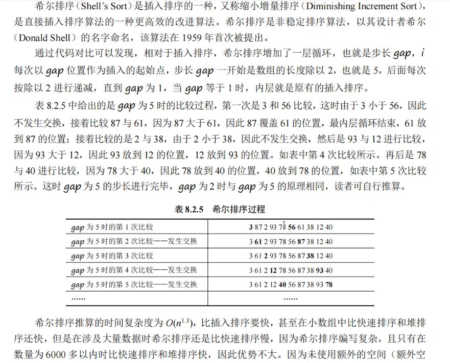


# 快速排序

交换法写起来简单

```c
//基于交換的快排
int partition(int* a, int left, int right) {
	int i, k;
	for (i = k = left; i < right; i++) {//right是分割值
		if (a[i] < a[right]) {
			SWAP(a[i], a[k]);
			k++;
		}
	}
	SWAP(a[k], a[right]);
	return k;
}
void quick(int* a,int left,int right) {//分治思想
	int pivot;	//分割值的下标
	if (left < right) {				//不是while！！！
		pivot = partition(a, left, right);
		quick(a, left, pivot - 1);
		quick(a, pivot + 1, right);
	}
}
```

传参应该是quick(a,0,N-1);不是N哦

考研更偏爱挖坑法

了解一下吧。真要用，还是回头调qsort()吧

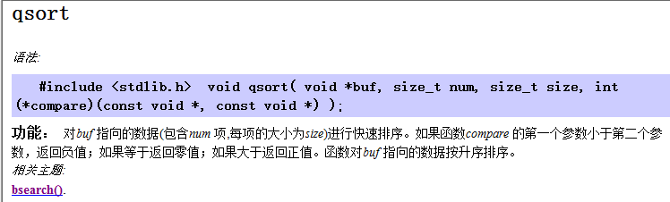

qsort非常灵活好用，由于size_t，还可以排结构体数组的大小，

还有这个函数指针做形参：

**(\*compare)(const void \*, const void \*)** 

qsort()调用了这个方法，要用qsort()就一定要写出这个compare函数

复写（请原谅我不得不用出这种java风格的描述。。）这个函数的时候

叫啥都行，compare()也好，cmp()也好，主要返回值要是int，里面入参要传对，俩个void*型指针


重写compare()

用来排int型数据，函数对buf指向数据升序排列，如果要降序，-1和1反过来填

```c
    qsort(a, N, sizeof(int), compare);

int compare(const void* pleft, const void* pright) {//compare就是比较规则，void*保证了其灵活性
	/*pleft, pright分别指向数组的任意俩个位置元素的地址
	其中，sort函数对compare函数有以下要求：
	如果函数compare 的第一个参数小于第二个参数，返回负值；
	如果等于返回零值；如果大于返回正值。*/
	int* p1 = (int*)pleft;
	int* p2 = (int*)pright;
	if (*p1 > *p2) {
		return 1;
	}
	else if (*p1 < *p2) {
		return -1;
	}
	else {
		return 0;
	}
}
```


当你想用qsort()来比较结构体大小时，原理是一致的：

从结构体中取出数据，再比较

其中，int，char型数据可以直接return前者减后者。

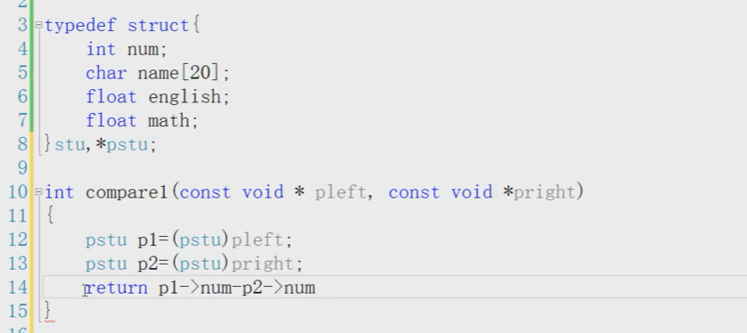

比较结构体中的float型及其他数据：

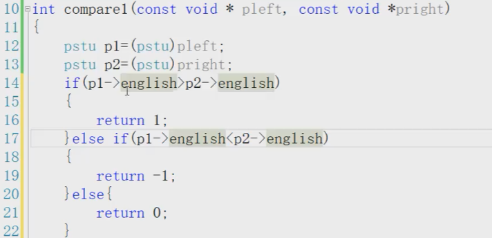


然而其实结构体数组的应用并不是很常见，更多实际情况是链表式数据，结构体链表

而我们知道，如果频繁的交换相对庞大的结构体，是非常不明智的行为。

我们之前的解决方案是，使用一个结构体指针数组，一串指针数组，只交换指针在数组中存放的位置。

现在我们结合快排来实现一下：

快排结构体：

首先遍历一遍链表并存下结构体地址给结构体指针数组的各个成员

pstu p[5];

p[i] = &sarr[i];	或者 = sarr+i；

结构体指针数组取结构体成员操作：

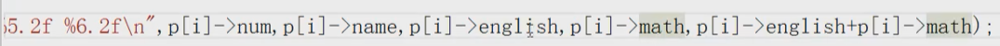


关键的地方在于传参：

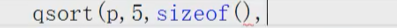

这里的sizeof到底填pstu还是stu呢？！

此处注意，你的数组里是什么内容，交换的是什么内容，就填sizeof什么，也就是此处是pstu

不要想着最终比较的是什么。

```c
	qsort(p, N, sizeof(pstu, compare_p);
```

然后复写新的compare中，有第二个关键点，传参后pleft，pright如何强转

强转成pstu还是stu呢？

答案是都不是，在compar()中最终强转的是一个二级指针类型：

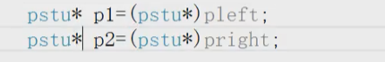

其实也很容易理解，你传进去的排序的虽然是一个数组，但是一个指针数组，里面存的都是地址。

看看compare()函数的形参

```c
int compare_p(const void* pleft, const void* pright) {}
```

这俩个变量，是任意俩元素的地址值，

以往来说，这俩个指针都指向某个数值，于是你拿一个指针就能操控这些值

现在传入的是指针数组，数组成员都是一些地址作为参数传进。

虽然他给我的是一级指针，那你得明白，

它是二级指针、


一定要记住，qsort排指针数组的时候，compare()一定是要强转成二级指针的


```c
int compare_p(const void* pleft, const void* pright) {
	pstu* pp1 = (pstu*)pleft;
	pstu* pp2 = (pstu*)pright;
	(*pp1)->english
}
```


