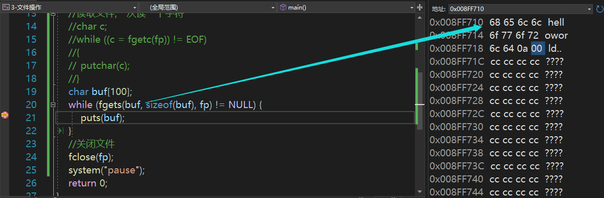
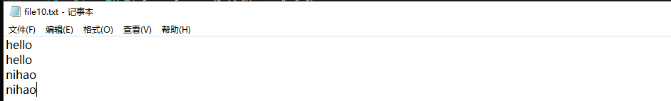

# fopen()/fclose()

直接用fopen()会让vs觉得不安全，需要在前面加_CRT的#define

```c
FILE *p = fp;
fp = fopen("file.txt","r+");
```


file资源文件需要和main.c同一级，如果放在别处，要用.. \\\等操作找到其相对路径

如果在下一级，前面不能有\\\\，而是应该直接FILE* fp = fopen("source\\StudentList.txt", "r");


用w方式打开该文件，会默认清空掉原来的数据.

常用的就是r和r+，r只读，r+可读可写


fopen之后一定要记得判断文件指针是否为NULL，不判断如果在后续操作，会直接程序故障。

perror("fopen");很常用的操作，可以返回你刚刚的错误原因。

```c
	if (NULL == fp)
	{
		perror("fopen");//判断刚刚执行失败的函数的失败原因
		return -1;
	}
```


fclose()用于关闭给出的文件流，并释放关联到流的所有缓冲区，fclose()执行成功时返回0，否则返回EOF。

打开一个文件后就会使用一些资源，你不close掉是不会释放的，就像指针指向空间要及时free掉一样。


附一个烦的愚蠢的错误，在循环里声明结构体，以为每一次循环都会是新的地址

结果while的一次循环结束后，该循环内的临时变量就没了，下一次执行到声明结构体时，又是这个一样的地址。

所以在循环里声明结构体变量，尽可能想清楚用不用malloc。


# fgetc()/fputc()

fgetc()/fputc()和以前读标准输入流的getchar(),putchar()很像，只是属性有些许差别。

文件是没有结束符一说的，不要把EOF误以为是文件结束符，	EOF只是文件读取结束后返回的标识

操作系统实际是知道文件的大小的，文件大小是其一个属性，读到文件大小的边界后，操作系统就知道结束了。


fgetc()读一个字符后，光标会自动往后移一位。

这个光标是有记录的，你用fgetc()读了后再用fgets()读一行，也会从当前光标开始读，光标不会随函数结束而回来。

移动光标有自己的接口，

一定要注意c = fgetc()要括号阔起来再！=

```c
	char c;
	while ((c = fgetc(fp)) != EOF)
	{
		putchar(c);
	}
```


# fgets()和fputs()

一次读一行，存到buf数组中

```c
	char buf[1000];//一次读一行
	while (fgets(buf, sizeof(buf), fp) != NULL)
	{
		printf("%s", buf);
	}
```


**细节区别1，fgets()一次读一行，读取失败时时返回NULL而不是EOF！**

**细节区别2，fgets()在之前与scanf()之类的区分时也知道了，fgets()读取一行，但会把\n也读进来**


**细节3，puts（）这个函数本来是用来和gets()对应的，gets()是会把流中的\n留在流中，结束读取，**

故puts()的设计是，输出一行，并自动换行。

于是当puts()和fgets()搭配时会发生诡异的，连换俩行！


所以建议，咱一般还是用printf搭配%s来输出，而不是puts()，连续换行太傻了。


**细节4，fgets()把数据读到buf指向空间后，会贴心的给你在末尾附上\0，这点挺好的。**每一次不用担心结束符。




# fscanf()和fprintf()

fscanf，从file中读取数据，写入某个地方

fprintf，将数据流写入file里。


原文件file10



运行后：


看来fprintf()打印会擦除掉原有的一些内容


但只要你不close掉，就会有记忆光标给你排忧解难~

合理推测，close掉后光标从0开始


记忆卷轴：

scanf的返回值是

写入成功的个数的多少，就返回多少


printf的返回值是

输出成功的个数多少，就返回多少


fscanf与scanf同理，是写入的个数

fprintf则不同，返回的是成功写入文件的字节数


# rewind（fp）

重置文件指针


# 常用判断函数

isalpha()


isalnum()


