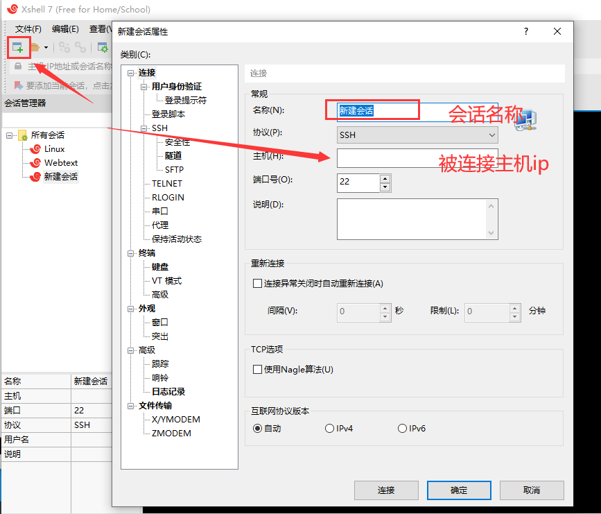
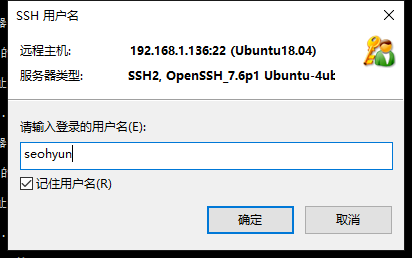
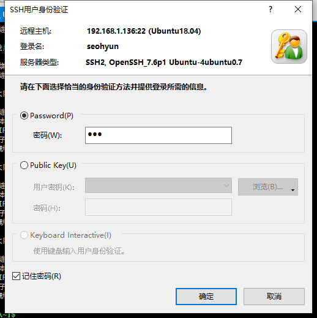
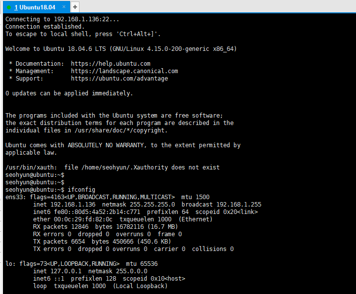
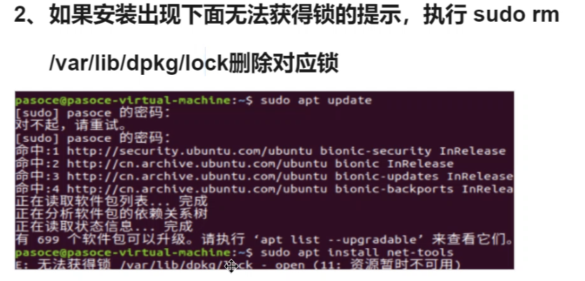
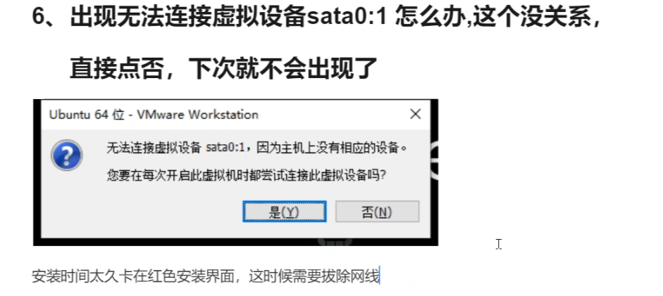
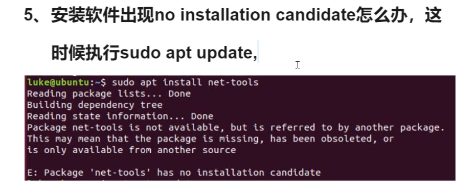

# 虚拟机基本操作


刚安装好的ubuntu连一些基本命令例如ifconfig都不能用

只能用ip addr之类的命令，如果要安装这些快捷命令（ifconfig）

需要

``` less
sudo apt install net-tools
```

安装这个包才行


需要使用Xshell连接虚拟机（基于ssh）的话

需要

``` 
sudo apt install ssh
```

安装ssh包

使用

``` 
ps -elf|grep ssh
```

来查看是否电脑上有ssh进程

``` 
4 S root       2746      1  0  80   0 - 18076 -      01:31 ?        00:00:00 /usr/sbin/sshd -D
```

有以上进程代表安装好了


# xshell连接ubuntu









大功告成了。


# 可能遇到的问题

## 软件安装锁



软件的下载安装得一个个执行，所以每一次都会有一个锁在这里，如果上一个软件没装完，就会导致这个锁停留在这个位置，那怎么办呢

只要他提示你了xx资源不可用，他提示你什么，你就删除什么。

如图提示/var/lib/dpkq/lock。

不要删多了 提示到lock就要删到lock，不能到lib之类的全删了


## 出现无法连接sata0：1




## no installation candidate




# 连接外网

暂时跳过，回头有需要在搞上