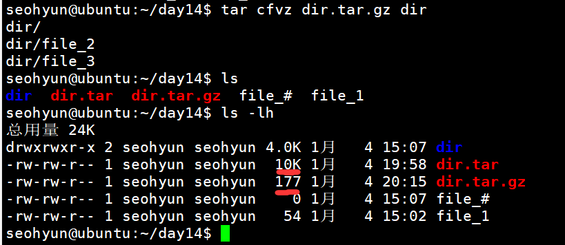

# Linux常用命令

## 用户配置

信息存放位置：


普通用户是$

超级用户是#

一般工作的时候，一定要尽量避免使用超级用户

切换用户：

```c
su root
```

在ubuntu的体系下，刚开始建立的初试用户（例如seohyun）就像是皇帝颁发圣旨的太监，某些时候可以代表皇帝的威仪

在命令前加上

```c
sudo xxx		//行使root的权限做xxx命令
```

可以用其改变root的密码：

```c
sudo passwd root
```


有了别的用户之后就可以用

```c
su xxx //用以切换用户，缺省xxx为切换至root
```


新增用户命令

开头

```c
root# useradd player
seohyun$ sudo useradd player
```

完整：

```c
seohyun# sudo useradd -m player -s /bin/bash
```

不加-m就没有home下的目录。

-s是指定解析器路径，业界最常用的解析器路径/bin/bash

如果不指定将会用最简陋的解析器，

将造成这个用户它的配置将不能够正常解析

bash解析器是在命令行输入的任何命令都得在解析器中解析


 

passwd 修改自己的密码需要满足一定的复杂度

如果是以root身份修改别的用户的密码，则没有这种要求


如何查看用户是否已经配置好了

```c
$ cat /etc/passwd
```

新增的会在最下面显示


删除用户

```c
$ sudo userdel -r player
```


第一个创建的用户seohyun，在admin组，一个用户可以在多个组里


Ctrl + a光标回到最开头，Ctrl + e回到结尾


## 目录及文件操作

```c
ls		//目录 ls ../
clear	//清屏
history		//查看历史使用命令
```


### ls

ls .就相当于ls，.代表当前目录，..代表上一级目录

-a查看所有隐藏文件，Linux默认以.开头的文件都是隐藏文件，


-l非常常用，-l可以看到文件的一些信息，（权限-拥有者-拥有组-大小-最后修改时间-名称）


主要关注权限，以drwx-xr-x为例

第一位代表文件类型，Linux不以文件后缀来区分文件类型（区别于windows）

第一位是d，代表是目录，

第一位是-，代表是普通文件例如.txt，.gz

第一位是l，符号链接，代表链接文件

第一位是b，块设备文件

第一位是c，字符设备文件

第一位是p，命名管道

第一位是s，socket文件

后9个字符代表读-写-执行的对应权限

r-read-读，w-write-写，x-执行

九个字符每三个分别对应：拥有者-拥有组-其他人


### cd

```c
cd ..	//到父目录
cd /	//到根目录
cd ~	//到home目录
cd -	//到上一次转跳来的目录
```


### pwd

显示当前目录

```c
pwd
```


### mkdir

创建目录

```c
mkdir dirname
mkdir dir1/dir2
```

可以嵌套


### rmdir

删除目录

```c
rmdir dirname
```


### cp

拷贝文件或目录

```c
cp file1 file3
cp 源 目的地
```

源和目的地都可以是xx路径，最好就在自己home里

加入-i用以提示是否会覆盖，不加会直接覆盖。

加入-f可以强制进行覆盖，不会提醒你

加-r参数，循环拷贝，可以将目录及目录里的文件一同拷贝


### mv

移动文件或目录，类似于剪贴，也常用来重命名

```c
mv [选项] 源文件或目录 目标文件或目录
```

功能：视mv命令的第二个参数类型不同，mv命令将文件重命名或将其移动到一个新的目录

mv也有-i和-f，功能与上面同理


### rm

删除文件和目录

```c
rm [选项] 文件或目录
```

rmdir只能删除空目录，rm目录文件都可以

需要加-r

大名鼎鼎的rm -rf /其中-rf，f就是不提醒


### tree

tree

需要安装，安装的命令也逐渐熟悉了sudo apt install tree

就可以浏览树形结构


最常使用的-h

tree -h


显示的文件夹的大小，而非文件夹中总文件的大小，文件夹都是4096

其他的参数到时候再man tree临时查阅吧


### chmod

重要的命令

chmod，改变文件，目录的权限

一般用数字设定法，记住各个权限的数字及顺序

执行1，写入2，可读4

u，g，o

例如chmod 600 file

之让自己读写，组和其他人全部0；


能不能删除某个目录或文件，取决于账号是否有写入权限


### find

```shell
find 起始目录 查找条件 操作
find /user/include/ -name stdio.h
```

-name以名字查

-type d就是查目录

-type f就是差文件，俩个都不加，全查了

报错的话，就尽量将filename用引号括起来

-o可以表示or条件

```shell
find /home/user -name file1 -o -name file2
```

字符串内可用通配符*，？，[]

*代表0个或任意多个字符

？代表1个字符

[]代表区间


就相当于模糊搜索，仅记住文件名的开头，就用file*，记得用引号引起


find后需要跟开始查找的起始路径，通常可以是.代表当前

可以用-group，或者-user来根据分组，分人来查，查哪个不是你的创建的文件。

-empty查找空文件夹，空文件


find常和管道，xargs连用，

```shell
find /sbin -perm +700 |xargs ls -l
```

xargs 一般是和管道一起使用。


-perm根据权限查找文件

```shell
find . -perm 777
```


### df

```shell
df -h
```

df用来检测文件系统的整体磁盘空间使用情况。


### du

前面我们知道ls -l不能看到包含文件的目录，整个目录多大，可以用du

显示每隔文件和目录的磁盘使用空间

```shell
du -h ./Desktop/
```


## 文件查看及处理命令

### cat

cat读取文件并将其输出到shell命令行中


-n能加上行数，-b行数不统计空白行


cat -E用来查看行真正的结尾，会在结尾处加上$

cat将文件的内容输入到标准输出中


### 重定向>

非常常用

重定向标准输出

cat打印到标准输出的内容，被重定向到file3中，就存到了文件file3中

如果该目录下没有该文件名，则会创建该文件。

```shell
cat file1 >file3
```


重定向输入<

**重定向输出>(常用)**

注意：重定向输出，会将文件里原来的东西覆盖掉！


**追加输出>>**

由于重定向会将文件原来的覆盖掉，当你想追加输出到某个文件时

需要用这个


错误重定向2>

可以重定向输出perror输出的错误信息


### 创建空文件

linux中创建空文件常用的四种方式：

```shell
echo >a.txt（有一个字节大小）
touch b.txt
cat >c.txt
vi d.txt
```


### head/tail

先不进入该文件，仅观察前/后几行

```shell
head -n 5 The_Holy_Bible.txt
```


### more/less

单页浏览文件使用more或less


### sort

对文件内容进行排序

可以帮我们快速的构造一些数据

sort后会按ascii码顺序排序输出，但不会改变原文件的内容顺序


### file

file命令查看文件属性

在Linux中可执行文件是ELF而不是.exe


### uniq

去重（重复）输出

单纯的

```shell
uniq filename
```

只会把排在一起的重复行去除

如果想把文件里相同的统统去掉，则可以结合上面的sort

sort后的输出不是管道型的，是一次性打在屏幕上的，不用xargs

只需要

```shell
sort filename | uniq
```


加-c可以在行头显示出现的次数

-d仅显示重复行

-u仅显示不重复行


### wc

卧槽，可以统计行数，单词数，字符数

可以单独查看，分别加-l，-w，-c分别实现


常与ls连用来统计该目录下共有多少个下一级文件/文件夹


### iconv

汉字编码转换

window下常用gbk，gb2312等汉字编码

Linux下一般全是utf-8


### *_grep

grep是过滤器一样的东西，用来筛选，查找文件中的某个东西

加-n显示行号

grep是重要的命令


最常用的，在某个文件中找某个字符串


ls与含有d的文件/目录


ls与首字母是d的筛选条件的grep


ls与尾巴是1的筛选条件的grep


常用来查.c文件之类的


## 其他命令

### 管道


### 文档管理/打包压缩


（多个）文件打包

```shell
tar cfv dir.tar dir
```

v会打印被打包的文件名，一般可不加


这只是打包，大小可能还会变大，就像用箱子装东西里面难免有闲余的地方。命名的.tar也是用来给人类自己看的，不是强制要求，不是格式


文件压缩

```shell
tar cfvz dir.tar.gz dir
```

就是要多一个参数z，用于压缩文件




解压缩则需要加上x的表示

```shell
tar xfv dir.tar
tar xfv dir.tar.gz
```


解压缩.gz的压缩包，也只需要一次xf，不需要多次解压，

解开打包和解开压缩包一样只需要xf


还有一种专门用来打包和解压的命令

```shell
gunzip clash-linux-amd64.gz
```


### scp

scp远程拷贝

将东西远程拷贝到某个地方

```shell
scp dir.tar.gz username@ ip:存放路径
scp dir.tar.gz player@42.192.117.114:~
```


将服务器的某个东西拷贝到本机上

(不要忘记最后的.，这是你拷贝到当前路径的路径，缺了就不行了)

```shell
scp player@42.192.117.114:~/dir.tar.gz .
```


### ssh

ssh可以用来远程登陆

```shell
ssh seohyun@192.168.1.136
ssh 用户名@ip
```


### source

改好配置文件不会立刻应用，重启啥的才能用，但是学计算机的怎么能随便依赖重启解决一切问题这种思路

```shell
source ~/.bashrc
```

source某个配置文件，可以直接启用其配置


## 永久着色

也就是修改.bashrc

可以加一句

```shell
export PS1="\[\e[37;40m\][\[\e[32;40m\]\u\[\e[37;40m\]@ \[\e[36;40m\]\w\[\e[0m\]]\\$ " 
```

用以备忘录

修改前：


修改后：


