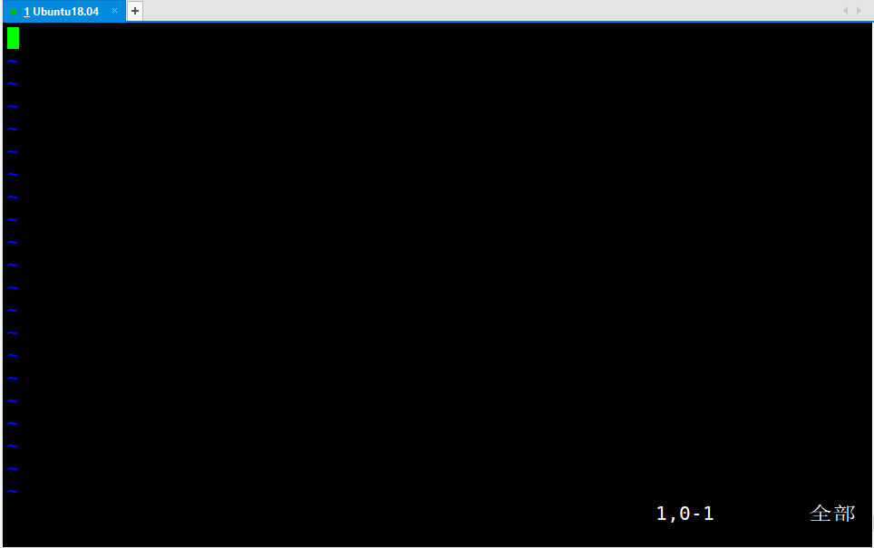
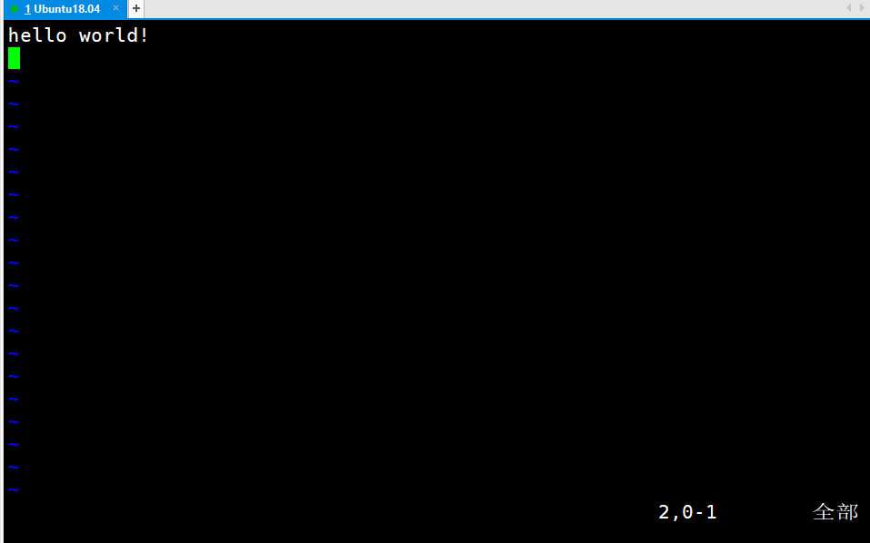

# vim的俩种状态

一切的一切的开始，要弄明白vim的俩种状态

vi刚出现的时候，鼠标都还没发明

故vim的操作基本脱离鼠标。

vim分为俩种状态：命令状态和编辑状态


刚进入vim时，是命令模式



按i进入编辑模式		------编辑模式左下角有INSERT（插入）



按Esc回到命令模式			------命令模式左下角插入消失了

在命令模式下，用：会将：后的命令累计执行

常用的退出命令：q退出（如果你没有修改任何）

q！（不保存强制退出）

wq（保存并退出）

w（相当于ctrl+s保存不退出）


在命令模式下，

i，从当前光标处进入编辑模式

I，光标回到行首并进入编辑模式

A，光标回到行尾并进入编辑模式


# 配置.vimrc

.vimrc应写在自己的home下，可以对vim编辑器的设定

基本配置一下

例如

```shell
set nu
set cursorline
set hlsearch
set tabstop=4//设置tab键为4空格
syntax on	//语法高亮
```

可以用软连接，也可以直接mv改名为.vimrc


# vim内常用的命令操作

（在命令模式下）

x，删除光标处字符

dd ，删除光标所在的整行

3dd，删除光标开始的三行，3为虚指，可以换。

d$，从光标开始删除到本行尾

yy，复制本行

p，将剪贴板的内容粘贴到光标所在的下一行

u，撤销上次操作


gg，光标到文档头

G，光标到文档尾


ctrl+f往下翻，ctrl+b往下翻一页

H，当前页首

L，当前页尾的行首

w，每一次移动一个单词往后


冒号+数字，可以快速到多少行

/+单词，文档内查找，相当于外部的grep，相当于Windows下的ctrl+f


还可以在vim状态下new参考别人的文档，多窗口了


命令模式下输入gg=G可以自动对齐


## 块操作

将某一部分操作

按v进入可视模式，进行框选范围

再按y赋值，p粘贴


# vim外使用到的命令

## sed

sed可以在文件外替换多个文件中的东西

```SHELL
sed "s/printf/puts/g" main.c
sed -i "s/printf/puts/g" *.c
```

不加-i只是测试，不会生效


可以和find联合使用，改不同路径的文件里的东西


## vimdiff

vimdiff可以对比俩个不同代码文件

相同部分可能被合并，按左箭头展开

````shell
vimdiff 原文件 对比文件
````

