# 编译与调试

用VS写代码时；

编写，编译，调试三者合一

而在Linux中

大家一般用：

Vim写代码（或vscode），gcc进行编译，gdb进行调试

好文：

[GCC基本使用 - 知乎 (zhihu.com)](https://zhuanlan.zhihu.com/p/404682058)

## gcc编译

安装gcc方法

```shell
sudo apt install gcc
```


当我们进行编译的时候，要使用一系列的工具，我们称之为工具链。SDK就是编译工具链的简写，我们所使用的是gcc系列编译工具链。

基本的gcc编译

```shell
gcc main.c
```

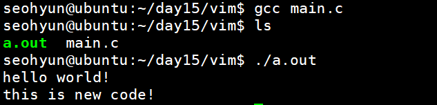


-o选项表示将输出到目标文件，即可以利用此命名输出后的可执行文件名（在Linux中无需exe后缀）

```shell
gcc -o main main.c
```

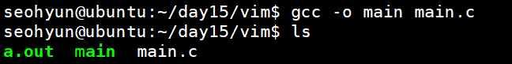

以及需要注意的是，执行可执行文件时，不能直接main，会被当成命令，需要加上./当前目录下


-c用于指定编译源文件的路径

```shell
gcc -c 
```

由-c直接变成-o目标文件


-g表示在目标文件中产生调试信息，用于gdb调试


### gcc编译过程

使用gcc编译程序的过程是

预处理---编译---汇编---链接

其中分别使用的工具分别为：

预处理器--编译器--汇编器as--链接器ld


源代码\*.c和头文件\*.h在预处理过程中		

预处理器会将头文件里的有#号开头的东西进行解析，将他们替换/展开掉。

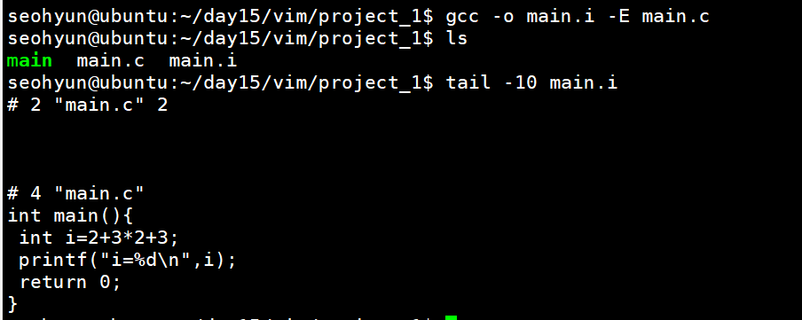

然后进行编译

编译将预处理后的文件（\*.i）进行编译，变成了汇编语言文件（\*.s）

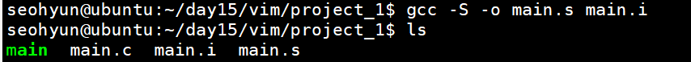

此时文件main.s就是汇编语言编成的

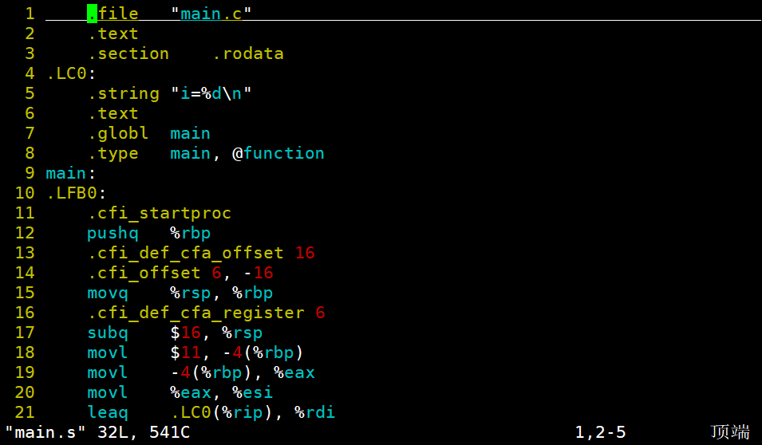

然后进行汇编

汇编器as将将hello.s 翻译成机器语言保存在hello.o 中（二进制文本形式）。

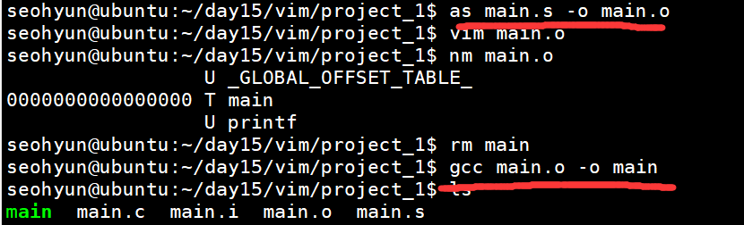

最后进行链接，将外部的类似printf函数啥的进行链接，最后得到可执行文件


-c将会只编译不链接，常用于增量编译，makefile之类的，如果不指定输出文件，则只生成后缀为.o的目标文件

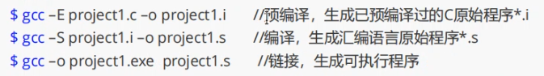

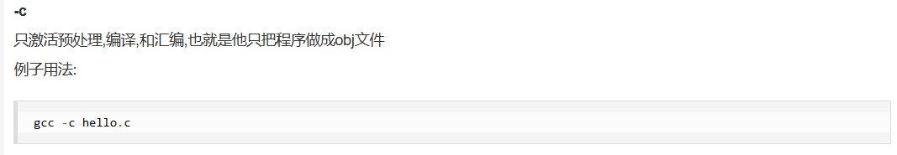

.c---------.i-------.s-------.o------elf


### 调试开关-D

#ifdef	和	#endif

被称为调试开关，通常测试版本会多一些测试语句，例如调试，报错信息的打印等，程序员可以通过测试开关的形式来打开或关闭测试语句

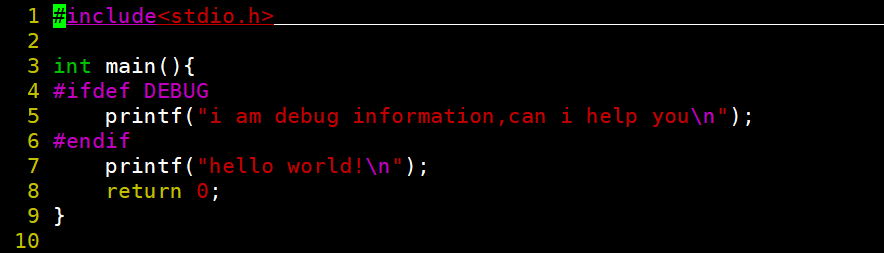

实际上如果没有达成debug的条件时，是不会打印出来的

实际上他都没有编进程序,预处理就把他处理走了。

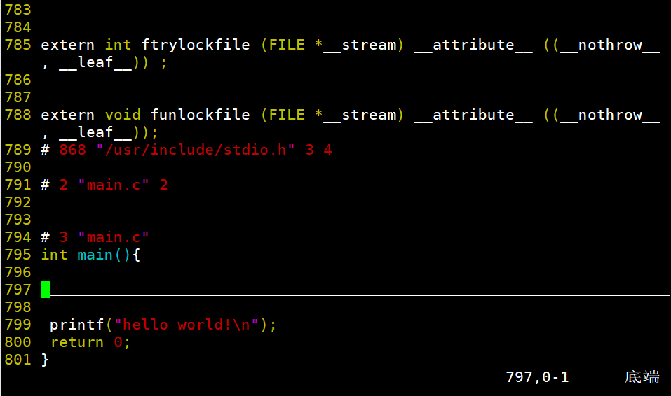

因为这个ifdef	endif前面都有#，带#的都在预处理处理掉了


如果要打开这个调试开关，需要在开头输入#define	DEBUG

就会开启这个调试开关


或者通过-D选项传递一个宏-D DEBUG

可以多次-D传递多个宏

就可以在预处理中激活这个开关了，不用反复修改文件上传仓库了

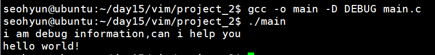


### 引用头文件-I

一般在工作中，我们会将头文件放在一个公用的目录下

而此时，我们需要引用该头文件下的函数时有俩种方案

1：

在include""中加上相对路径

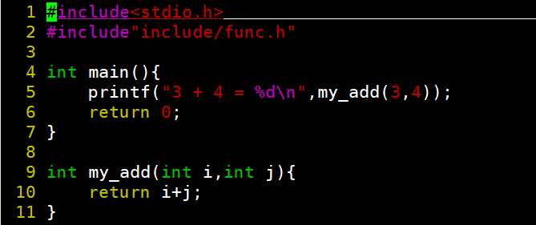


但总是这样修改引用头文件实在不是个明智的办法

2：

加参数-I，则是增加头文件的搜索路径。

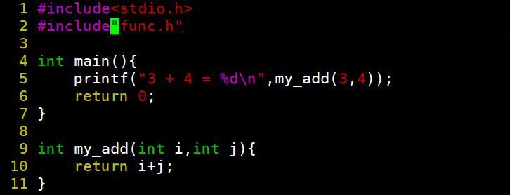

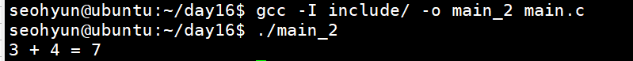


### -Wall/-Werror

-Wall打开最高级别的警报等级，最严格

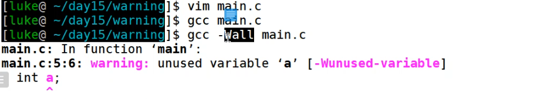


-Werror

将warning变成error卡住编译


### 动态库和静态库

企业一般分为俩种

ToC	公司交付给个人用户盈利

ToB	把程序封装成动态库，交付给对应公司


#### 动态库和静态库的区别：


详细说明：

如果是目标文件main.o动态链接动态库形成可执行程序elf

其中print函数是动态库里的

那么在elf中，没有print函数的实现，只有一个地址address是动态库中实现该函数的地址接口

可以用ldd a.out来查看a.out依赖于哪些动态库

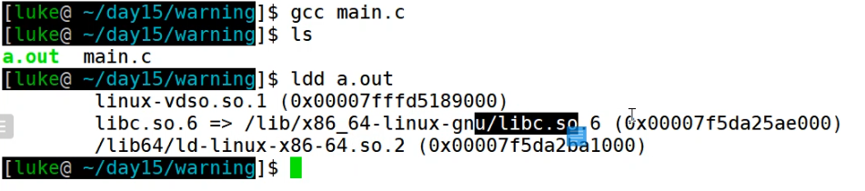

如果这个动态库被删除了，那么这个程序就没法执行了。

运行这个程序时，将elf加载到进程地址空间里的同时，该动态库也会被加载到进程地址空间。

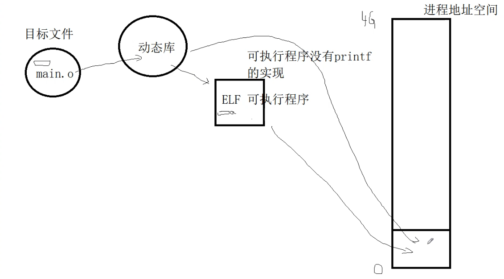

而静态库被main.o链接后编译成elf可执行程序

其中print函数是静态库中，

则在该elf可执行程序中，他会把静态库中print函数的实现直接copy进来，把源码放进elf中，elf中已经包含了print函数的实现过程

静态链接完之后，就算该静态库被杀掉了，只需要把elf加载到进程地址空间中，就能正常运行。


#### 创建动态库

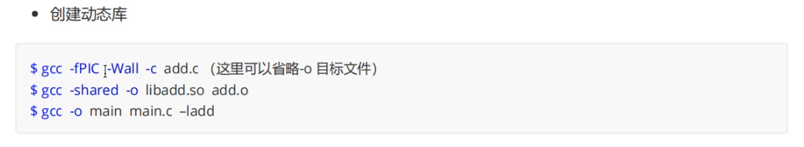

参数说明：

-c：只做预处理--编译--汇编，也就是不链接，生成.obj文件


-fpic：生成位置无关的目标代码（position independent Code）

每个函数的入口地址是独立的，不需要计算离main函数的相对地址

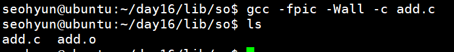

-shared：1.在生成时 可生产动态库文件

​				  2.进行动态编译，尽可能的链接动态库，只有没有动态库时才会链接同名静态库

你做了一个动态库，该动态库也许会引用别的动态库，用shared尽可能链接

该同名不是真正的同名，是去除命名规范后的同名例如：libadd.so和libadd.a

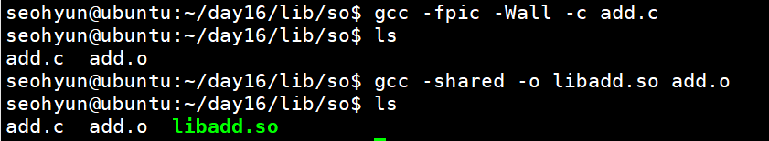

大功告成，接下俩我们回忆一下这个过程

第一步首先将.c文件编译成.o目标文件（-c），这一步加-fpic

第二步将目标文件编译成.so（-o），记得用-shared尽可能链接动态库

第三步将该动态库放到系统的搜索路径下（lib or lib64 or usr/lib）

一般情况下我们不装到lib和lib64这个基本都是系统的，我们一般放到usr/lib下

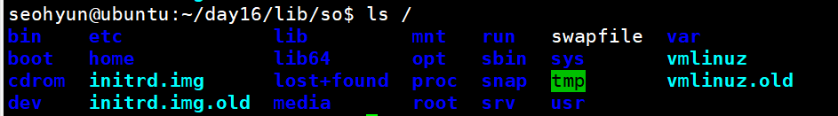

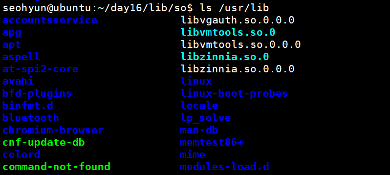

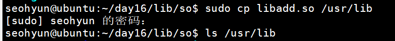


使用过程：

直接写一个main.c不用实现my_add，但要记得声明

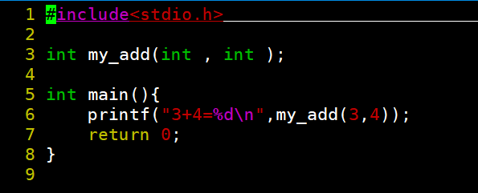

如果直接gcc main.c会报错

自己做的库，无论是静态库还是动态库，都必须要显式链接

也就是-l

```shell
gcc main.c -ladd
```

顺序不能错，-ladd必须在最后面

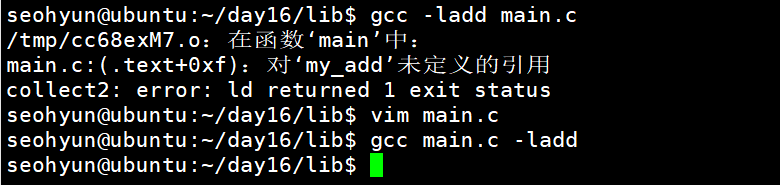

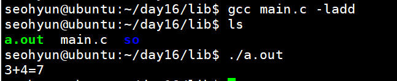

如果该库被删掉了，再执行elf，执行不了！

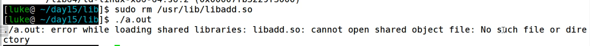


注意，调用动态库的函数，也需要在main或头文件中进行声明，不然会warning，但不是error，也能动


#### 创建静态库

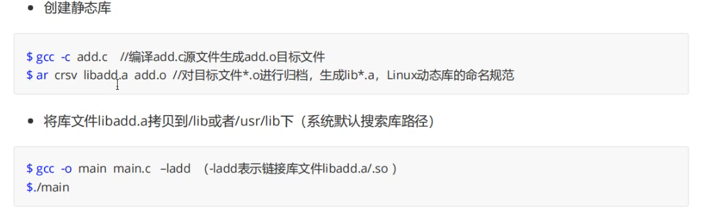

详细过程：

第一步仍是用-c使其到.o目标文件，但这一步不用-fpic，-fpic会生成距离main函数距离无关的函数目标代码，而静态库相当于将函数源码拷贝进来，不需要着一些

```shell
gcc -c file.c
```

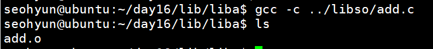


然后用这个crsv

```shell
ar crsv libfile.a file.o
```

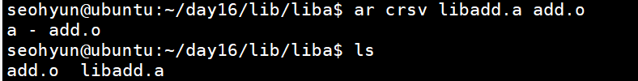

最后仍移到lib文件中，通过-ladd链接

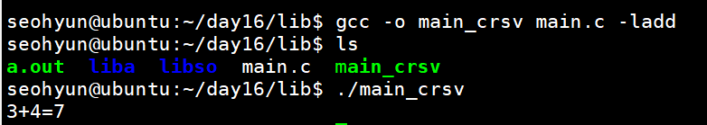

随后即使删除libadd.a，程序任然能动

elf中已经有了my_add函数的实现过程了。在程序执行过程中，静态库不参与了。

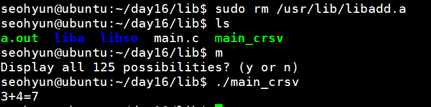

但一般动态库用的更多啊。。


#### 优劣评价


动态库实现了更好的复用，存储空间只要一份，静态库疯狂copy，导致要用到的elf很大

而且动态库有一个很好的地方就是便于维护升级

换库是不需要其他重新编译，就像车在跑的时候还能换轮子

通过软连接

我们的程序在执行的时候是通过名字去加载动态库的，而我们可以将一个软连接命名为xxx.so.0

让他指向某个动态库文件

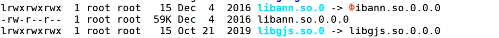

升级的时候只需要重新定向一下这个软链接，让其指向新的动态库，这个时候，lef程序仍然可以运行

这就是动态库最大的优势了，不同原来的接口的前提下，更新新东西，完美实现了向前兼容


 

## gdb调试

Linux包含了一个叫gdb的调试程序，gdb可以用来调试C和C++程序，在程序编译时用-g选项可以打开调试选项

```shell
gcc -g main.c
```

### 简易gdb命令

l--list---显示代码（list最后一个 }看不见）

b 4 --break--在第四行打断点

b main-- break main--在main函数这一行打断点

r--run--运行

n--next--逐过程，相当于VS的F10

s--step--逐步，相当于VS的F11

p i--print i--打印该变量的值

c--continue--运行到最后，相当于VS的F5

q--quit--退出

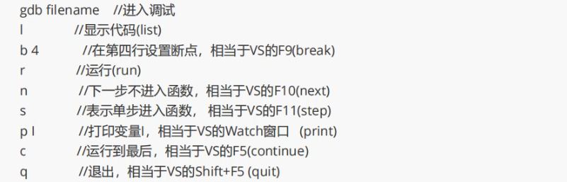


### 给main函数传参

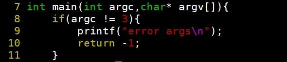

argc代表传几个参数进去，argv接收键入字符串

包含在头文件stdlib中

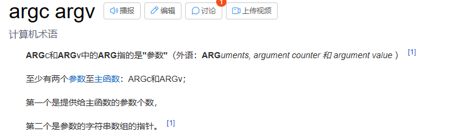

```shell
./main 0 1
```

如此运行该程序，argc则等于3

最开始的./main放在argv[0]中，后面以此类推

常用的函数

```shell
atoi(),atol(),atoll()
```

atoi()就是argv[x]---->int

atol()就是argv[x]----->long


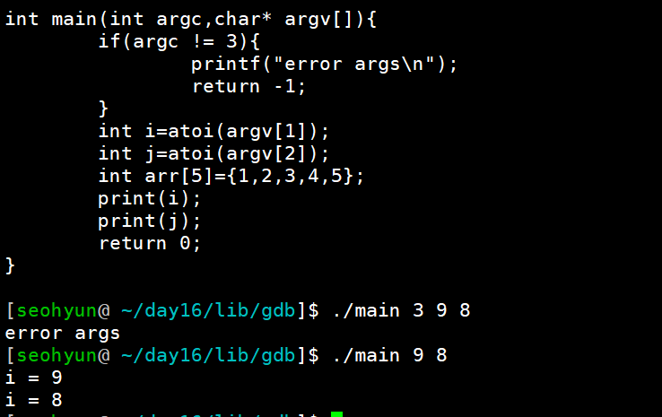


向main函数混合传参

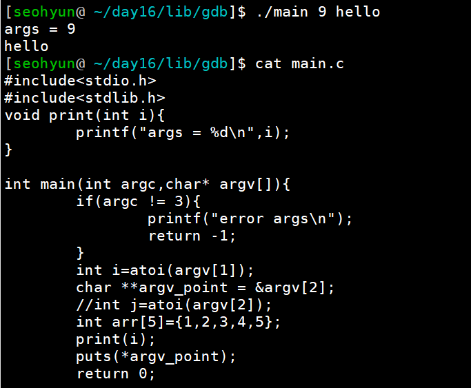


在gdb调试中给main函数传参

首先需要gcc -g编译并在gdb中

```shell 
set args 
```

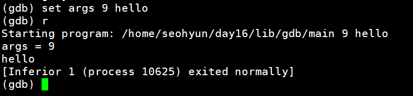


### CORE文件

产生段错误已转存--程序挂了怎么办

```shell
$gdb -g main.c
$ulimit -a
$ulimit -c unlimited
//此时会在当前目录下产生core文件
$ gdb a.out core
//定位至储存错误点地方
```

