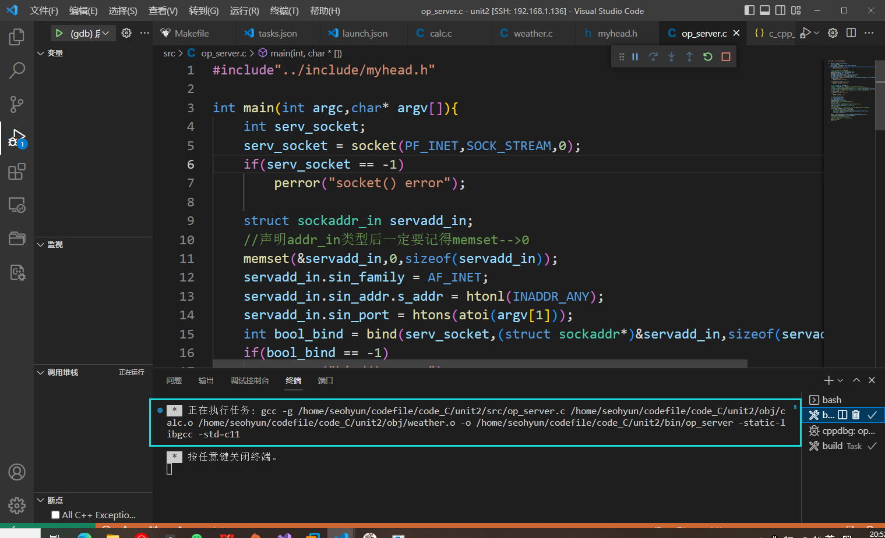

## Makefile简述


工程的源文件极多，极杂，分布在不同目录，此番若直接编译这些源文件的命令就会极其复杂。

makefile即是解决这项问题的按照增量编译模式设计的命令脚本。


## 规则、目标文件、依赖文件

规则格式：

```makefile
[target]:[prerequisites]
<tab>[command]
```

仿写：

```makefile
main:main.c
	gcc main.c -o main
```


如果你在main.c中include了一个外部.c文件，那么你就只有gcc main.c就行

如果不一一include那个文件，则可以再makefile中添加进main中

```makefile
main:main.c func.c
	gcc main.c func.c -o main
```

注意，在makefile中这样写了，就不能include"func.c"了，不然会重定义

但是func.c中也需要stdio.h头文件

 

另一种规范形式：


makefile的执行呢，和C语言是不一样的，

从最开始开始执行，当他发现main.o func.o这俩依赖项在当前目录不存在

这个时候就会像递归一样，会去下面这个目标项里找有没有这个依赖性

然后再执行该项。


为什么要这么做呢，因为我们可以获得.o这个目标文件

我们如果要改变其他的例如func.c，我们便可以编译func.c并与之前的main.c链接

就可以省略掉gcc -c main.c这一步，实现增量编译，减少编译时间


因为在当下目录找得到main.o文件，就不会找下面的目标项了


## 伪目标


举例：


clean就是跟在make后面的参数一样，不加clean直接make是不会执行clean这个目标项的


rebuild就像是VS里的重新生成（将会重新编译所有需要文件）


## 变量


一言蔽之，makefile可以定义变量，调用时用$()来引用变量（字符串替代）


一般用:=而不用=

=会递归展开，:=只展开一次

操作


#### 预定义变量

makefile中分为自定义变量，预定义变量，自动变量，环境变量

预定义变量就是内部定义好的变量，这些变量的含义是固定的

%百分号是匹配符作用例如：

%.o：%.c

等同于

f1.o:f1.c

f2.o:f2.c


#### 隐含规则

文件默认去找当前目录下的c文件的规则，是隐含规则，不写也会执行


默认调用cc，再用变量可以替换成gcc，替换隐含规则的内容


同理，可以将

```makefile
CFLAGES:=-g
```


此时gdb就可以调试这个main了

-g是得加载gcc之后.c文件之前，在编译的时候需要，而不是链接时需要


### 自动变量


$@目标文件就是$(out)也就是main


OBJS可以进一步替换


这样使用变量的好处，就是新增一些目标文件，也不会改动多处了


## 搭配VSCode

没有图形化界面光用gdb在终端悲惨的debug经历直接导致我宁可使用肉眼观察程序盯着发呆也不愿意-g，但这一切终于要在现在结束了，

VSCode搭配Makefile管理好你的程序项目！

首先，一个正常的健全的程序，他的工作目录基本表示如下：


### include中

在include中要加上这几句

```c
#ifndef __HELLO_H__
#define __HELLO_H__

xxx代码部分
    
#endif
```

头文件中的 `#ifndef/#define/#endif` 防止该头文件被重复引用。
 被重复引用”是指一个头文件在同一个cpp文件中被include了多次，

这种错误常常是由于include嵌套造成的。

​    比如：存在a.h文件**#include "c.h"**而此时**b.cpp**文件导入了**#include “a.h”** 和**#include “c.h”**此时就会造成c.h重复引用。


### .vscode中

#### c_cpp_properties.json

主要要修改一下includePath路径，不然容易找不到各种头文件。

可以注释掉config那一行

```json
{
    "configurations": [
        {
            "name": "Linux",
            "includePath": [
                "${workspaceFolder}/**",
                "/home/seohyun/codefile/code_C/unit1/include",
                "/usr/include/",
                "/usr/lib/gcc/x86_64-linux-gnu/7/include",
                "/usr/local/include",
                "/usr/lib/gcc/x86_64-linux-gnu/7/include-fixed",
                "/usr/include/x86_64-linux-gnu"
            ],
            "defines": [],
            "compilerPath": "/usr/bin/gcc",
            "cStandard": "c11",
            "cppStandard": "c++17",
            "intelliSenseMode": "linux-gcc-x64"
        }
    ],
    "version": 4
}
```

注意：includePath中，要含有本程序自用的include文件夹，而不是一昧的复制

```json
"/home/seohyun/codefile/code_C/unit1/include",
```


当系统提示您，fatal error: include/myhead.h: 没有那个文件或目录  时

您就应该注意路径问题，如果你的code写在src下面，你就得在头文件引用时加../


若要在vscode中调试代码，则需要修修改改tasks与lauch。

#### tasks

常用模板，修修改改就能挪用

```json
{
    "version": "2.0.0",
    "tasks": [
        {
            "label": "build",
            "type": "shell",
            "command": "gcc",
            "args": [
                "-g",
                "${file}",
                //改成-c -o
                //顺带要学一下vscoode配和makefile使用build
                "-o",
                "${workspaceFolder}/unit1/bin/${fileBasenameNoExtension}",
                "-static-libgcc",
                "-std=c11"
            ],
            "group": "build",
            "presentation": {
                "echo": true,
                "reveal": "always",
                "focus": false,
                "panel": "new"
            },
            "problemMatcher": "$gcc"
        },
        {
            "label": "run",
            "type": "shell",
            "dependsOn": "build",
            "command": "${fileDirname}/bin/${fileBasenameNoExtension}",
            "group": {
                "kind": "test",
                "isDefault": true
            },
            "presentation": {
                "echo": true,
                "reveal": "always",
                "focus": true,
                "panel": "new"
            }
        },
        {
            "type": "cppbuild",
            "label": "C/C++: gcc-7 生成活动文件",
            "command": "/usr/bin/gcc-7",
            "args": [
                "-fdiagnostics-color=always",
                "-g",
                "${file}",
                "-o",
                "${fileDirname}/${fileBasenameNoExtension}"
            ],
            "options": {
                "cwd": "${fileDirname}"
            },
            "problemMatcher": [
                "$gcc"
            ],
            "group": {
                "kind": "build",
                "isDefault": true
            },
            "detail": "调试器生成的任务。"
        }
    ]
}
```

#### make与tasks结合

就得在tasks.json文件中将launch之前的前置lable的shell命令改为make相关

tasks.json中




说白了，tasks就是负责编译的，通过设置tasks的command例如“gcc”和复杂度args参数

和command设置成“make”，参数更是基本没有，或者clean之类的

具体编译操作细节再makefile中实现是一样的。


#### launch

lauch中主要要记得miDebuggerPath要加上

以及

preLauchTask（在lauch之前要执行的tasks的lable项，与tasks中某个lable要对应起来）

```json
{
    // 使用 IntelliSense 了解相关属性。 
    // 悬停以查看现有属性的描述。
    // 欲了解更多信息，请访问: https://go.microsoft.com/fwlink/?linkid=830387
    "version": "0.2.0",
    "configurations": [
        {
            "name": "(gdb) 启动",
            "type": "cppdbg",
            "request": "launch",
            "program": "${workspaceFolder}/bin/${fileBasenameNoExtension}",
            "args": ["7777"],   
            "stopAtEntry": false,
            "cwd": "${fileDirname}",
            "environment": [],
            "externalConsole": false,
            "MIMode": "gdb",
            "miDebuggerPath": "/usr/bin/gdb",//*
            "preLaunchTask": "build",//要与tasks.json中执行的lable相同
            "setupCommands": [
                {
                    "description": "为 gdb 启用整齐打印",
                    "text": "-enable-pretty-printing",
                    "ignoreFailures": true
                },
                {
                    "description": "将反汇编风格设置为 Intel",
                    "text": "-gdb-set disassembly-flavor intel",
                    "ignoreFailures": true
                }
            ]
        }
    ]
}
```


### makefile中


通过makefile来管理整个项目，通过.vscode来调配整个项目

makefile中，可以删除文件，文件夹（unix中一切都是文件）

```makefile
clean:
	rm -rf main obj
```

常用的变量，格式：

```makefile
CFLEAGS := -g -std=c11 -I include
```

其中-I include表示所有的头文件都在inlcude文件中

常用匹配符来省略%

mkdir -p $(@D)中

-p是确保该目录存在，若不存在，则自行创立

 


常用法1

```makefile
CFLEAGS := -g -std=c11
#像calc.c这样相当于独立的库，可以将他设为独立的obj文件
#就可以只在最后一步链接了，之后不改变就可以不编译了 
object := obj/calc.o

#将src/目录下.c源文件编成obj/相应.o
obj/%.o : src/%.c
#$(@D)表示目标文件的目录部分，在这里就指的是obj/这个目录
	mkdir -p $(@D)
	gcc $(CFLEAGS) -o $@ -c $<

all: $(object)
	gcc $(CFLEAGS) -o ./bin/server src/op_server.c $(object)

clean:
	rm -rf obj main
```


常用法2

```makefile
out := main
CFLAGS := -g
$(out):op_server.o calc.o
	gcc $(@D)/obj/op_server.o $(@D)/obj/calc.o -o $(@D)/bin/server 

op_server.o:src/op_server.c 
	gcc -c $^ -o $(@D)/obj/op_server.o

calc.o:src/calc.c
	gcc -c $^ -o $(@D)/obj/calc.o

rebuild:clean $(@D)/bin/server
clean:
	rm -rf $(@D)/obj/op_server.o $(@D)/obj/calc.o $(out)
```


