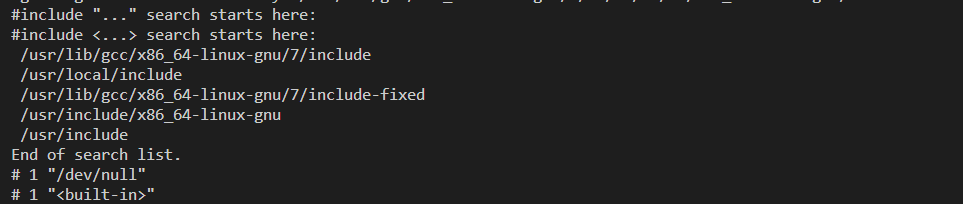
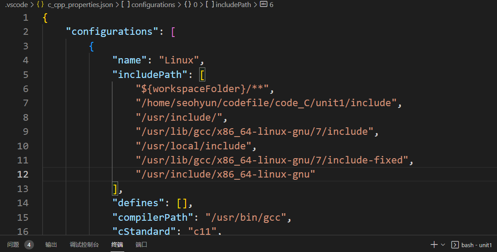
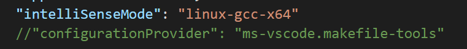
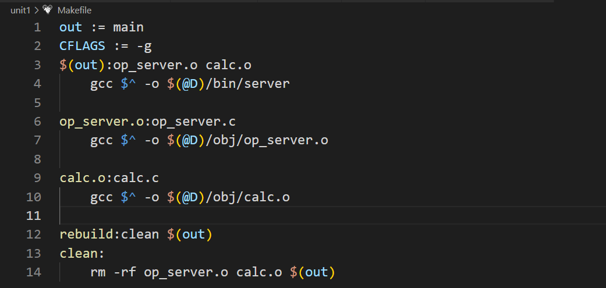
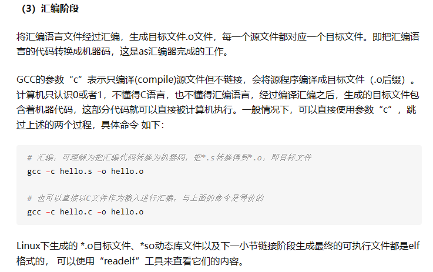
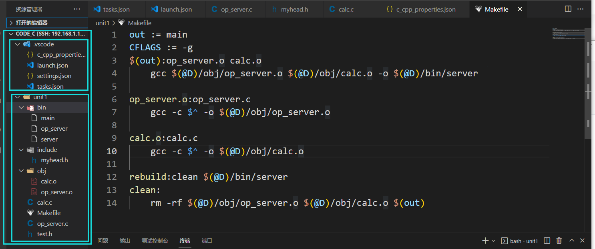
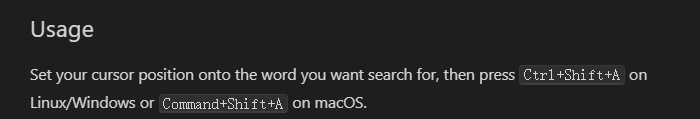

## vscode检测到#include错误请更新includepath


使用

```shell
gcc -v -x c -E /dev/null
```

查看gcc基本包含路径



将此物写入c_cpp_properties.json的includePath



```shell
"name": "Linux",
            "includePath": [
                "${workspaceFolder}/**",
                "/home/seohyun/codefile/code_C/unit1/include",
                "/usr/include/",
                "/usr/lib/gcc/x86_64-linux-gnu/7/include",
                "/usr/local/include",
                "/usr/lib/gcc/x86_64-linux-gnu/7/include-fixed",
                "/usr/include/x86_64-linux-gnu"
            ],
```


configurationProvider要注释掉，不然就按照makefile-tool里的设置搞了。




## main中出现未定义的引用/链接阶段出问题

例如main中用了hello()函数，而此函数在头文件head.h中被声明

main.c

```c
#include"head.h>
int main(){
	hello();
	return 0;
}
```

head.h

```c
#include<stdio.h>

void hello();
```

hello.c

```c
#include<head.h>

void hello(){
	printf("hello\n");
}
```

Makefile




出现此问题的原因，就是编译器仅编译了main.c文件，其中即使include了hello.h，但在.h文件中只引用（声明），没有具体定义，具体定义在hello.c中，这玩意还没编，故出错。


当你想在vscode中debug时，可以修改tasks.json中的args参数

将args参数中的`${file}`修改为`${fileDirname}\\*.c`


当你用Makefile时，要么将这俩个合在一起

```c
op_server.o:op_server.c calc.c
	gcc $^ -o $(@D)/obj/op_server
```

编译成obj文件并链接


但如果你更正规，更低耦合，需要将其分开写

```c
$(out):op_server.o calc.o
	gcc $(@D)/obj/op_server.o $(@D)/obj/calc.o -o $(@D)/bin/server 

op_server.o:op_server.c 
	gcc -c $^ -o $(@D)/obj/op_server.o

calc.o:calc.c
	gcc -c $^ -o $(@D)/obj/calc.o
```

带上-c参数的作用是

只编译不链接，在函数调用处留下地址，到需要时再从地址进入calc函数用，







## cpp reference

使用方法



+


