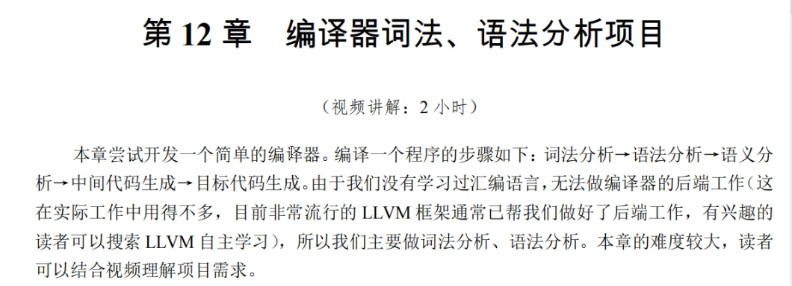

编译器所作的工作：

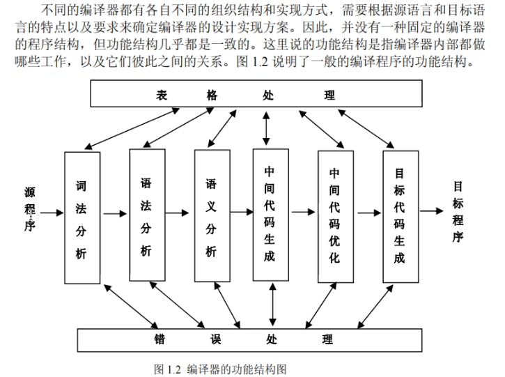

编译器前端，实际写的源程序到中间代码的过程

编译器后端，从中间代码到生成机器指令的过程，编译后端我们交给LLVM处理。


LLVM业界编译性能几乎最佳，我再做也没啥意义了。。

为什么gcc最流行呢，因为gcc出现的更早。。

# 词法分析

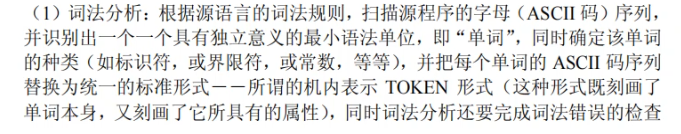

 分的每个词用链表存储起来，因为都是有序的，没必要用什么红黑树之类的数据结构存

文件.txt之类的要放在资源文件栏。

分词，着色，并生成链表，替换成TOKEN。（其实就是一个整形数，用enum【枚举】实现）

 

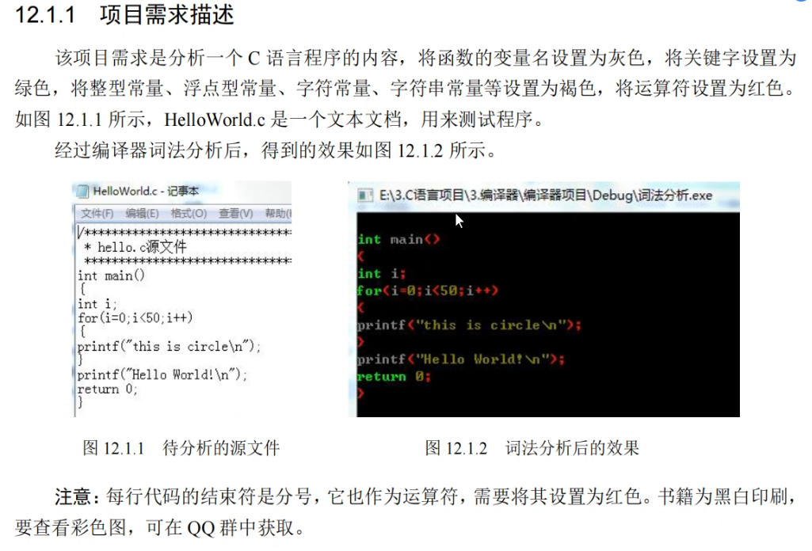

TOKEN类型

运算符及分隔符，常量，关键字，标识符

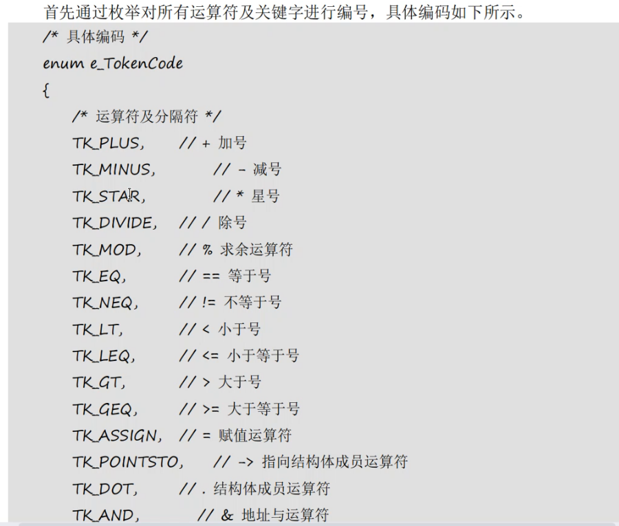

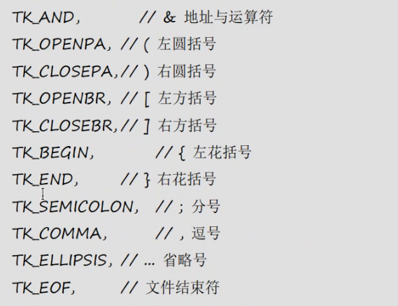

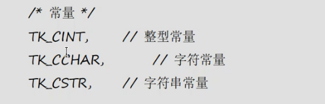


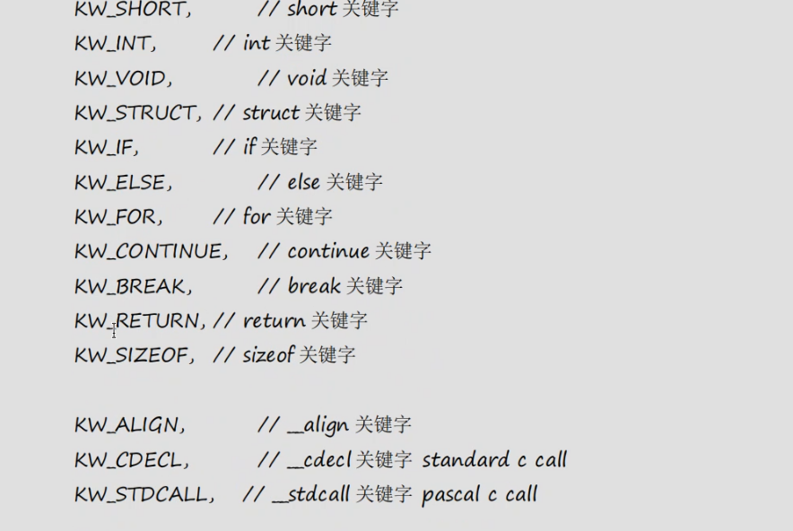

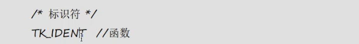

任何函数名或变量名，都是一个标识符

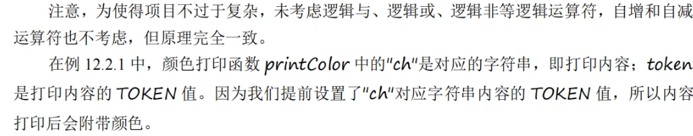


## 着色

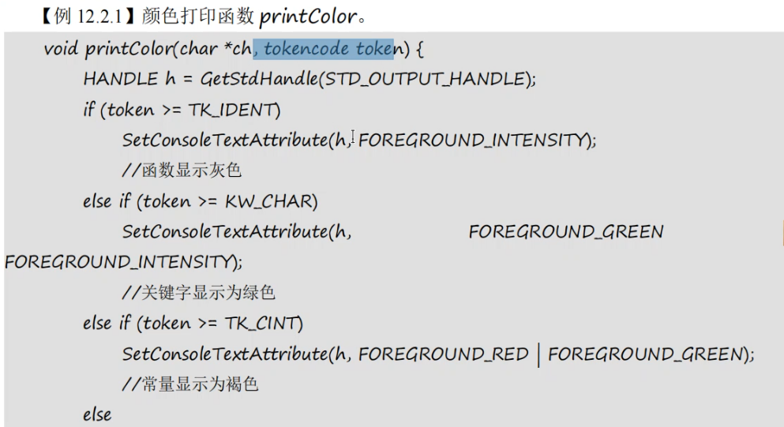

token值从后往前判断，判断它再哪个token类型区间，是关键字，还是常量

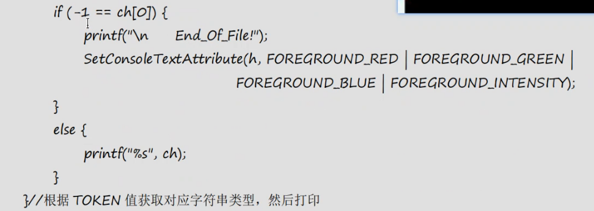

文件读到最后了，再设置回去。

每次读一行，fgets最后返回的就是null

每次要切换颜色前要换句柄HANDLE

```c
int main(int argc, char* argv[])
{
	HANDLE h = GetStdHandle(STD_OUTPUT_HANDLE);//先得到一个句柄
	SetConsoleTextAttribute(h, FOREGROUND_INTENSITY);//灰色
	printf("first\n");
	SetConsoleTextAttribute(h, FOREGROUND_GREEN | FOREGROUND_INTENSITY);//绿色
	printf("second\n");
	SetConsoleTextAttribute(h, FOREGROUND_RED | FOREGROUND_GREEN);//褐色，常量
	printf("third\n");
	SetConsoleTextAttribute(h, FOREGROUND_RED | FOREGROUND_INTENSITY);	//红色
	printf("fourth\n");
	system("pause");
}
```

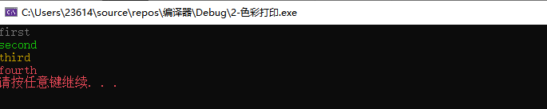


## 字符串存储及TOKEN快速识别

源文件解析后，每隔字符串会存为一个结点。

为了能够存储每一个读到的字符串，可以采用动态数组的形式（也可以采用链表的形式），当空间不够时，可以用realloc()来增加空间。动态数组的定义方法如下：

```c
typedef struct DynArray {
	int count;				//动态数组元素个数
	int capacity;			//动态数组缓冲区长度
	void** data;			//指向数据指针数组
}DynArray;

```

每个指针指向的空间都存储一个结构体，这个结构体用来存储单词，这里只说明一下动态字符串的设计，可以让data中每一个指针直接指向实际的字符串。当我们从文件中读取一个字符串时，如何快速判断并得到该字符串的TOKEN值？可以通过哈希算法来实现，单词存储结构定义如下：

```c
typedef struct TkWord {
	int tkcode;				//单词编码，也就是TOKEN值
	struct TkWord* next;			//指向哈希冲突的其他单词
	char* spelling;					//单词字符串
}TkWord;
```


哈希表：

一开始就要建立一个哈希表，目的是我们得到任何一个字符串后，能够快速通过哈希表知道他的TOKEN值

哈希表中建议就存以下内容：

```c
typedef struct TkWord {
	int tkcode;				//单词编码，也就是TOKEN值
	char* spelling;					//单词字符串
    struct TkWord* next;			//指向哈希冲突的其他单词
}TkWord;
```


## 动态数组

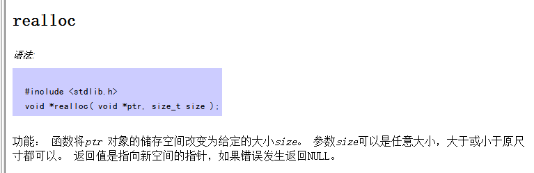

把原来的指针传参，并指定更改后的尺寸。


realloc()函数可以用来个malloc开辟的空间来扩容

例如你先malloc一个400字节的空间，填满了要扩容了，

如果malloc后面没有足够的连续空间，realloc可以贴心的给你找一块总共800字节空间的地方

会帮你把原始数据给填过去，还会帮你把原来的地方free掉


## 关键split

举出其中一部分if判断为例

首先进入for循环来处理传入的本行数据const string str

```c
int split(vector<string> &word,const string str){
	for(int i=0;i<str.length();i++){
		if(isalpha(str[i]) || str[i]=='_'){//变量名，必须以英文字母和下划线开头
			string temp;
			while(isalnum(str[i])|| str[i]=='_'){//变量名中可以为英文字母、数字和下划线
				temp.push_back(str[i]);
				i++;
			}
			word.push_back(temp);
			--i;
```

首先对str进行判断isalpha或_，及，无论是int，float这种关键字，还是num之类的变量名都先进入这个if

其他的后续再判断，如果不是关键字的话，是在哈希表中得不到它的hash值的。

在该if中，声明一个存放的temp，

c++中：temp.push_back(str[i]);的作用是不断地把某一个字符（str[i]）推到temp这个string后面

妙就妙在这个if中的while循环，进入这个if，就意味着接下来的字符不是字母就是下划线

接下来只要连续的把这一行数据中这个完整的关键字/变量 取出来就可以了。

于是在这里直接用了个while，连续取，并加到temp里

这个循环结束了，就意味着这个单词读完了，就可以把temp给push_back到word里了。

最后退出这个while循环是读到空格了，

然后push_back to word

注意了，这个外层的for循环还会给你i++一回，此时就是指向空格后一个了，

记得i--再回来一个，才能拿到空格。

其中ispunct()

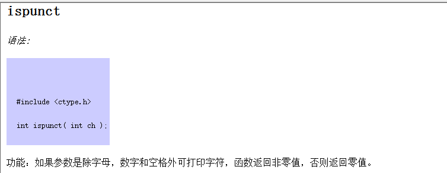


## 基本流程

首先建立好枚举，哈希表，fopen()，

然后用while搭配fgets()一次读一行，一次处理一行数据

在while中声明一个char 型数组用来存这一行中split出的单词

然后再split中处理行数据的识别，剥离，存回temp

再根据temp进行elf_hash得到关键值之后，用关键值在结构体hashtable找到这个结构体

再在结构体中得到他的token值，并根据token值着色。

看，还是很简单的逻辑的！动手试一试吧！


 


视频截至45.   00：48：58，开始简单语法分析。


