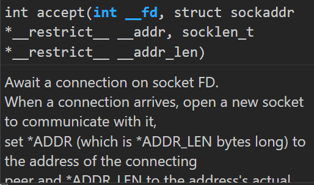
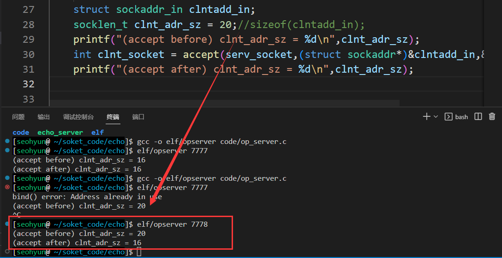

## 关于accept()第三个参数socklen_t

```c
int accept(int sockfd, struct sockaddr *addr, socklen_t *addrlen)
```



大部分资料对于accept函数第三个参数的描述如下：

连线成功时，参数addr所指的结构会被系统填入远程主机的地址数据，参数addrlen为scokaddr的结构长度。

亦即指针addrlen为从申请连接的客户机socket获取的数据长度。

但实验时发现，如果将addrlen指针所指向的值中的数据不初始化或初始化为一个小于sizeof(struct sockaddr)的值时，所获取的客户机地址就会出现错误。

官方关于accept的*addrlen参数解释如下：

The addrlen argument is a value-result argument: the caller  must  initialize  it  to contain the size (in bytes) of the structure pointed to by addr; on return it will contain the actual size of the peer address.

addrlen 参数是一个值-结果参数：调用者必须将其初始化为包含 addr 指向的结构的大小（以字节为单位）； 返回时它将包含对等地址的实际大小。



也就是说，这里的addrlen所指向的值，是必须初始化的，而且要初始化为一个大于等于实际获取socket的数据长度的值，而accept函数在执行后，会将实际值赋给addrlen所指向的值，故如果期望值小于实际值，所获取的数据在存储时就会发生溢出，读取时所得值便产生了错误。


也就是说这个需要是个socklen_t指针能指向的变量，要是变量！！所以得初始化一个变量

这个变量有个忌讳，就是这个值必须要大于或等于addr_in的size，返回时会将其赋值成其实际大小，若小于赋值时会发成溢出错误导致函数失效。


